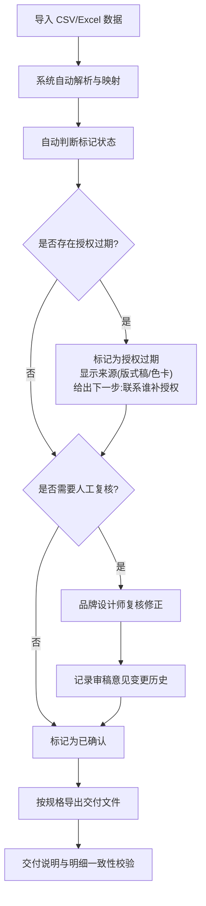

## 1. 产品概述

摄影选片标记（PhotoMark）是一款面向摄影制作团队的本地化选片标记管理工具，解决团队长期依赖表格凑标记、导出规格漏改靠人工备注、时间一长信息对不上的问题。目标用户为客户经理、品牌设计师、摄影师等非技术角色，所有数据本地存储（IndexedDB），无需后端服务。

- **核心痛点**：表格标记无自动判断、规格变更无追踪、授权过期信息被吞掉、交付说明与明细各说各话
- **产品价值**：自动判断选片标记并给出理由和下一步、完整变更历史、授权过期溯源、交付明细一致

## 2. 核心功能

### 2.1 用户角色

| 角色 | 使用方式 | 核心权限 |
|------|----------|----------|
| 客户经理 | 浏览标记结果与导出 | 查看标记、理由、下一步建议、导出报表 |
| 品牌设计师 | 手动修正审稿意见 | 编辑审稿意见、查看变更历史 |
| 摄影师 | 导入原始选片数据 | 导入数据、查看标记结果 |

### 2.2 功能模块

1. **导入页**：批量导入摄影选片数据（CSV/Excel），解析规格字段，自动映射
2. **标记看板页**：展示所有选片记录，自动判断标记状态，显示判断理由和下一步
3. **复核修正页**：逐条复核自动判断结果，品牌设计师可手动修改审稿意见
4. **历史记录页**：查看所有字段变更轨迹，审稿意见前后对比
5. **导出页**：按规格导出标记结果，交付说明与明细数据一致

### 2.3 页面详情

| 页面名称 | 模块名称 | 功能描述 |
|----------|----------|----------|
| 导入页 | 文件上传区 | 支持拖拽上传 CSV/Excel 文件，解析并预览数据 |
| 导入页 | 字段映射区 | 自动匹配列名，手动调整映射关系 |
| 导入页 | 导入确认区 | 预览映射结果，确认导入数量 |
| 标记看板页 | 筛选器 | 按标记状态、来源类型、授权状态筛选 |
| 标记看板页 | 记录列表 | 卡片式展示每条选片记录，含自动判断标记、理由、下一步 |
| 标记看板页 | 标记详情面板 | 展开查看完整判断逻辑链、来源追溯、授权信息 |
| 复核修正页 | 待复核列表 | 仅显示需人工复核的记录 |
| 复核修正页 | 修正编辑区 | 修改审稿意见，系统自动记录前后变化 |
| 复核修正页 | 批量操作 | 批量确认/批量修正 |
| 历史记录页 | 变更时间线 | 按时间倒序展示所有变更 |
| 历史记录页 | 审稿意见对比 | 左右对照展示修改前后的审稿意见 |
| 历史记录页 | 筛选与搜索 | 按修改人、时间范围、字段类型筛选 |
| 导出页 | 规格选择 | 选择导出规格（含上次使用的规格记忆） |
| 导出页 | 内容预览 | 预览导出内容，确保交付说明与明细一致 |
| 导出页 | 导出按钮 | 导出为 CSV/Excel，文件名含日期与版本号 |

## 3. 核心流程

用户从导入原始数据开始，系统自动判断标记状态并给出理由，客户经理查看标记结果和下一步建议，品牌设计师对需要修正的审稿意见进行手动修改（变更自动记录），最终按规格导出一致的交付文件。

授权过期处理流程：系统检测到授权过期时，不吞掉该记录，而是标记为"授权过期"状态，显示来源（版式稿/色卡），并给出下一步建议（联系谁补授权）。

## 4. 用户界面设计

### 4.1 设计风格

- **主色调**：深炭灰 (#1a1a2e) 为底，暖橙 (#e94560) 为强调色，米白 (#eaeaea) 为文字色
- **辅助色**：授权过期用琥珀黄 (#f0a500)，已确认用翠绿 (#0f9b58)，待复核用天蓝 (#4ea8de)
- **按钮风格**：圆角微凸（rounded-lg + shadow-sm），hover 时阴影加深
- **字体**：标题用 Noto Sans SC Bold，正文用 Noto Sans SC Regular
- **布局**：侧边导航 + 内容区卡片式布局，桌面端优先
- **图标**：Lucide Icons 圆角线性风格

### 4.2 页面设计概览

| 页面名称 | 模块名称 | UI 元素 |
|----------|----------|----------|
| 导入页 | 文件上传区 | 虚线边框拖拽区，上传图标，支持的格式提示 |
| 导入页 | 字段映射区 | 左侧源字段列表，右侧目标字段下拉选择，自动匹配高亮 |
| 标记看板页 | 记录列表 | 卡片网格，每卡含状态色带、缩略信息、判断理由标签 |
| 标记看板页 | 标记详情面板 | 右侧抽屉式面板，含判断逻辑链、来源信息、授权状态 |
| 复核修正页 | 修正编辑区 | 行内编辑模式，修改后自动弹出变更确认气泡 |
| 历史记录页 | 审稿意见对比 | 左右对照布局，删除线标注旧值，高亮新值 |
| 导出页 | 内容预览 | 表格预览，差异高亮，一致性状态徽章 |

### 4.3 响应式

- 桌面端优先设计（1440px+ 最佳）
- 平板端（768px-1440px）侧边导航收起为图标模式
- 移动端（<768px）底部标签导航，卡片单列布局

### 4.4 3D 场景

不适用
