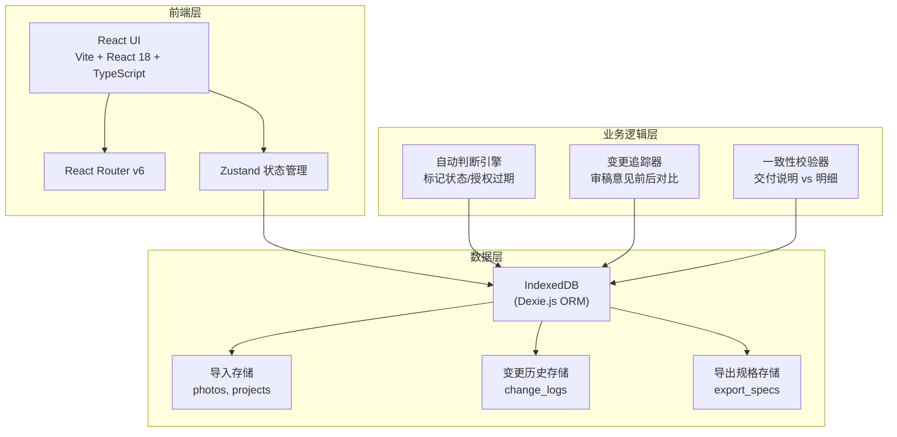
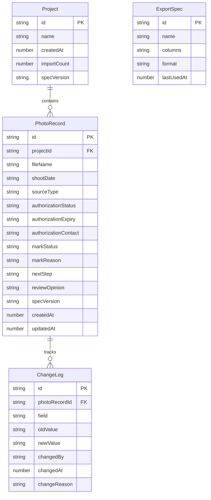

## 1. 架构设计



## 2. 技术说明

- **前端**：React@18 + TypeScript + TailwindCSS@3 + Vite
- **初始化工具**：vite-init (react-ts 模板)
- **后端**：无（纯本地应用）
- **数据库**：IndexedDB（通过 Dexie.js ORM 操作）
- **状态管理**：Zustand
- **路由**：React Router v6
- **图标库**：lucide-react
- **文件解析**：PapaParse（CSV）、SheetJS/xlsx（Excel）
- **文件导出**：SheetJS/xlsx

## 3. 路由定义

| 路由 | 用途 |
|------|------|
| `/` | 重定向到标记看板 |
| `/import` | 导入页：上传与映射数据 |
| `/board` | 标记看板页：查看所有选片记录与自动判断 |
| `/review` | 复核修正页：逐条复核与手动修正 |
| `/history` | 历史记录页：变更时间线与审稿意见对比 |
| `/export` | 导出页：按规格导出交付文件 |

## 4. API 定义

无后端 API，所有数据操作通过 Dexie.js 直接访问 IndexedDB。

### 核心 Hooks 接口

```typescript
interface PhotoRecord {
  id: string;
  projectId: string;
  fileName: string;
  shootDate: string;
  sourceType: "版式稿" | "色卡" | "其他";
  authorizationStatus: "有效" | "过期" | "未知";
  authorizationExpiry: string | null;
  authorizationContact: string | null;
  markStatus: "待判断" | "已确认" | "待复核" | "授权过期";
  markReason: string;
  nextStep: string;
  reviewOpinion: string;
  specVersion: string;
  createdAt: number;
  updatedAt: number;
}

interface ChangeLog {
  id: string;
  photoRecordId: string;
  field: string;
  oldValue: string;
  newValue: string;
  changedBy: string;
  changedAt: number;
  changeReason: string;
}

interface ExportSpec {
  id: string;
  name: string;
  columns: string[];
  format: "csv" | "xlsx";
  lastUsedAt: number;
}

interface Project {
  id: string;
  name: string;
  createdAt: number;
  importCount: number;
  specVersion: string;
}
```

## 5. 服务端架构图

不适用（纯前端本地应用）

## 6. 数据模型

### 6.1 数据模型定义



### 6.2 数据定义

```sql
-- IndexedDB 通过 Dexie.js schema 定义
-- Projects 表
CREATE TABLE projects (
  id TEXT PRIMARY KEY,
  name TEXT NOT NULL,
  createdAt INTEGER NOT NULL,
  importCount INTEGER DEFAULT 0,
  specVersion TEXT
);

-- PhotoRecords 表
CREATE TABLE photo_records (
  id TEXT PRIMARY KEY,
  projectId TEXT NOT NULL REFERENCES projects(id),
  fileName TEXT NOT NULL,
  shootDate TEXT,
  sourceType TEXT CHECK(sourceType IN ('版式稿', '色卡', '其他')),
  authorizationStatus TEXT CHECK(authorizationStatus IN ('有效', '过期', '未知')),
  authorizationExpiry TEXT,
  authorizationContact TEXT,
  markStatus TEXT CHECK(markStatus IN ('待判断', '已确认', '待复核', '授权过期')),
  markReason TEXT,
  nextStep TEXT,
  reviewOpinion TEXT,
  specVersion TEXT,
  createdAt INTEGER NOT NULL,
  updatedAt INTEGER NOT NULL
);

-- ChangeLogs 表
CREATE TABLE change_logs (
  id TEXT PRIMARY KEY,
  photoRecordId TEXT NOT NULL REFERENCES photo_records(id),
  field TEXT NOT NULL,
  oldValue TEXT,
  newValue TEXT,
  changedBy TEXT,
  changedAt INTEGER NOT NULL,
  changeReason TEXT
);

-- ExportSpecs 表
CREATE TABLE export_specs (
  id TEXT PRIMARY KEY,
  name TEXT NOT NULL,
  columns TEXT NOT NULL,
  format TEXT CHECK(format IN ('csv', 'xlsx')),
  lastUsedAt INTEGER
);

-- 索引
CREATE INDEX idx_photo_records_project ON photo_records(projectId);
CREATE INDEX idx_photo_records_status ON photo_records(markStatus);
CREATE INDEX idx_change_logs_record ON change_logs(photoRecordId);
CREATE INDEX idx_change_logs_time ON change_logs(changedAt);
```

### 自动判断引擎规则

1. **授权过期判断**：若 `authorizationStatus === '过期'`，标记为"授权过期"，理由写明"授权已于 {authorizationExpiry} 过期，来源：{sourceType}"，下一步写"请联系 {authorizationContact} 补充授权"
2. **来源类型判断**：根据 `sourceType` 字段判断来源是版式稿还是色卡，过期信息必须关联来源
3. **规格一致性判断**：若记录的 `specVersion` 与当前项目 `specVersion` 不一致，标记为"待复核"，理由写"规格版本不一致：记录版本 {record.specVersion}，项目版本 {project.specVersion}"
4. **审稿意见变更追踪**：品牌设计师手动修改 `reviewOpinion` 时，系统自动生成 ChangeLog，记录 oldValue → newValue，changedBy 为当前操作人，changeReason 为用户填写的修改原因
