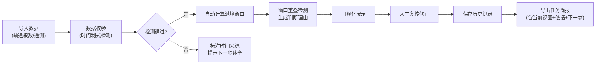

# 卫星过境窗口 - 产品需求文档

## 1. 产品概述

卫星过境窗口是一个基于Phaser的航天任务管理工具，用于可视化和管理卫星过境时间窗口。解决任务计划中窗口重叠留痕、时间制混用溯源、任务简报导出等核心问题，确保任务主任能够清晰查看决策依据和执行计划。

- 主要用途：卫星过境时间窗口的导入、可视化、复核、修正和导出
- 目标用户：任务主任、航天任务规划人员
- 核心价值：减少任务计划扯皮，提供完整审计轨迹，明确判断依据和下一步行动

## 2. 核心功能

### 2.1 用户角色

| 角色 | 注册方式 | 核心权限 |
|------|----------|----------|
| 任务规划人员 | 本地访问 | 导入数据、创建/编辑过境窗口、复核修正 |
| 任务主任 | 本地访问 | 查看任务简报、导出报告、审核判断依据 |

### 2.2 功能模块

1. **主界面**：过境时间轴可视化、窗口列表、筛选控制
2. **数据导入**：轨道根数/遥测片段导入、数据校验
3. **复核修正**：窗口重叠检测、冲突标注、手动调整
4. **历史记录**：操作日志、版本对比、回滚功能
5. **任务简报**：导出当前视图、包含判断依据和下一步行动

### 2.3 页面详情

| 页面名称 | 模块名称 | 功能描述 |
|----------|----------|----------|
| 主界面 | 时间轴视图 | Phaser渲染的交互式时间轴，支持缩放平移 |
| 主界面 | 过境窗口卡片 | 显示窗口基本信息、时间来源、冲突状态 |
| 主界面 | 筛选工具栏 | 按卫星、时间范围、状态筛选 |
| 导入面板 | 文件导入 | 支持JSON格式导入轨道根数和遥测数据 |
| 导入面板 | 数据校验 | 检测时间制式冲突，标注数据来源 |
| 复核面板 | 冲突检测 | 自动检测窗口重叠，显示判断理由 |
| 复核面板 | 手动修正 | 拖拽调整窗口、添加备注、标记处理状态 |
| 历史面板 | 操作日志 | 记录所有修改操作、修改人、时间戳 |
| 导出面板 | 任务简报 | 导出PDF/JSON，包含当前视图、判断依据、下一步 |

## 3. 核心流程

用户从导入卫星数据开始，系统自动校验时间制式和冲突，用户复核并修正窗口，最终导出任务简报。所有操作都记录在历史中，支持回溯和审计。

## 4. 用户界面设计

### 4.1 设计风格

- **主色调**：深空蓝 (#0a1628) 搭配科技青 (#00d4ff)，营造航天任务氛围
- **辅助色**：警告橙 (#ff9500)、危险红 (#ff3b30)、成功绿 (#34c759)
- **按钮风格**：直角科技感边框，悬停时有发光效果
- **字体**：标题使用 Orbitron（科技感），正文使用 Roboto Mono（等宽易读）
- **布局风格**：工业仪表盘风格，模块化分区，信息密度高但层次清晰
- **视觉元素**：网格背景、扫描线动效、状态指示灯

### 4.2 页面设计概览

| 页面名称 | 模块名称 | UI元素 |
|----------|----------|--------|
| 主界面 | 顶部导航 | 应用标题、筛选控件、导出按钮、历史入口 |
| 主界面 | 时间轴区域 | Phaser画布、时间刻度、过境窗口条、冲突标记 |
| 主界面 | 侧边面板 | 窗口详情、判断依据展示、操作按钮 |
| 主界面 | 底部状态栏 | 当前视图范围、数据来源统计、时间制式提示 |
| 导入弹窗 | 表单区域 | 文件上传区、数据预览、校验结果展示 |
| 导出弹窗 | 预览区域 | 任务简报预览、导出格式选择、导出按钮 |

### 4.3 响应式设计

- 桌面端优先（1920x1080+）：三栏布局，时间轴占主要区域
- 平板适配：两栏布局，侧边面板可折叠
- 时间轴画布自适应容器大小，保持交互可用性

### 4.4 Phaser场景设计

- **环境**：深色网格背景，模拟指挥中心控制台
- **光照**：霓虹发光效果，重要元素有光晕
- **相机**：支持缩放（滚轮）、平移（拖拽）、聚焦到冲突区域
- **交互元素**：
  - 过境窗口：可拖拽调整，悬停显示详情
  - 时间刻度：动态缩放时自动调整精度
  - 冲突标记：闪烁的警告图标，点击显示判断理由
- **动画**：窗口加载时的滑入效果、冲突检测时的扫描动画
