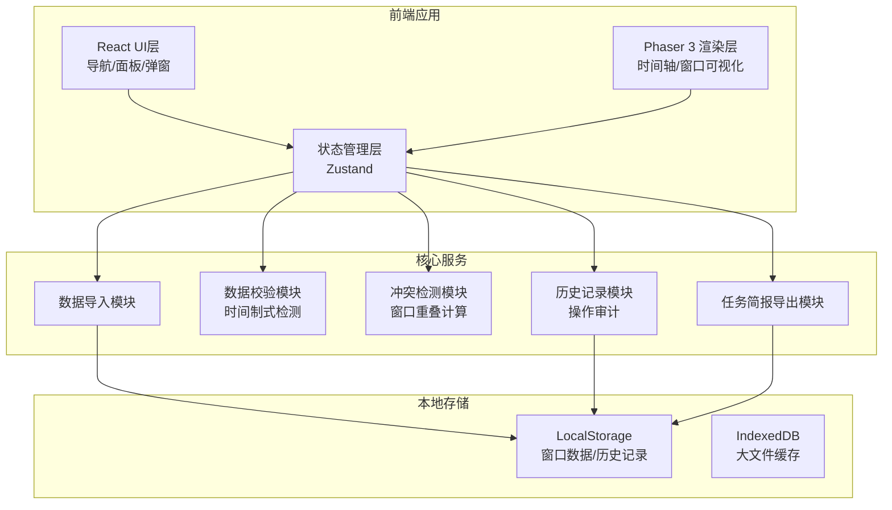
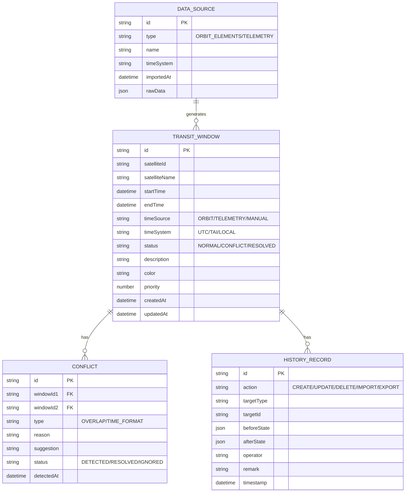

# 卫星过境窗口 - 技术架构文档

## 1. 架构设计



## 2. 技术描述

- **前端框架**：React@18 + TypeScript
- **构建工具**：Vite@5
- **样式方案**：TailwindCSS@3
- **游戏引擎**：Phaser@3.80
- **状态管理**：Zustand
- **本地存储**：LocalStorage + IndexedDB
- **导出功能**：jsPDF (PDF导出)
- **无后端架构**：纯前端应用，所有数据本地存储

## 3. 模块结构

```
src/
├── components/          # React组件
│   ├── Layout/         # 布局组件
│   ├── Toolbar/        # 工具栏
│   ├── SidePanel/      # 侧边详情面板
│   ├── Modal/          # 弹窗(导入/导出/历史)
│   └── StatusBar/      # 底部状态栏
├── phaser/             # Phaser相关
│   ├── scenes/         # 场景
│   │   └── TimelineScene.ts
│   ├── objects/        # 游戏对象
│   │   ├── TransitWindow.ts
│   │   ├── ConflictMarker.ts
│   │   └── TimeScale.ts
│   └── plugins/        # 插件
├── store/              # 状态管理
│   └── useAppStore.ts
├── services/           # 核心服务
│   ├── importService.ts
│   ├── validationService.ts
│   ├── overlapService.ts
│   ├── exportService.ts
│   └── historyService.ts
├── types/              # TypeScript类型
│   └── index.ts
├── utils/              # 工具函数
│   ├── timeUtils.ts
│   └── storage.ts
├── data/               # Mock数据
│   └── mockData.ts
├── App.tsx
└── main.tsx
```

## 4. 核心数据模型

### 4.1 数据定义



### 4.2 TypeScript类型定义

```typescript
// 时间来源类型
type TimeSource = 'ORBIT' | 'TELEMETRY' | 'MANUAL';

// 时间制式
type TimeSystem = 'UTC' | 'TAI' | 'LOCAL';

// 窗口状态
type WindowStatus = 'NORMAL' | 'CONFLICT' | 'RESOLVED';

// 冲突类型
type ConflictType = 'OVERLAP' | 'TIME_FORMAT_MIX';

// 冲突状态
type ConflictStatus = 'DETECTED' | 'RESOLVED' | 'IGNORED';

interface TransitWindow {
  id: string;
  satelliteId: string;
  satelliteName: string;
  startTime: string;
  endTime: string;
  timeSource: TimeSource;
  timeSystem: TimeSystem;
  status: WindowStatus;
  description: string;
  color: string;
  priority: number;
  dataSourceId?: string;
  createdAt: string;
  updatedAt: string;
}

interface Conflict {
  id: string;
  windowId1: string;
  windowId2?: string;
  type: ConflictType;
  reason: string;
  suggestion: string;
  nextStep: string;
  status: ConflictStatus;
  detectedAt: string;
  overlapDuration?: number;
}

interface HistoryRecord {
  id: string;
  action: 'CREATE' | 'UPDATE' | 'DELETE' | 'IMPORT' | 'EXPORT' | 'RESOLVE';
  targetType: 'WINDOW' | 'CONFLICT' | 'SETTINGS';
  targetId: string;
  beforeState: any;
  afterState: any;
  operator: string;
  remark: string;
  timestamp: string;
}

interface ViewState {
  startTime: string;
  endTime: string;
  zoom: number;
  panX: number;
  filters: {
    satellites: string[];
    statuses: WindowStatus[];
    timeSources: TimeSource[];
  };
}
```

## 5. 状态管理设计

### 5.1 Store 结构

```typescript
interface AppState {
  // 数据
  windows: TransitWindow[];
  conflicts: Conflict[];
  history: HistoryRecord[];
  dataSources: DataSource[];
  
  // 视图状态
  view: ViewState;
  selectedWindowId: string | null;
  selectedConflictId: string | null;
  
  // UI状态
  isImportModalOpen: boolean;
  isExportModalOpen: boolean;
  isHistoryModalOpen: boolean;
  isSidePanelOpen: boolean;
  
  // Actions
  setWindows: (windows: TransitWindow[]) => void;
  addWindow: (window: Omit<TransitWindow, 'id' | 'createdAt' | 'updatedAt'>) => void;
  updateWindow: (id: string, updates: Partial<TransitWindow>) => void;
  deleteWindow: (id: string) => void;
  
  importData: (data: ImportData) => Promise<ImportResult>;
  detectConflicts: () => void;
  resolveConflict: (conflictId: string, resolution: string) => void;
  
  setView: (view: Partial<ViewState>) => void;
  selectWindow: (id: string | null) => void;
  
  exportBriefing: (format: 'PDF' | 'JSON') => Promise<void>;
  
  persist: () => void;
  load: () => void;
}
```

## 6. 核心算法

### 6.1 窗口重叠检测算法

```typescript
function detectOverlaps(windows: TransitWindow[]): Conflict[] {
  const conflicts: Conflict[] = [];
  
  for (let i = 0; i < windows.length; i++) {
    for (let j = i + 1; j < windows.length; j++) {
      const w1 = windows[i];
      const w2 = windows[j];
      
      const overlapStart = Math.max(
        new Date(w1.startTime).getTime(),
        new Date(w2.startTime).getTime()
      );
      const overlapEnd = Math.min(
        new Date(w1.endTime).getTime(),
        new Date(w2.endTime).getTime()
      );
      
      if (overlapStart < overlapEnd) {
        const overlapDuration = overlapEnd - overlapStart;
        conflicts.push({
          id: generateId(),
          windowId1: w1.id,
          windowId2: w2.id,
          type: 'OVERLAP',
          reason: `窗口[${w1.satelliteName}]与[${w2.satelliteName}]发生重叠，重叠时长${formatDuration(overlapDuration)}`,
          suggestion: '建议调整其中一个窗口的时间，或根据优先级保留较高优先级窗口',
          nextStep: '请联系任务规划人员复核并调整窗口时间',
          status: 'DETECTED',
          detectedAt: new Date().toISOString(),
          overlapDuration
        });
      }
    }
  }
  
  return conflicts;
}
```

### 6.2 时间制式混合检测

```typescript
function detectTimeFormatMix(windows: TransitWindow[]): Conflict[] {
  const conflicts: Conflict[] = [];
  const timeSystems = new Set(windows.map(w => w.timeSystem));
  
  if (timeSystems.size > 1) {
    const mixedWindows = windows.filter(w => w.timeSource !== 'MANUAL');
    
    mixedWindows.forEach(window => {
      conflicts.push({
        id: generateId(),
        windowId1: window.id,
        type: 'TIME_FORMAT_MIX',
        reason: `检测到时间制式混合。当前窗口使用${window.timeSystem}，系统中存在${Array.from(timeSystems).join('/')}多种制式`,
        suggestion: `该时间数据来自${window.timeSource === 'ORBIT' ? '轨道根数' : '遥测片段'}，建议统一时间制式`,
        nextStep: `请联系${window.timeSource === 'ORBIT' ? '轨道计算人员' : '遥测接收人员'}确认并补全正确的时间数据`,
        status: 'DETECTED',
        detectedAt: new Date().toISOString()
      });
    });
  }
  
  return conflicts;
}
```

## 7. 本地存储方案

### 7.1 存储键定义

```typescript
const STORAGE_KEYS = {
  WINDOWS: 'satellite_transit_windows',
  CONFLICTS: 'satellite_transit_conflicts',
  HISTORY: 'satellite_transit_history',
  DATA_SOURCES: 'satellite_data_sources',
  VIEW_STATE: 'satellite_view_state',
  SETTINGS: 'satellite_app_settings'
};
```

### 7.2 数据持久化策略

- 自动保存：每次状态变更后延迟500ms写入LocalStorage
- 版本控制：数据结构版本号，支持迁移
- 容量限制：超过5MB时提示用户清理历史记录
- 导出备份：支持导出完整数据JSON文件
