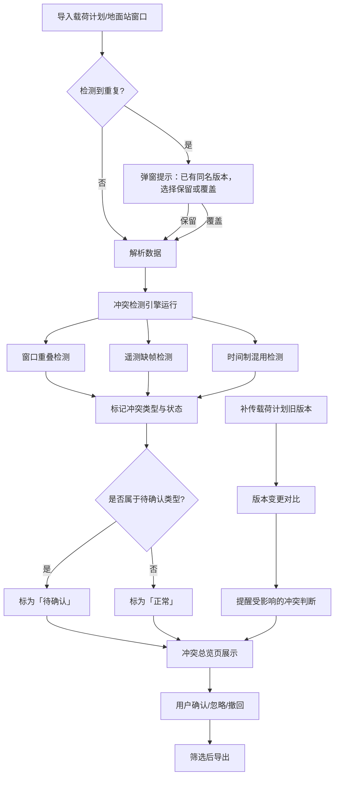

## 1. 产品概述

地面站资源冲突管理系统——面向航天任务一线操作人员，用于导入载荷计划与地面站窗口数据，自动检测窗口重叠、遥测缺帧、时间制混用等资源冲突，并提供人话错误提示、待确认标记、版本变更追踪、撤回修正、筛选导出等完整操作链路。解决现有任务计划软件在冲突检测时静默覆盖、提示不友好、无版本留底等痛点。

- 目标用户：航天任务一线调度人员、载荷计划管理员
- 核心价值：让冲突检测从"敢用"变为"愿意跑"，减少因漏判、误判导致的任务延误

## 2. 核心功能

### 2.1 用户角色

| 角色 | 注册方式 | 核心权限 |
|------|----------|----------|
| 调度员 | 管理员分配账号 | 导入数据、查看冲突、撤回修正、筛选导出 |
| 计划管理员 | 管理员分配账号 | 以上全部 + 载荷计划版本管理、确认待确认项 |

### 2.2 功能模块

1. **冲突总览页**：全局冲突状态仪表盘、最近变更提醒、待确认项计数
2. **数据导入页**：载荷计划导入、地面站窗口导入、重复导入检测与处理
3. **冲突检测页**：冲突列表、按类型/状态/站址筛选、冲突详情展开、人话错误提示
4. **版本追踪页**：载荷计划版本历史、变更对比、变更提醒

### 2.3 页面详情

| 页面名称 | 模块名称 | 功能描述 |
|----------|----------|----------|
| 冲突总览页 | 状态仪表盘 | 按冲突类型(窗口重叠/遥测缺帧/时间制混用)统计数量，按状态(正常/待确认/已确认)分组展示 |
| 冲突总览页 | 变更提醒栏 | 展示载荷计划版本变更后的差异提醒，标注哪些冲突判断发生了变化，不允许静默覆盖 |
| 冲突总览页 | 待确认项快捷入口 | 一键跳转到待确认冲突列表 |
| 数据导入页 | 载荷计划导入 | 上传JSON/CSV格式载荷计划，自动解析并检测重复，重复时弹窗提示已有版本，由用户选择保留或覆盖 |
| 数据导入页 | 地面站窗口导入 | 上传JSON/CSV格式地面站窗口数据，同样检测重复 |
| 数据导入页 | 导入历史 | 展示最近导入记录，支持撤回修正(回退到导入前状态) |
| 冲突检测页 | 冲突列表 | 表格展示所有冲突项，列：冲突类型、站址、时间窗口、状态、错误提示 |
| 冲突检测页 | 筛选器 | 按冲突类型、状态、站址、时间段筛选，筛选条件与导出动作口径一致 |
| 冲突检测页 | 人话错误提示 | 遥测缺帧→"该站XX时段遥测数据缺失3帧，可能影响下行解调，请确认"；时间制混用→"同一计划中UTC与BJT混用，XX条记录时间基准不一致"；窗口重叠→"站A的XX窗口与YY窗口重叠12分钟，请确认优先级" |
| 冲突检测页 | 导出 | 按当前筛选条件导出CSV，导出内容与页面展示一致，不遗漏筛选条件外的数据 |
| 冲突检测页 | 撤回修正 | 对单条冲突标记撤回，恢复到上一判断状态 |
| 版本追踪页 | 版本列表 | 展示载荷计划所有历史版本，标注导入时间、操作人 |
| 版本追踪页 | 变更对比 | 两个版本间逐条对比，高亮新增/删除/修改项 |
| 版本追踪页 | 变更影响提醒 | 补传旧版本时，提醒哪些冲突判断受影响(如"补传后3条窗口重叠判断结果已变更") |

## 3. 核心流程

**主流程**：用户导入载荷计划 → 系统自动检测重复 → 触发冲突检测引擎 → 结果按类型分类展示 → 遥测缺帧/时间制混用/窗口重叠标为"待确认" → 用户逐条确认或标记忽略 → 筛选后导出 → 若后续补传载荷计划旧版本，系统提醒变更内容。

**撤回流程**：用户在冲突列表点击"撤回" → 系统恢复到上一判断状态 → 冲突状态变回"待确认" → 变更记录保留。

## 4. 用户界面设计

### 4.1 设计风格

- 主色调：深空蓝(#0F172A) + 星白(#F8FAFC)，强调色用琥珀橙(#F59E0B)标注待确认项
- 按钮风格：圆角(8px)、中度阴影、hover时微抬升
- 字体：思源黑体/Noto Sans SC 作为正文，等宽字体展示时间戳
- 布局：左侧固定导航栏 + 右侧内容区，表格为主的数据展示
- 图标风格：线性图标(Lucide)

### 4.2 页面设计概览

| 页面名称 | 模块名称 | UI元素 |
|----------|----------|--------|
| 冲突总览页 | 状态仪表盘 | 三列统计卡片(窗口重叠/遥测缺帧/时间制混用)，数字大字+类型标签，待确认用琥珀橙高亮 |
| 冲突总览页 | 变更提醒栏 | 顶部横向滚动提醒条，带版本号和变更摘要，点击展开详情 |
| 冲突总览页 | 待确认快捷入口 | 琥珀色按钮，显示待确认数量徽标 |
| 数据导入页 | 导入区域 | 虚线拖拽上传区，支持JSON/CSV，上传后显示解析预览 |
| 数据导入页 | 导入历史 | 时间线列表，每条显示文件名、时间、操作人，撤回按钮红色 |
| 冲突检测页 | 冲突列表 | 表格行按状态着色(待确认-琥珀底、正常-白底、已忽略-灰底)，展开行显示人话提示 |
| 冲突检测页 | 筛选器 | 顶部多选下拉(类型、状态、站址) + 时间范围选择器 |
| 冲突检测页 | 导出按钮 | 表格右上角，筛选条件激活时按钮旁标注"按当前筛选导出" |
| 版本追踪页 | 版本列表 | 左侧版本时间线，右侧对比面板 |
| 版本追踪页 | 变更对比 | 左右双栏对比，新增绿底、删除红底、修改黄底高亮 |

### 4.3 响应式

- 桌面优先设计(1920×1080为主)
- 中屏(1366px)隐藏侧边栏为汉堡菜单
- 不做移动端适配(一线人员使用桌面终端)

### 4.4 3D场景

不适用
