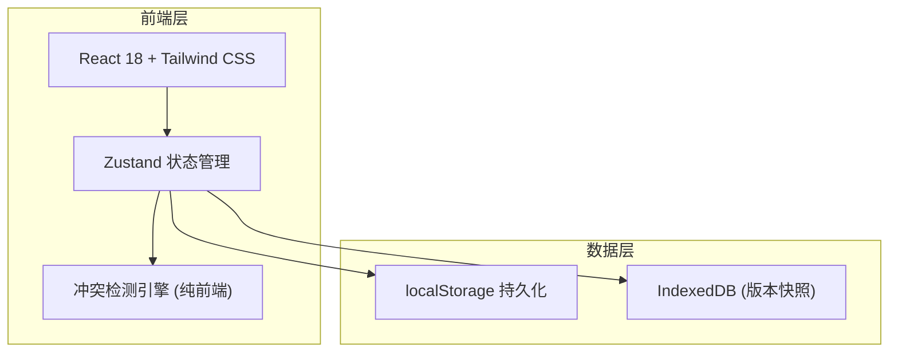
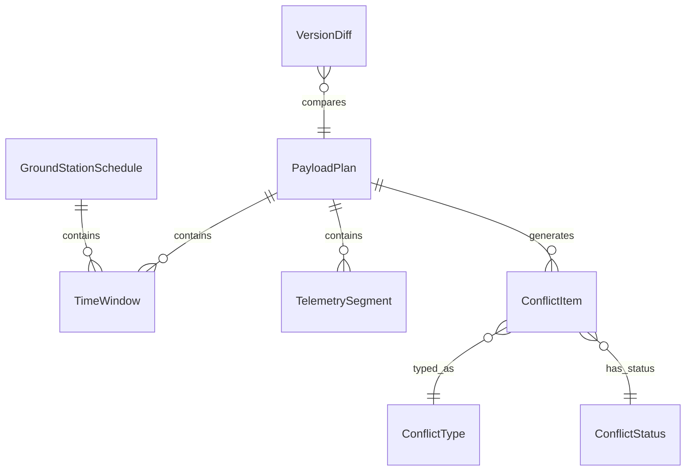

## 1. 架构设计



纯前端架构，无后端依赖。数据持久化使用 localStorage + IndexedDB，冲突检测引擎在前端运行。

## 2. 技术说明

- 前端：React@18 + Tailwind CSS@3 + Vite
- 初始化工具：vite-init
- 后端：无（纯前端应用）
- 数据库：localStorage + IndexedDB（浏览器端持久化）
- 状态管理：Zustand
- 路由：react-router-dom

## 3. 路由定义

| 路由 | 用途 |
|------|------|
| / | 冲突总览页 - 仪表盘、变更提醒、待确认快捷入口 |
| /import | 数据导入页 - 载荷计划与地面站窗口导入 |
| /conflicts | 冲突检测页 - 冲突列表、筛选、导出 |
| /versions | 版本追踪页 - 版本历史、变更对比、变更影响 |

## 4. API定义

无后端API，所有数据操作通过 Zustand store + localStorage/IndexedDB 完成。

### 4.1 核心数据类型

```typescript
type ConflictType = "window_overlap" | "telemetry_frame_drop" | "time_system_mixed";

type ConflictStatus = "pending" | "confirmed" | "ignored";

type TimeSystem = "UTC" | "BJT" | "UNKNOWN";

interface TimeWindow {
  id: string;
  stationName: string;
  startTime: string;
  endTime: string;
  timeSystem: TimeSystem;
}

interface TelemetrySegment {
  id: string;
  stationName: string;
  startTime: string;
  endTime: string;
  expectedFrames: number;
  actualFrames: number;
  timeSystem: TimeSystem;
}

interface PayloadPlan {
  id: string;
  name: string;
  version: string;
  importedAt: string;
  operator: string;
  windows: TimeWindow[];
  telemetrySegments: TelemetrySegment[];
}

interface GroundStationSchedule {
  id: string;
  name: string;
  importedAt: string;
  operator: string;
  windows: TimeWindow[];
}

interface ConflictItem {
  id: string;
  type: ConflictType;
  status: ConflictStatus;
  stationName: string;
  description: string;
  humanMessage: string;
  relatedWindowIds: string[];
  payloadPlanId: string;
  payloadPlanVersion: string;
  detectedAt: string;
  retractedFrom?: string;
  versionChanged?: boolean;
  versionChangeNote?: string;
}

interface VersionDiff {
  planId: string;
  oldVersion: string;
  newVersion: string;
  added: TimeWindow[];
  removed: TimeWindow[];
  modified: TimeWindow[];
  affectedConflictIds: string[];
  summary: string;
}
```

## 5. 服务端架构图

不适用（纯前端应用）

## 6. 数据模型

### 6.1 数据模型定义



### 6.2 存储方案

使用 localStorage 存储元数据和冲突结果，IndexedDB 存储载荷计划版本快照（支持大体积数据）。

- `gs_conflicts`: 冲突项列表
- `gs_plans`: 载荷计划摘要
- `gs_schedules`: 地面站窗口调度
- `gs_versions` (IndexedDB): 载荷计划完整版本快照
- `gs_import_history`: 导入历史记录

### 6.3 冲突检测引擎核心逻辑

1. **窗口重叠检测**：对同一站址的时间窗口按 startTime 排序，逐一检查相邻窗口是否有交集，有交集则生成冲突项，标为"待确认"
2. **遥测缺帧检测**：检查每条 TelemetrySegment 的 actualFrames < expectedFrames，缺帧则生成冲突项，标为"待确认"
3. **时间制混用检测**：对同一载荷计划内所有时间窗口和遥测段检查 timeSystem 是否一致，不一致则生成冲突项，标为"待确认"
4. **人话提示映射**：每种冲突类型有对应的模板，填充具体数据后生成 humanMessage
5. **版本变更检测**：补传载荷计划时，逐字段对比旧版本，生成 VersionDiff，关联受影响的 ConflictItem 并更新 versionChanged 标记
