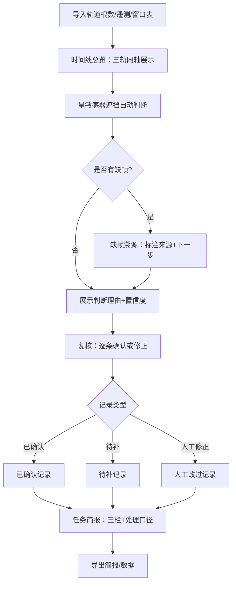

## 1. 产品概述

**星敏感器遮挡分析工具**——面向航天任务计划的一站式本地工具，将轨道根数、遥测片段和窗口表统一到同一条时间线上，自动识别星敏感器遮挡事件并给出判断理由，帮助任务主任快速掌握遮挡状况、溯源缺帧、下达处理口径。

- 目标用户：航天任务主任、测控分析人员
- 核心价值：消除三类数据分散查看的割裂感，让遮挡判断有据可查、缺帧不遗漏、简报可导出

## 2. 核心功能

### 2.1 用户角色

| 角色 | 进入方式 | 核心权限 |
|------|----------|----------|
| 任务主任 | 本地启动即用 | 查看、复核、修正、导出简报 |
| 测控分析员 | 本地启动即用 | 导入数据、查看时间线、标记待补 |

### 2.2 功能模块

1. **时间线总览页**：轨道根数 / 遥测片段 / 窗口表三轨道同轴展示，缩放平移
2. **数据导入页**：分别导入轨道根数（CSV/JSON）、遥测片段（CSV/JSON）、窗口表（CSV/JSON），导入后自动入库
3. **星敏感器遮挡分析页**：自动遮挡判断 + 判断理由展示 + 缺帧溯源（区分来源）+ 下一步建议
4. **复核与修正页**：对自动判断结果进行确认/修正，记录修改历史
5. **任务简报页**：生成任务简报，含处理口径；已确认 / 待补 / 人工改过三类记录分栏展示
6. **导出功能**：简报导出为 PDF / JSON，数据导出为 CSV

### 2.3 页面详情

| 页面名称 | 模块名称 | 功能描述 |
|----------|----------|----------|
| 时间线总览 | 三轨时间轴 | 轨道根数轨道、遥测片段轨道、窗口表轨道同轴对齐，时间轴可缩放平移 |
| 时间线总览 | 遮挡标记 | 在时间轴上叠加遮挡区间标记，点击查看判断理由 |
| 数据导入 | 轨道根数导入 | 上传 CSV/JSON，解析并存入 IndexedDB，校验字段完整性 |
| 数据导入 | 遥测片段导入 | 上传 CSV/JSON，解析并存入 IndexedDB，校验时间连续性，缺帧标注来源 |
| 数据导入 | 窗口表导入 | 上传 CSV/JSON，解析并存入 IndexedDB，校验窗口起止时间 |
| 星敏感器遮挡分析 | 自动判断 | 基于轨道根数几何+遥测数据自动判定遮挡，输出遮挡区间及原因 |
| 星敏感器遮挡分析 | 判断理由面板 | 每条遮挡结果展示：判断依据、数据来源、置信度 |
| 星敏感器遮挡分析 | 缺帧溯源 | 遥测缺帧时明确标注"来自轨道根数"或"来自遥测片段"，写明下一步找谁补 |
| 复核与修正 | 结果确认/修正 | 对自动判断逐条确认或人工修正，修正内容记入历史 |
| 复核与修正 | 修改历史 | 每次修正保留旧值、新值、修改人、修改时间 |
| 任务简报 | 处理口径 | 每条遮挡记录附处理口径（已确认/待补/人工改过） |
| 任务简报 | 分类分栏 | 已确认记录、待补记录、人工改过记录三栏分别展示 |
| 任务简报 | 导出 | 导出 PDF/JSON 简报，或 CSV 数据 |

## 3. 核心流程

用户启动工具后，先导入三类数据，系统在时间线总览上同轴展示；进入遮挡分析页查看自动判断结果及理由；对缺帧项溯源确认来源；在复核页逐条确认或修正；最后在任务简报页生成分栏简报并导出。

## 4. 用户界面设计

### 4.1 设计风格

- **主色调**：深空蓝 `#0B1426` 背景，辅以钢灰 `#1E293B`；强调色琥珀橙 `#F59E0B`（遮挡告警）、翠绿 `#10B981`（已确认）
- **按钮风格**：圆角 6px，扁平化，hover 微浮起
- **字体**：JetBrains Mono（数据/时间）、Noto Sans SC（正文/标题）
- **布局风格**：左侧导航栏 + 右侧内容区，卡片化内容块
- **图标**：lucide-react 线性图标

### 4.2 页面设计概览

| 页面名称 | 模块名称 | UI 元素 |
|----------|----------|----------|
| 时间线总览 | 三轨时间轴 | 深色背景水平时间轴，三条轨道纵列排列，遮挡区间用琥珀橙高亮，hover 弹出理由浮窗 |
| 时间线总览 | 缩放控制 | 底部缩放滑块 + 时间范围输入框 |
| 数据导入 | 上传区域 | 三个拖拽上传卡片，分别对应三类数据，上传后显示校验结果列表 |
| 星敏感器遮挡分析 | 遮挡结果列表 | 表格：遮挡区间、判断理由、数据来源、置信度、缺帧溯源列 |
| 星敏感器遮挡分析 | 理由详情面板 | 右侧抽屉：判断依据原文、几何示意图、缺帧来源说明、下一步操作 |
| 复核与修正 | 修正表单 | 行内编辑，修正后自动记录历史，历史列表在下方折叠展示 |
| 任务简报 | 三栏卡片 | 已确认（绿）、待补（橙）、人工改过（蓝）三栏，每条附处理口径标签 |
| 任务简报 | 导出按钮 | 顶部操作栏：导出 PDF / 导出 JSON / 导出 CSV |

### 4.3 响应式

- 桌面优先（1440px+），时间轴三轨纵向排列
- 平板（768-1440px）导航栏折叠为图标模式
- 不适配手机端（任务场景为桌面办公）

### 4.4 3D 场景

不涉及
