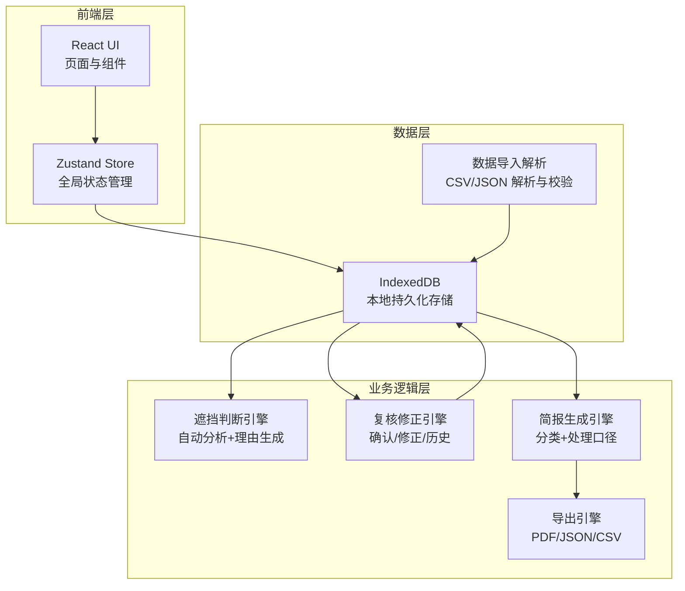
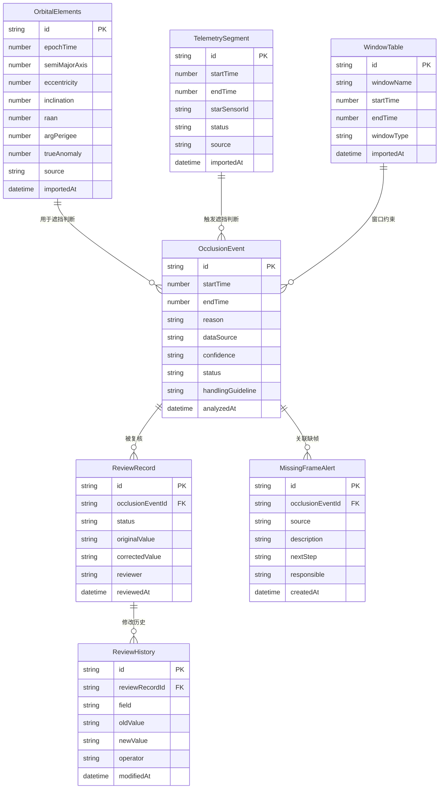

## 1. 架构设计

## 2. 技术说明

- **前端**：React@18 + TypeScript + Tailwind CSS@3 + Vite
- **初始化工具**：vite-init (react-ts 模板)
- **后端**：无（纯本地应用）
- **数据库**：IndexedDB（通过 idb 库操作）
- **状态管理**：Zustand
- **路由**：react-router-dom
- **图标**：lucide-react

## 3. 路由定义

| 路由 | 用途 |
|------|------|
| `/` | 重定向至时间线总览 |
| `/timeline` | 时间线总览页：三轨同轴展示 |
| `/import` | 数据导入页：轨道根数/遥测/窗口表导入 |
| `/analysis` | 星敏感器遮挡分析页：自动判断+理由+缺帧溯源 |
| `/review` | 复核与修正页：确认/修正/历史 |
| `/briefing` | 任务简报页：三栏分类+处理口径+导出 |

## 4. API 定义

无后端 API，所有数据操作通过 IndexedDB 本地完成。

## 5. 服务端架构

不涉及

## 6. 数据模型

### 6.1 数据模型定义

### 6.2 数据定义语言

IndexedDB 对象仓库（Object Store）定义：

- **orbital_elements**：轨道根数，索引 `epochTime`
- **telemetry_segments**：遥测片段，索引 `startTime`、`starSensorId`
- **window_tables**：窗口表，索引 `startTime`
- **occlusion_events**：遮挡事件，索引 `startTime`、`status`
- **missing_frame_alerts**：缺帧告警，索引 `occlusionEventId`、`source`
- **review_records**：复核记录，索引 `occlusionEventId`、`status`
- **review_history**：修改历史，索引 `reviewRecordId`
