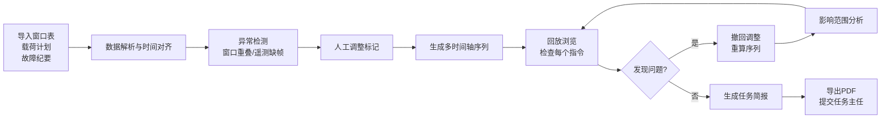

## 1. 产品概述

任务序列回放系统是航天任务联调前的辅助决策工具，针对载荷开机顺序临时调整后的校验需求，提供多时间轴统一回放、异常事件标注、人工调整撤回重算等核心能力，帮助任务团队快速核对窗口表、载荷计划与故障纪要的一致性。

- **核心目标**：解决联调前临时调整带来的计划核对效率低、异常发现不及时问题
- **目标用户**：任务调度人员、载荷主管、任务主任
- **产品价值**：将多源时间数据统一可视化，异常事件自动识别高亮，支持决策推演

## 2. 核心功能

### 2.1 用户角色

| 角色 | 核心权限 |
|------|----------|
| 任务调度员 | 导入数据、回放序列、标记人工调整、导出简报 |
| 载荷主管 | 查看载荷相关指令、核对开机顺序、标注冲突原因 |
| 任务主任 | 查看全局视图、审阅任务简报、确认调整方案 |

### 2.2 功能模块

1. **主控制台**：时间轴总览、播放控制、时间制式切换
2. **序列详情面板**：指令列表、事件详情、原因说明
3. **异常标注模块**：窗口重叠、遥测缺帧、人工插队三类异常高亮
4. **调整推演模块**：撤回人工调整、重算后续窗口、影响范围分析
5. **简报导出模块**：冲突分析、处理建议、PDF/Word导出

### 2.3 页面详情

| 页面名称 | 模块名称 | 功能描述 |
|----------|----------|----------|
| 主控制台 | 多时间轴视图 | UTC、北京时、相对任务时三轴同步显示，可缩放拖动 |
| 主控制台 | 播放控制 | 播放/暂停/倍速/步进控制，支持拖拽定位 |
| 主控制台 | 时间制式切换 | 一键切换主显示时间制式，其余两轴联动 |
| 序列详情 | 指令时间线 | 按时间顺序排列所有指令，显示载荷、类型、执行状态 |
| 序列详情 | 事件详情卡 | 点击指令显示完整信息：前置条件、依赖关系、调整历史 |
| 异常标注 | 窗口重叠检测 | 自动识别时间重叠窗口，红色边框标注，悬停显示冲突详情 |
| 异常标注 | 遥测缺帧标记 | 黄色虚线框标记数据缺失时段，显示缺失时长和影响范围 |
| 异常标注 | 人工插队标识 | 紫色角标标记人工插入指令，显示调整人和调整原因 |
| 调整推演 | 撤回操作 | 右键人工调整项可选择"撤回此次调整" |
| 调整推演 | 重算引擎 | 撤回后自动重排后续指令，计算窗口偏移量 |
| 调整推演 | 影响分析 | 高亮显示受影响的窗口，计算延误/提前时长 |
| 简报导出 | 冲突汇总 | 自动汇总所有冲突事件，分类统计数量和严重等级 |
| 简报导出 | 处理建议 | 根据冲突类型生成建议：合并窗口、调整顺序、延后执行等 |
| 简报导出 | 一键导出 | 支持导出为PDF格式，包含时间轴截图和详细分析 |

## 3. 核心流程

用户操作流程：
1. 导入三类数据源：窗口表、载荷计划、故障纪要
2. 系统自动解析并对齐时间轴，检测异常事件
3. 用户在时间轴上浏览回放，查看每个指令的安排原因
4. 发现不合适的人工调整，可撤回并触发重算
5. 系统分析影响范围，高亮显示受影响的窗口
6. 确认无误后，一键导出任务简报

## 4. 用户界面设计

### 4.1 设计风格

**航天测控专业风格**：
- **主色调**：深空蓝 `#0a192f` 作为背景，科技感强
- **辅助色**：
  - 正常指令：冷青色 `#64ffda`
  - 窗口重叠：警示红 `#ff6b6b`
  - 遥测缺帧：警告黄 `#ffd93d`
  - 人工调整：决策紫 `#a855f7`
- **字体**：
  - 标题：`JetBrains Mono` 等宽字体，强化专业感
  - 正文：`Noto Sans SC` 确保中文可读性
  - 时间数字：`Roboto Mono` 等宽数字字体
- **布局**：左侧指令列表 + 中央时间轴 + 右侧详情面板的三栏布局
- **视觉元素**：网格背景、扫描线效果、发光边框、数据流动画
- **按钮风格**：扁平直角，轻微发光效果，悬停时边框亮度提升

### 4.2 页面设计概述

| 页面名称 | 模块名称 | UI元素 |
|----------|----------|--------|
| 主控制台 | 顶部工具栏 | 导入按钮、时间制式切换、播放控制条、导出按钮 |
| 主控制台 | 时间轴区域 | 三条平行时间轴（UTC/北京时/相对时），指令块沿轴分布，颜色区分类型 |
| 主控制台 | 播放控制 | 大尺寸播放按钮、进度条、倍速选择（0.5x/1x/2x/4x）、步进按钮 |
| 序列详情 | 左侧指令列表 | 可滚动列表，每项显示时间、载荷图标、指令名称、异常标签 |
| 序列详情 | 右侧详情卡 | 半透明毛玻璃效果，显示指令完整信息、调整历史、依赖关系图 |
| 异常标注 | 异常标记 | 不同颜色边框 + 角标 + 悬停tooltip，点击展开冲突详情 |
| 调整推演 | 右键菜单 | 深色背景菜单，"撤回此次调整"选项带紫色图标 |
| 调整推演 | 重算动画 | 指令块平滑移动，受影响区域闪烁提示，进度条显示重算过程 |
| 简报导出 | 预览模态框 | 居中弹窗，左侧目录导航，右侧内容预览，底部导出按钮 |

### 4.3 响应式设计

- **桌面优先**：1920px及以上为最优体验，三栏布局完整显示
- **平板适配**：1024px-1920px，左右面板可折叠收起
- **移动适配**：1024px以下，改为上下布局，通过Tab切换不同视图
- **触摸优化**：时间轴支持双指缩放，滑动拖动，长按显示详情

### 4.4 动效设计

- **页面加载**：时间轴从左到右渐入，指令块逐个浮现，带轻微的扫描线效果
- **回放动画**：当前时间指示器发光扫描，正在执行的指令块亮度提升
- **异常检测**：异常标记脉动闪烁，首次出现时有从小到大的弹性动画
- **撤回重算**：被撤回的指令淡出消失，后续指令平滑滑动到新位置，受影响区域有波纹扩散效果
- **悬停交互**：指令块悬停时轻微上浮，边框发光增强，显示快捷操作按钮
