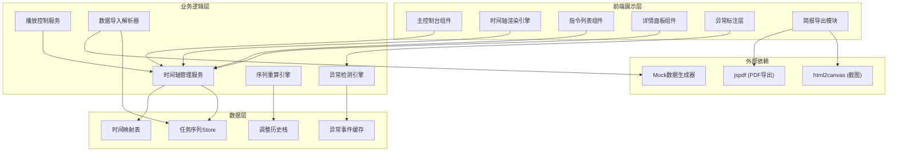
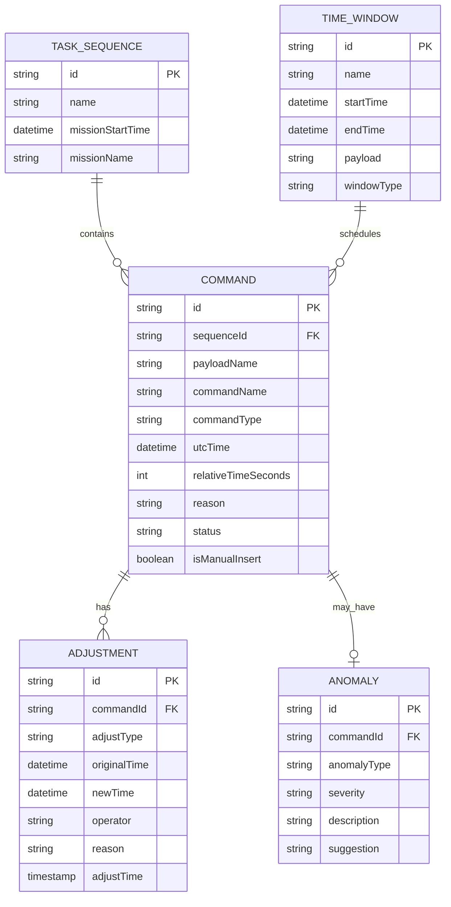

## 1. 架构设计



## 2. 技术描述

- **前端框架**：React@18 + TypeScript
- **构建工具**：Vite@5
- **样式方案**：TailwindCSS@3
- **状态管理**：Zustand (轻量级，适合复杂时间状态管理)
- **动画库**：Framer Motion (流畅的时间轴动画)
- **后端服务**：无（纯前端应用，使用Mock数据）
- **数据存储**：LocalStorage 持久化回放进度
- **导出工具**：html2canvas + jspdf

## 3. 路由定义

| 路由 | 页面名称 | 功能 |
|------|----------|------|
| `/` | 主控制台 | 核心回放界面，包含时间轴、指令列表、详情面板 |
| `/briefing` | 简报预览 | 任务简报预览和导出页面 |

## 4. 数据模型

### 4.1 核心数据结构



### 4.2 TypeScript 类型定义

```typescript
// 时间制式
type TimeFormat = 'UTC' | 'BEIJING' | 'RELATIVE';

// 指令类型
type CommandType = 'POWER_ON' | 'POWER_OFF' | 'CONFIG' | 'DATA_TRANSFER' | 'CALIBRATION';

// 异常类型
type AnomalyType = 'WINDOW_OVERLAP' | 'TELEMETRY_MISSING' | 'MANUAL_INSERT';

// 严重等级
type Severity = 'CRITICAL' | 'WARNING' | 'INFO';

interface TimePoint {
  utc: Date;
  beijing: Date;
  relativeSeconds: number;
}

interface Command {
  id: string;
  sequenceId: string;
  payloadName: string;
  commandName: string;
  commandType: CommandType;
  time: TimePoint;
  durationSeconds: number;
  reason: string;
  prerequisites: string[];
  status: 'SCHEDULED' | 'EXECUTING' | 'COMPLETED' | 'SKIPPED';
  isManualInsert: boolean;
  adjustments: Adjustment[];
  anomaly?: Anomaly;
}

interface TimeWindow {
  id: string;
  name: string;
  startTime: TimePoint;
  endTime: TimePoint;
  payload: string;
  windowType: string;
  commands: string[];
}

interface Adjustment {
  id: string;
  commandId: string;
  adjustType: 'INSERT' | 'MOVE' | 'DELETE';
  originalTime?: TimePoint;
  newTime: TimePoint;
  operator: string;
  reason: string;
  adjustTime: Date;
}

interface Anomaly {
  id: string;
  commandId: string;
  anomalyType: AnomalyType;
  severity: Severity;
  title: string;
  description: string;
  suggestion: string;
  relatedCommands: string[];
}

interface TaskSequence {
  id: string;
  name: string;
  missionName: string;
  missionStartTime: Date;
  commands: Command[];
  windows: TimeWindow[];
  adjustments: Adjustment[];
}
```

## 5. 模块划分

### 5.1 目录结构

```
src/
├── components/
│   ├── timeline/           # 时间轴组件
│   │   ├── Timeline.tsx    # 主时间轴
│   │   ├── TimeAxis.tsx    # 单条时间轴
│   │   ├── CommandBlock.tsx # 指令块
│   │   └── AnomalyMarker.tsx # 异常标记
│   ├── controls/           # 播放控制组件
│   │   ├── PlaybackControls.tsx
│   │   └── TimeFormatSwitch.tsx
│   ├── command-list/       # 指令列表
│   │   ├── CommandList.tsx
│   │   └── CommandItem.tsx
│   ├── detail-panel/       # 详情面板
│   │   ├── DetailPanel.tsx
│   │   └── AdjustmentHistory.tsx
│   └── briefing/           # 简报导出
│       ├── BriefingPreview.tsx
│       └── ExportButton.tsx
├── store/                  # 状态管理
│   ├── useSequenceStore.ts
│   └── usePlaybackStore.ts
├── services/               # 业务逻辑
│   ├── timeService.ts      # 时间转换服务
│   ├── anomalyDetector.ts  # 异常检测引擎
│   ├── recalculator.ts     # 序列重算引擎
│   └── dataImporter.ts     # 数据导入解析
├── hooks/                  # 自定义Hooks
│   ├── useTimeline.ts
│   └── usePlayback.ts
├── types/                  # 类型定义
│   └── index.ts
├── mock/                   # Mock数据
│   └── sampleData.ts
├── utils/                  # 工具函数
│   ├── timeUtils.ts
│   └── exportUtils.ts
└── App.tsx
```

### 5.2 核心服务说明

#### 时间转换服务 (timeService.ts)
- 负责UTC、北京时、相对任务时三者之间的相互转换
- 维护时间映射表，确保三轴同步
- 提供时间格式化、时区计算等工具方法

#### 异常检测引擎 (anomalyDetector.ts)
- **窗口重叠检测**：遍历时间窗口，检测时间范围重叠
- **遥测缺帧检测**：分析指令间隔，标记异常空白时段
- **人工调整识别**：标记所有isManualInsert为true的指令
- 为每个异常生成处理建议

#### 序列重算引擎 (recalculator.ts)
- 维护调整历史栈，支持undo操作
- 撤回调整后，重新计算所有后续指令的时间
- 分析影响范围，标记受影响的指令和窗口
- 计算时间偏移量，生成重算报告

#### 数据导入解析器 (dataImporter.ts)
- 解析窗口表、载荷计划、故障纪要三类数据
- 统一数据格式，对齐时间基准
- 生成完整的任务序列数据结构

## 6. 关键技术实现

### 6.1 时间轴渲染
- 使用Canvas或SVG绘制三条平行时间轴
- 指令块使用绝对定位，根据时间计算x坐标
- 支持缩放（改变时间分辨率）和拖动（平移时间范围）
- 帧率控制，确保大量指令时仍保持流畅

### 6.2 播放控制
- 使用requestAnimationFrame实现平滑播放
- 支持倍速播放（0.5x, 1x, 2x, 4x）
- 播放进度与时间轴指示器联动
- 支持键盘快捷键控制（空格播放/暂停，左右箭头步进）

### 6.3 异常标注
- 三种异常使用不同的视觉样式：
  - 窗口重叠：红色实线边框 + 脉冲动画
  - 遥测缺帧：黄色虚线边框 + 条纹背景
  - 人工调整：紫色角标 + 图标标记
- 悬停显示tooltip，点击展开详情

### 6.4 撤回重算
- 维护调整历史栈，记录每次调整的完整状态
- 撤回时从栈中弹出上一次调整
- 使用Framer Motion实现指令块平滑移动动画
- 重算完成后显示影响分析报告

### 6.5 简报导出
- 使用html2canvas捕获时间轴截图
- 使用jspdf生成PDF文档
- 自动生成冲突分析和处理建议文本
- 包含任务基本信息、异常汇总、调整历史
