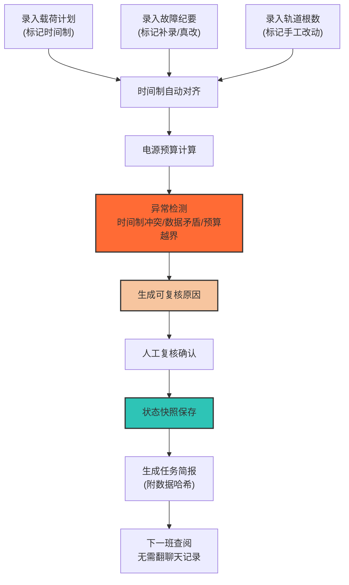

## 1. 产品概述
电源预算日历是面向航天器载荷、测控和总体调度人员的专业工具，解决多源数据（载荷计划、故障纪要、轨道根数）在时间制混用场景下的电源预算计算可信度问题。核心目标是让每一笔电源开销可追溯、可复核，下一班交接时无需翻查聊天记录。

- 主要用途：航天器每日电源预算编制、状态复核、异常追溯、交接班简报
- 解决问题：时间制混用导致数据对齐困难、历史改动追溯不清、补材料与真修改混淆
- 目标用户：载荷工程师、测控工程师、总体调度人员
- 产品价值：消除时间制争议、建立改动审计链、保证跨班次信息一致性

## 2. 核心功能

### 2.1 用户角色
| 角色 | 注册方式 | 核心权限 |
|------|----------|----------|
| 数据录入员 | 本地登录 | 录入载荷计划、故障纪要、轨道根数 |
| 复核人员 | 本地登录 | 查看历史状态、异常原因、导出简报 |
| 调度人员 | 本地登录 | 时间制切换、数据融合、生成交接班简报 |

### 2.2 功能模块
1. **数据录入页**：三源数据录入（载荷计划、故障纪要、轨道根数），每条记录标记"补材料"或"真修改"
2. **日历视图页**：按日展示电源预算状态，支持时间轴回溯，每笔数据显示时间制标签
3. **异常分析页**：自动检测时间制混用冲突、数据前后不一致、预算越界，每条异常附可复核原因
4. **任务简报页**：生成纯文本交接简报，包含修改轨迹、异常清单、待复核项

### 2.3 页面详情
| 页面名称 | 模块名称 | 功能描述 |
|---------|---------|---------|
| 数据录入页 | 载荷计划录入 | 支持UTC/TAI/北京时间三种时间制，标记计划类型（常规/提前/推迟） |
| 数据录入页 | 故障纪要录入 | 记录故障时间、影响时长、电源消耗增量，区分"故障发生"与"纪要补录" |
| 数据录入页 | 轨道根数录入 | 支持手工改动标记，记录改动前后数值对比 |
| 数据录入页 | 数据标签系统 | 每条记录强制标记：[补材料]/[真修改]，附操作人、时间戳 |
| 日历视图页 | 日电源预算卡 | 显示当日总预算、实际消耗、余量、数据来源标签 |
| 日历视图页 | 时间轴回溯 | 可滑动查看任意历史时刻的预算状态，显示当时所有生效数据 |
| 日历视图页 | 时间制切换 | 一键切换UTC/TAI/北京时间显示，所有数据自动换算并标注原时间制 |
| 日历视图页 | 改动痕迹展示 | 每笔数据悬停显示修改历史：修改人、修改时间、修改内容、原因 |
| 异常分析页 | 冲突检测列表 | 时间制混用风险、数据前后矛盾、预算越界告警 |
| 异常分析页 | 原因解释面板 | 每条异常自动生成可复核原因：涉及数据、计算公式、判定依据 |
| 异常分析页 | 复核确认 | 支持人工确认异常、标注处理结果、记录复核人 |
| 任务简报页 | 简报生成器 | 纯文本格式，包含：当日预算汇总、异常清单、修改轨迹、待办事项 |
| 任务简报页 | 导出一致性保证 | 导出时自动记录快照哈希，保证简报内容与当时系统状态完全一致 |

## 3. 核心流程

**主要工作流：数据录入 → 时间制对齐 → 预算计算 → 异常检测 → 状态确认 → 简报导出**

**状态回看流程：**

## 4. 用户界面设计

### 4.1 设计风格
- **整体风格**：工业级控制台风格，深色主题，高信息密度，少装饰重功能
- **主色调**：深空灰 `#0f1419` 背景，工程蓝 `#1e5f8a` 主色，警示橙 `#ff6b35` 异常标记，确认绿 `#2ec4b6` 正常状态
- **字体**：等宽字体 `JetBrains Mono` 用于数据展示，保证数字对齐；`Noto Sans SC` 用于中文说明
- **布局**：固定左侧导航 + 右侧内容区，卡片式模块划分，严格的栅格对齐
- **交互**：无多余动效，仅在状态变化时用颜色闪烁提示，悬停显示详细溯源信息

### 4.2 页面设计概览
| 页面名称 | 模块名称 | UI 元素 |
|---------|---------|---------|
| 数据录入页 | 三源录入表单 | 时间制下拉框、数据类型标签（补材料/真修改）、数值输入、原因文本框 |
| 日历视图页 | 日历网格 | 每日卡片显示预算数值、状态指示灯、异常标记角标 |
| 日历视图页 | 时间回溯滑块 | 底部横向滑块，显示关键时间节点标记 |
| 异常分析页 | 异常列表 | 每行显示异常类型、涉及数据、可复核原因、确认状态 |
| 异常分析页 | 原因详情面板 | 右侧展开面板，显示计算公式、原始数据、判定逻辑 |
| 任务简报页 | 纯文本预览 | 等宽字体展示，带行号，关键信息高亮 |
| 任务简报页 | 导出操作区 | 复制按钮、下载按钮、哈希校验值显示 |

### 4.3 响应式
- 桌面端优先设计，保证1920px宽屏下信息密度
- 平板端自适应栅格列数，保证核心数据可见
- 移动端仅支持查看简报和异常列表，不支持数据录入

### 4.4 关键视觉特征
- **时间制标签**：UTC=蓝色边框、TAI=绿色边框、北京时间=橙色边框，所有数据始终显示原时间制标签
- **改动标记**：补材料记录用虚线边框+浅色填充，真修改记录用实线边框+正常填充
- **状态指示灯**：正常=绿色圆点、异常=橙色闪烁、待复核=黄色脉动、已确认=绿色实心
- **数据溯源**：悬停任意数据显示浮动卡片，包含完整操作链：录入人→修改人→复核人→时间戳→原因
