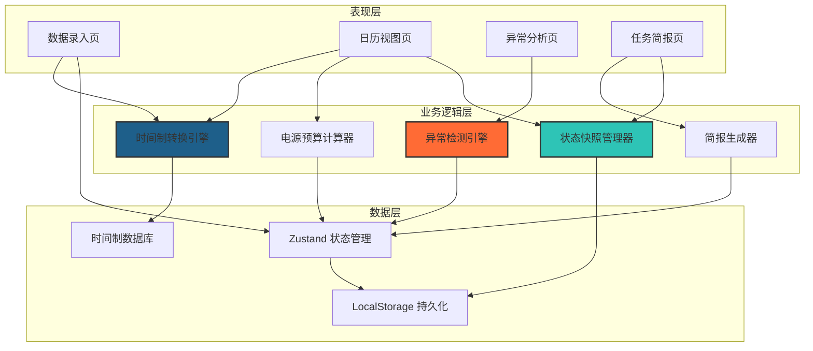

## 1. 架构设计

本应用为纯前端专业工具，采用分层架构设计，核心是时间制转换引擎和状态快照管理。



## 2. 技术描述

- **前端框架**：React@18 + TypeScript@5 + Vite@5
- **状态管理**：Zustand@4（轻量、可追溯，支持时间旅行调试）
- **样式方案**：TailwindCSS@3
- **路由**：React Router DOM@6
- **图标**：Lucide React
- **数据持久化**：LocalStorage（带版本号和哈希校验）
- **初始化工具**：vite-init
- **后端**：无（纯前端应用，所有数据本地存储）
- **数据库**：无（使用 Zustand + LocalStorage 实现数据持久化）

### 技术选型理由
1. **Zustand**：轻量无 Provider 嵌套，支持状态订阅和中间件，便于实现状态快照和回溯
2. **纯前端架构**：工具类应用无需后端，降低部署复杂度，数据安全可控
3. **LocalStorage + 哈希校验**：保证导出数据的一致性和可验证性
4. **TailwindCSS**：工业级控制台风格需要精细的样式控制，工具类CSS效率更高

## 3. 路由定义

| 路由 | 页面组件 | 功能说明 |
|------|---------|---------|
| `/` | 重定向到 `/calendar` | 默认入口 |
| `/calendar` | CalendarPage | 日历视图页，电源预算总览和状态回溯 |
| `/entry` | DataEntryPage | 数据录入页，三源数据录入和标签管理 |
| `/anomaly` | AnomalyPage | 异常分析页，冲突检测和原因解释 |
| `/briefing` | BriefingPage | 任务简报页，生成和导出交接班简报 |

## 4. 数据模型

### 4.1 核心数据结构

```mermaid
erDiagram
    PAYLOAD_PLAN {
        string id PK
        string name
        string timeSystem "UTC|TAI|BEIJING"
        datetime startTime
        datetime endTime
        number powerConsumption "W"
        string planType "NORMAL|ADVANCED|DELAYED"
        string recordType "SUPPLEMENT|REAL_CHANGE"
        string operator
        datetime createdAt
        string remark
    }
    
    FAULT_RECORD {
        string id PK
        string description
        string timeSystem "UTC|TAI|BEIJING"
        datetime faultTime
        number duration "min"
        number powerIncrement "W"
        string recordType "FAULT_OCCUR|SUPPLEMENT"
        string operator
        datetime createdAt
        string remark
    }
    
    ORBIT_ELEMENT {
        string id PK
        string parameterName
        string timeSystem "UTC|TAI|BEIJING"
        datetime effectiveTime
        number oldValue
        number newValue
        boolean isManualChange
        string recordType "SUPPLEMENT|REAL_CHANGE"
        string operator
        datetime createdAt
        string remark
    }
    
    DAILY_BUDGET {
        string id PK
        date date
        number totalBudget "Wh"
        number actualConsumption "Wh"
        number margin "Wh"
        string status "NORMAL|WARNING|ERROR"
        string timeSystem "UTC|TAI|BEIJING"
        datetime snapshotTime
        string hash
    }
    
    STATE_SNAPSHOT {
        string id PK
        datetime timestamp
        string hash
        text payloadData
        text faultData
        text orbitData
        string operator
        string description
    }
    
    ANOMALY {
        string id PK
        string type "TIME_CONFLICT|DATA_INCONSISTENCY|BUDGET_OVERRUN"
        string severity "WARNING|ERROR"
        string description
        text reason "可复核原因，JSON格式"
        string[] relatedRecordIds
        string status "PENDING|CONFIRMED|RESOLVED"
        string reviewer
        datetime createdAt
        datetime reviewedAt
        string reviewRemark
    }
    
    AUDIT_LOG {
        string id PK
        string recordType "PAYLOAD|FAULT|ORBIT"
        string recordId
        string action "CREATE|UPDATE|DELETE"
        string operator
        datetime timestamp
        text oldValue
        text newValue
        string reason
    }
```



### 4.2 关键数据类型定义（TypeScript）

```typescript
// 时间制类型
type TimeSystem = 'UTC' | 'TAI' | 'BEIJING';

// 记录类型：补材料 / 真修改
type RecordType = 'SUPPLEMENT' | 'REAL_CHANGE';

// 状态
type BudgetStatus = 'NORMAL' | 'WARNING' | 'ERROR';
type AnomalyStatus = 'PENDING' | 'CONFIRMED' | 'RESOLVED';
type AnomalyType = 'TIME_CONFLICT' | 'DATA_INCONSISTENCY' | 'BUDGET_OVERRUN';
type AnomalySeverity = 'WARNING' | 'ERROR';

// 载荷计划
interface PayloadPlan {
  id: string;
  name: string;
  timeSystem: TimeSystem;
  startTime: string;
  endTime: string;
  powerConsumption: number;
  planType: 'NORMAL' | 'ADVANCED' | 'DELAYED';
  recordType: RecordType;
  operator: string;
  createdAt: string;
  remark: string;
}

// 故障纪要
interface FaultRecord {
  id: string;
  description: string;
  timeSystem: TimeSystem;
  faultTime: string;
  duration: number;
  powerIncrement: number;
  recordType: RecordType | 'FAULT_OCCUR';
  operator: string;
  createdAt: string;
  remark: string;
}

// 轨道根数
interface OrbitElement {
  id: string;
  parameterName: string;
  timeSystem: TimeSystem;
  effectiveTime: string;
  oldValue: number;
  newValue: number;
  isManualChange: boolean;
  recordType: RecordType;
  operator: string;
  createdAt: string;
  remark: string;
}

// 异常原因（可复核）
interface AnomalyReason {
  formula: string;
  rawData: Array<{
    source: string;
    value: number | string;
    time: string;
    timeSystem: TimeSystem;
  }>;
  criteria: string;
  calculationSteps: string[];
  conclusion: string;
}

// 状态快照
interface StateSnapshot {
  id: string;
  timestamp: string;
  hash: string;
  payloadData: string;
  faultData: string;
  orbitData: string;
  operator: string;
  description: string;
}

// 审计日志
interface AuditLog {
  id: string;
  recordType: 'PAYLOAD' | 'FAULT' | 'ORBIT';
  recordId: string;
  action: 'CREATE' | 'UPDATE' | 'DELETE';
  operator: string;
  timestamp: string;
  oldValue: string;
  newValue: string;
  reason: string;
}
```

## 5. 核心模块设计

### 5.1 时间制转换引擎 (`src/utils/timeConverter.ts`)
- UTC ↔ TAI 转换（TAI = UTC + 37秒，截至2024年）
- UTC ↔ 北京时间（UTC + 8小时）
- 所有时间内部存储为 ISO 格式 UTC 时间
- 展示时按用户选择的时间制转换，始终标注原始时间制

### 5.2 电源预算计算器 (`src/utils/budgetCalculator.ts`)
- 按日归集所有载荷电源消耗
- 叠加故障电源增量
- 根据轨道根数计算阴影期影响（简化模型）
- 计算日预算、实际消耗、余量

### 5.3 异常检测引擎 (`src/utils/anomalyDetector.ts`)
- 时间制冲突检测：相邻记录时间制不一致且无转换说明
- 数据不一致检测：同一时段存在矛盾的载荷计划
- 预算越界检测：实际消耗 > 预算阈值
- 每条异常生成结构化的可复核原因

### 5.4 状态快照管理器 (`src/utils/snapshotManager.ts`)
- 生成状态快照（JSON序列化所有数据）
- 计算 SHA-256 哈希用于一致性校验
- 支持按时间点恢复快照
- 快照用于任务简报导出时的一致性保证

### 5.5 简报生成器 (`src/utils/briefingGenerator.ts`)
- 纯文本格式，等宽字体排版
- 包含：预算汇总、异常清单、修改轨迹、待办事项
- 附数据哈希，保证导出内容可验证
- 支持复制到剪贴板和下载为 .txt 文件

## 6. 状态管理设计（Zustand Store）

```typescript
interface PowerBudgetState {
  // 数据
  payloadPlans: PayloadPlan[];
  faultRecords: FaultRecord[];
  orbitElements: OrbitElement[];
  anomalies: Anomaly[];
  snapshots: StateSnapshot[];
  auditLogs: AuditLog[];
  
  // UI 状态
  currentDate: string;
  displayTimeSystem: TimeSystem;
  selectedSnapshotId: string | null;
  
  // 操作
  addPayloadPlan: (plan: Omit<PayloadPlan, 'id' | 'createdAt'>) => void;
  updatePayloadPlan: (id: string, plan: Partial<PayloadPlan>) => void;
  deletePayloadPlan: (id: string, reason: string) => void;
  
  addFaultRecord: (record: Omit<FaultRecord, 'id' | 'createdAt'>) => void;
  updateFaultRecord: (id: string, record: Partial<FaultRecord>) => void;
  deleteFaultRecord: (id: string, reason: string) => void;
  
  addOrbitElement: (element: Omit<OrbitElement, 'id' | 'createdAt'>) => void;
  updateOrbitElement: (id: string, element: Partial<OrbitElement>) => void;
  deleteOrbitElement: (id: string, reason: string) => void;
  
  // 业务操作
  runAnomalyDetection: () => Anomaly[];
  createSnapshot: (operator: string, description: string) => StateSnapshot;
  loadSnapshot: (snapshotId: string) => void;
  confirmAnomaly: (id: string, reviewer: string, remark: string) => void;
  generateBriefing: (date: string) => { content: string; hash: string };
  
  // 持久化
  saveToLocalStorage: () => void;
  loadFromLocalStorage: () => void;
}
```

## 7. Mock 数据

为了演示功能，预置以下 Mock 数据：
- 7天的载荷计划数据（含部分提前/推迟计划）
- 3条故障纪要（含1条补录记录）
- 2条轨道根数手工改动
- 若干异常记录用于演示检测功能
- 2个历史状态快照用于演示回溯功能
