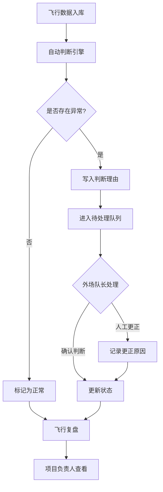
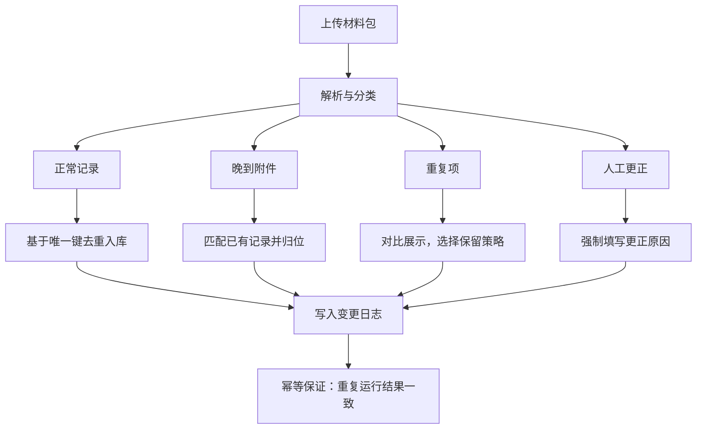

## 1. 产品概述

电力杆塔巡检系统是一套面向输电线路无人机巡检场景的全流程管理平台，解决外场巡检数据"进不来、理不清、对不上"的核心痛点。系统自动完成禁飞区擦边判断、重复项合并、晚到附件归位和人工更正留痕，确保每条记录的判断理由和下一步操作清晰可追溯——外场队长留痕防扯皮，项目负责人直看飞行复盘。

- 目标用户：外场巡检队长（关注过程留痕与异常处理）、项目负责人（关注飞行复盘与决策依据）、数据管理员（关注批量导入与数据质量）
- 市场价值：将巡检数据从"人工口头对账"升级为"系统自动判别+全链路留痕"，减少返工和扯皮，提升巡检效率 30%+

## 2. 核心功能

### 2.1 用户角色

| 角色 | 注册方式 | 核心权限 |
|------|----------|----------|
| 外场队长 | 管理员分配 | 查看巡检记录、处理异常、确认判断理由、导出复盘 |
| 项目负责人 | 管理员分配 | 查看飞行复盘、审批异常处理、导出报告 |
| 数据管理员 | 管理员分配 | 批量导入数据、处理重复项/晚到附件、人工更正 |

### 2.2 功能模块

1. **仪表盘**：巡检概览统计、异常告警、待处理任务队列
2. **巡检记录**：记录列表、筛选条件、批量操作、判断理由展示
3. **记录详情**：完整留痕链、附件管理、判断引擎输出、下一步建议
4. **数据导入**：上传材料包、自动解析、重复检测、晚到归位、人工更正
5. **飞行复盘**：汇总视图、条件筛选、一键导出、屏幕与导出一致性

### 2.3 页面详情

| 页面名称 | 模块名称 | 功能描述 |
|----------|----------|----------|
| 仪表盘 | 统计卡片区 | 今日巡检数、异常率、待处理数、禁飞区擦边次数 |
| 仪表盘 | 异常告警列表 | 最近24h异常事件，含判断理由摘要，可点击跳转详情 |
| 仪表盘 | 待处理任务 | 按优先级排列的待确认/待处理任务队列 |
| 巡检记录 | 筛选栏 | 按日期、杆塔编号、巡检状态、异常类型筛选 |
| 巡检记录 | 记录列表 | 分页展示，每条显示判断结果、理由摘要、状态标签 |
| 巡检记录 | 批量操作栏 | 批量确认、批量导出、批量标记处理 |
| 记录详情 | 留痕时间线 | 按时间顺序展示所有判断、更正、附件变更事件 |
| 记录详情 | 判断理由面板 | 每条自动判断显示：触发规则、匹配数据、判断结论、建议下一步 |
| 记录详情 | 附件区 | 原始附件+晚到附件，标注来源和时间 |
| 记录详情 | 人工更正区 | 更正历史记录，含更正人、时间、原因、前后对比 |
| 数据导入 | 上传区 | 拖拽上传材料包（zip/json/csv），显示解析进度 |
| 数据导入 | 解析结果预览 | 自动分类：正常记录、晚到附件、重复项、待人工确认 |
| 数据导入 | 重复处理面板 | 重复项对比，选择保留/合并/丢弃，操作留痕 |
| 数据导入 | 人工更正入口 | 对自动判断结果进行修正，必须填写更正原因 |
| 飞行复盘 | 汇总面板 | 按筛选条件生成复盘摘要，含统计图表 |
| 飞行复盘 | 导出区 | 一键导出PDF/Excel，内容与屏幕显示完全一致 |
| 飞行复盘 | 条件同步 | 切换筛选条件后，屏幕与导出内容自动同步 |

## 3. 核心流程

### 3.1 巡检数据处理主流程

项目负责人发起巡检任务 → 外场队长执行飞行 → 系统自动接收飞行数据 → 自动判断引擎运行（禁飞区擦边检测、数据完整性校验、异常识别）→ 判断理由写入留痕链 → 异常记录进入待处理队列 → 外场队长确认/人工更正 → 记录状态更新 → 飞行复盘生成

### 3.2 数据导入幂等流程

上传材料包 → 解析提取记录 → 重复检测（基于唯一键去重）→ 晚到附件匹配已有记录 → 人工更正需注明原因 → 所有操作写入变更日志 → 重复运行不产生重复数据

## 4. 用户界面设计

### 4.1 设计风格

- **主色调**：深青灰（#1B2A3D）为基底，琥珀橙（#E8913A）为强调色——工业感+警示感，贴合电力巡检场景
- **辅助色**：钢蓝（#4A7FB5）用于信息态、浅灰（#F0F2F5）用于背景
- **按钮风格**：圆角4px，主操作用实心琥珀橙，次操作用描边钢蓝，危险操作用暗红
- **字体**：标题用 Noto Sans SC Bold，正文用 Noto Sans SC Regular，数据用 JetBrains Mono
- **布局风格**：左侧固定导航栏 + 顶部操作栏 + 内容区卡片式布局
- **图标**：Lucide 图标库，统一线宽风格

### 4.2 页面设计概览

| 页面名称 | 模块名称 | UI 元素 |
|----------|----------|---------|
| 仪表盘 | 统计卡片区 | 4列网格，每卡片含图标、数字、趋势箭头、微动画 |
| 仪表盘 | 异常告警列表 | 紧凑列表，行内显示判断理由摘要（最多2行截断+展开） |
| 仪表盘 | 待处理任务 | 优先级色条 + 任务描述 + 操作按钮，垂直堆叠 |
| 巡检记录 | 筛选栏 | 顶部固定，下拉+日期选择器+搜索框，横排排列 |
| 巡检记录 | 记录列表 | 表格布局，行悬停展开判断理由，状态标签彩色 |
| 巡检记录 | 批量操作栏 | 表格上方粘性工具栏，勾选后浮现 |
| 记录详情 | 留痕时间线 | 左侧时间轴线 + 右侧事件卡片，颜色编码事件类型 |
| 记录详情 | 判断理由面板 | 可折叠卡片，含规则名、匹配数据、结论、建议 |
| 记录详情 | 附件区 | 网格缩略图 + 标签（原始/晚到）+ 时间戳 |
| 记录详情 | 人工更正区 | 对比视图（左旧右新），更正原因文本框 |
| 数据导入 | 上传区 | 大虚线框拖拽区，进度条+文件列表 |
| 数据导入 | 解析结果预览 | 四列分类卡片（正常/晚到/重复/更正），各含计数和展开列表 |
| 数据导入 | 重复处理面板 | 分屏对比 + 操作选择按钮组 |
| 数据导入 | 人工更正入口 | 内联编辑 + 必填原因字段 + 确认按钮 |
| 飞行复盘 | 汇总面板 | 统计图表（柱状图+饼图）+ 关键指标卡片 |
| 飞行复盘 | 导出区 | 格式选择按钮 + 导出按钮，加载动画 |
| 飞行复盘 | 条件同步 | 筛选栏与巡检记录页面共享组件，切换即时生效 |

### 4.3 响应式

- 桌面优先设计，最小支持 1280px 宽度
- 平板（768-1279px）：侧边栏折叠为图标模式，表格改为卡片列表
- 移动端（<768px）：底部Tab导航，单列堆叠布局

### 4.4 3D 场景

不适用
