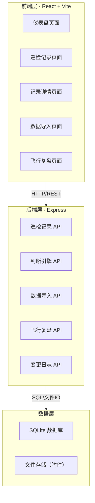
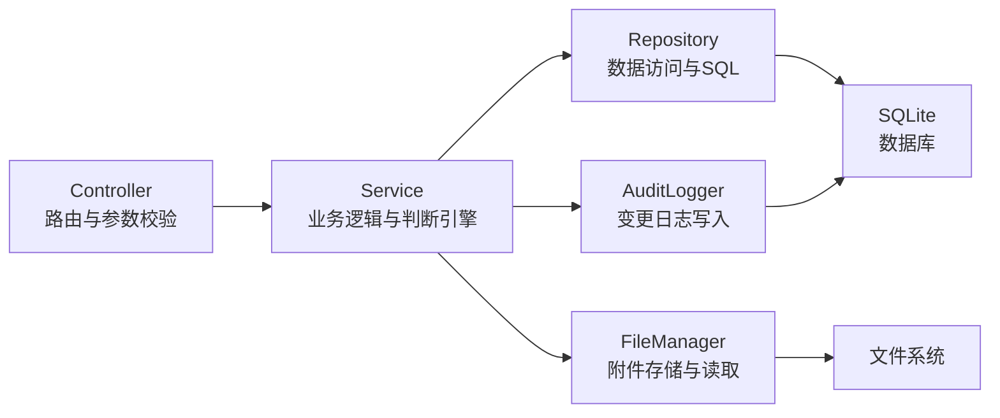
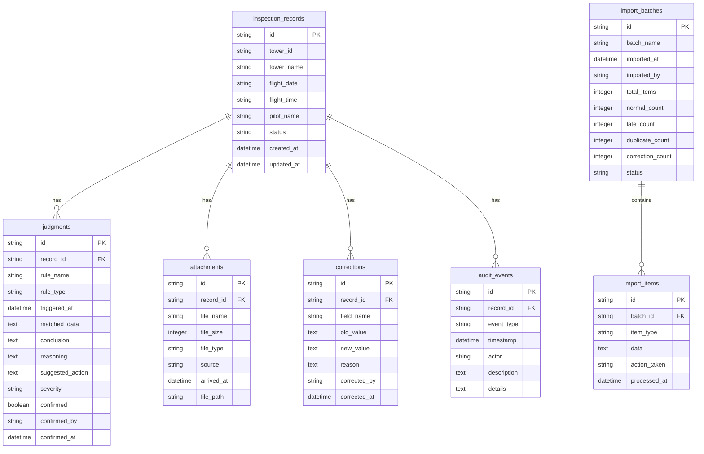

## 1. 架构设计



## 2. 技术说明

- **前端**：React@18 + tailwindcss@3 + vite + zustand（状态管理）+ react-router-dom
- **初始化工具**：vite-init
- **后端**：Express@4 + TypeScript（ESM）
- **数据库**：SQLite（better-sqlite3），适合单机部署、零配置
- **图表**：recharts（轻量级 React 图表库）
- **文件处理**：multer（上传）、archiver（zip 解析）
- **导出**：html2canvas + jspdf（PDF）、xlsx（Excel）

## 3. 路由定义

| 路由 | 用途 |
|------|------|
| / | 仪表盘，巡检概览统计与异常告警 |
| /records | 巡检记录列表，筛选与批量操作 |
| /records/:id | 记录详情，留痕时间线与判断理由 |
| /import | 数据导入，材料包上传与处理 |
| /review | 飞行复盘，汇总视图与导出 |

## 4. API 定义

### 4.1 巡检记录 API

```typescript
interface InspectionRecord {
  id: string;
  towerId: string;
  towerName: string;
  flightDate: string;
  flightTime: string;
  pilotName: string;
  status: "normal" | "warning" | "critical" | "corrected";
  judgments: Judgment[];
  attachments: Attachment[];
  corrections: Correction[];
  auditTrail: AuditEvent[];
  createdAt: string;
  updatedAt: string;
}

interface Judgment {
  id: string;
  ruleName: string;
  ruleType: "no_fly_zone" | "data_integrity" | "anomaly" | "custom";
  triggeredAt: string;
  matchedData: Record<string, unknown>;
  conclusion: string;
  reasoning: string;
  suggestedAction: string;
  severity: "info" | "warning" | "critical";
  confirmed: boolean;
  confirmedBy?: string;
  confirmedAt?: string;
}

interface Attachment {
  id: string;
  fileName: string;
  fileSize: number;
  fileType: string;
  source: "original" | "late_arrival";
  arrivedAt: string;
  url: string;
}

interface Correction {
  id: string;
  fieldName: string;
  oldValue: unknown;
  newValue: unknown;
  reason: string;
  correctedBy: string;
  correctedAt: string;
}

interface AuditEvent {
  id: string;
  eventType: "judgment" | "correction" | "attachment_add" | "status_change" | "import";
  timestamp: string;
  actor: string;
  description: string;
  details: Record<string, unknown>;
}

// GET /api/records - 获取巡检记录列表
interface GetRecordsRequest {
  page?: number;
  pageSize?: number;
  dateFrom?: string;
  dateTo?: string;
  towerId?: string;
  status?: string;
  anomalyType?: string;
}

interface GetRecordsResponse {
  records: InspectionRecord[];
  total: number;
  page: number;
  pageSize: number;
}

// GET /api/records/:id - 获取记录详情
// POST /api/records/:id/confirm - 确认判断
interface ConfirmJudgmentRequest {
  judgmentId: string;
  confirmedBy: string;
}

// POST /api/records/:id/correct - 人工更正
interface CreateCorrectionRequest {
  fieldName: string;
  newValue: unknown;
  reason: string;
  correctedBy: string;
}
```

### 4.2 判断引擎 API

```typescript
// POST /api/engine/judge - 触发判断引擎（内部调用）
interface JudgeRequest {
  recordId: string;
  flightData: Record<string, unknown>;
}

interface JudgeResponse {
  judgments: Judgment[];
  overallStatus: "normal" | "warning" | "critical";
}

// GET /api/engine/rules - 获取当前规则列表
interface Rule {
  id: string;
  name: string;
  type: string;
  description: string;
  enabled: boolean;
}
```

### 4.3 数据导入 API

```typescript
// POST /api/import/upload - 上传材料包
interface UploadResponse {
  batchId: string;
  parsed: ParsedResult;
}

interface ParsedResult {
  normalRecords: number;
  lateAttachments: number;
  duplicates: number;
  manualCorrections: number;
  items: ParsedItem[];
}

interface ParsedItem {
  id: string;
  type: "normal" | "late_attachment" | "duplicate" | "manual_correction";
  data: Record<string, unknown>;
  duplicateOf?: string;
  lateFor?: string;
  originalValue?: unknown;
  correctedValue?: unknown;
}

// POST /api/import/confirm - 确认导入（幂等）
interface ConfirmImportRequest {
  batchId: string;
  decisions: ImportDecision[];
}

interface ImportDecision {
  itemId: string;
  action: "accept" | "merge" | "reject" | "correct";
  mergeTargetId?: string;
  correctionReason?: string;
}

// GET /api/import/batch/:batchId - 查询批次状态（幂等验证）
```

### 4.4 飞行复盘 API

```typescript
// GET /api/review - 获取复盘数据
interface GetReviewRequest {
  dateFrom: string;
  dateTo: string;
  towerIds?: string[];
  status?: string[];
}

interface ReviewData {
  summary: ReviewSummary;
  records: InspectionRecord[];
  charts: ChartData[];
}

interface ReviewSummary {
  totalFlights: number;
  normalCount: number;
  warningCount: number;
  criticalCount: number;
  correctedCount: number;
  noFlyZoneEdges: number;
  lateAttachmentRate: number;
  duplicateRate: number;
}

// POST /api/review/export - 导出复盘报告
interface ExportReviewRequest {
  format: "pdf" | "excel";
  filters: GetReviewRequest;
}

interface ExportReviewResponse {
  downloadUrl: string;
  fileName: string;
}
```

### 4.5 变更日志 API

```typescript
// GET /api/audit - 获取变更日志
interface GetAuditLogRequest {
  recordId?: string;
  eventType?: string;
  dateFrom?: string;
  dateTo?: string;
  page?: number;
  pageSize?: number;
}

interface AuditLogResponse {
  events: AuditEvent[];
  total: number;
}
```

## 5. 服务器架构图



## 6. 数据模型

### 6.1 数据模型定义



### 6.2 数据定义语言

```sql
CREATE TABLE inspection_records (
  id TEXT PRIMARY KEY,
  tower_id TEXT NOT NULL,
  tower_name TEXT NOT NULL,
  flight_date TEXT NOT NULL,
  flight_time TEXT NOT NULL,
  pilot_name TEXT NOT NULL,
  status TEXT NOT NULL DEFAULT 'normal' CHECK(status IN ('normal','warning','critical','corrected')),
  created_at TEXT NOT NULL DEFAULT (datetime('now')),
  updated_at TEXT NOT NULL DEFAULT (datetime('now'))
);

CREATE INDEX idx_records_tower_id ON inspection_records(tower_id);
CREATE INDEX idx_records_flight_date ON inspection_records(flight_date);
CREATE INDEX idx_records_status ON inspection_records(status);
CREATE UNIQUE INDEX idx_records_unique ON inspection_records(tower_id, flight_date, flight_time, pilot_name);

CREATE TABLE judgments (
  id TEXT PRIMARY KEY,
  record_id TEXT NOT NULL REFERENCES inspection_records(id) ON DELETE CASCADE,
  rule_name TEXT NOT NULL,
  rule_type TEXT NOT NULL CHECK(rule_type IN ('no_fly_zone','data_integrity','anomaly','custom')),
  triggered_at TEXT NOT NULL DEFAULT (datetime('now')),
  matched_data TEXT NOT NULL DEFAULT '{}',
  conclusion TEXT NOT NULL,
  reasoning TEXT NOT NULL,
  suggested_action TEXT NOT NULL,
  severity TEXT NOT NULL DEFAULT 'info' CHECK(severity IN ('info','warning','critical')),
  confirmed INTEGER NOT NULL DEFAULT 0,
  confirmed_by TEXT,
  confirmed_at TEXT
);

CREATE INDEX idx_judgments_record_id ON judgments(record_id);
CREATE INDEX idx_judgments_rule_type ON judgments(rule_type);
CREATE INDEX idx_judgments_severity ON judgments(severity);

CREATE TABLE attachments (
  id TEXT PRIMARY KEY,
  record_id TEXT NOT NULL REFERENCES inspection_records(id) ON DELETE CASCADE,
  file_name TEXT NOT NULL,
  file_size INTEGER NOT NULL DEFAULT 0,
  file_type TEXT NOT NULL,
  source TEXT NOT NULL DEFAULT 'original' CHECK(source IN ('original','late_arrival')),
  arrived_at TEXT NOT NULL DEFAULT (datetime('now')),
  file_path TEXT NOT NULL
);

CREATE INDEX idx_attachments_record_id ON attachments(record_id);
CREATE INDEX idx_attachments_source ON attachments(source);

CREATE TABLE corrections (
  id TEXT PRIMARY KEY,
  record_id TEXT NOT NULL REFERENCES inspection_records(id) ON DELETE CASCADE,
  field_name TEXT NOT NULL,
  old_value TEXT NOT NULL,
  new_value TEXT NOT NULL,
  reason TEXT NOT NULL,
  corrected_by TEXT NOT NULL,
  corrected_at TEXT NOT NULL DEFAULT (datetime('now'))
);

CREATE INDEX idx_corrections_record_id ON corrections(record_id);

CREATE TABLE audit_events (
  id TEXT PRIMARY KEY,
  record_id TEXT NOT NULL REFERENCES inspection_records(id) ON DELETE CASCADE,
  event_type TEXT NOT NULL CHECK(event_type IN ('judgment','correction','attachment_add','status_change','import')),
  timestamp TEXT NOT NULL DEFAULT (datetime('now')),
  actor TEXT NOT NULL,
  description TEXT NOT NULL,
  details TEXT NOT NULL DEFAULT '{}'
);

CREATE INDEX idx_audit_record_id ON audit_events(record_id);
CREATE INDEX idx_audit_event_type ON audit_events(event_type);
CREATE INDEX idx_audit_timestamp ON audit_events(timestamp);

CREATE TABLE import_batches (
  id TEXT PRIMARY KEY,
  batch_name TEXT NOT NULL,
  imported_at TEXT NOT NULL DEFAULT (datetime('now')),
  imported_by TEXT NOT NULL,
  total_items INTEGER NOT NULL DEFAULT 0,
  normal_count INTEGER NOT NULL DEFAULT 0,
  late_count INTEGER NOT NULL DEFAULT 0,
  duplicate_count INTEGER NOT NULL DEFAULT 0,
  correction_count INTEGER NOT NULL DEFAULT 0,
  status TEXT NOT NULL DEFAULT 'pending' CHECK(status IN ('pending','processing','completed','failed'))
);

CREATE TABLE import_items (
  id TEXT PRIMARY KEY,
  batch_id TEXT NOT NULL REFERENCES import_batches(id) ON DELETE CASCADE,
  item_type TEXT NOT NULL CHECK(item_type IN ('normal','late_attachment','duplicate','manual_correction')),
  data TEXT NOT NULL DEFAULT '{}',
  action_taken TEXT,
  processed_at TEXT
);

CREATE INDEX idx_import_items_batch_id ON import_items(batch_id);
CREATE INDEX idx_import_items_type ON import_items(item_type);
```

## 7. 幂等性设计

### 7.1 数据导入幂等

- 每条记录基于 `tower_id + flight_date + flight_time + pilot_name` 唯一键去重
- 重复导入同一材料包时，`INSERT OR IGNORE` 跳过已存在记录
- 晚到附件通过 `record_id + file_name` 匹配，已归位的不重复处理
- 人工更正每次写入新行（追加而非覆盖），保持完整变更历史
- 每次导入操作均写入 `audit_events`，可追溯

### 7.2 屏幕与导出一致性

- 前端筛选条件序列化为 URL 查询参数，刷新后自动恢复
- 导出 API 与列表 API 共享同一筛选逻辑（Service 层复用）
- zustand store 中的筛选状态与 URL 参数双向同步
- 页面加载时从 URL 参数恢复筛选状态，确保刷新/重启后视图一致
