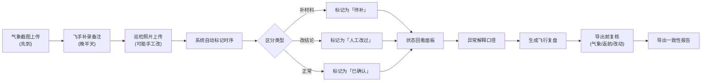

## 1. 产品概述

农田病虫航拍管理系统，解决外场作业中"气象截图先到、飞手备注晚补、巡检照片手工改"的混乱问题，让项目负责人能快速区分补材料与结论变更，生成带处理口径的飞行复盘。

- 核心痛点：时序混乱（气象/飞手/照片不同步）、篡改痕迹不明、复盘口径不统一
- 目标用户：外场队长、飞手、项目负责人
- 价值：缩短复盘时间80%，消除"谁改了什么为什么"的反复沟通

## 2. 核心功能

### 2.1 用户角色

| 角色 | 权限说明 |
|------|----------|
| 外场队长 | 上传气象截图、标记返航点、导出前复核 |
| 飞手 | 补录飞行备注、上传巡检照片、标记异常 |
| 项目负责人 | 查看全量记录、生成飞行复盘、导出报告 |

### 2.2 功能模块

1. **飞行记录总览**：按时间轴展示气象/飞手/照片三类数据，用颜色区分录入时序
2. **状态回看面板**：单条记录的完整变更历史，标注"补录"vs"修改"
3. **异常解释模块**：对返航点丢失、照片篡改、备注延迟等异常提供标准处理口径
4. **飞行复盘导出**：自动分类"已确认/待补/人工改过"三类记录，一键导出一致性报告
5. **操作指引**：内嵌收尾操作说明（气象截图放置、返航点查看、导出前复核）

### 2.3 页面详情

| 页面名称 | 模块名称 | 功能描述 |
|-----------|-------------|---------------------|
| 总览页 | 时间轴面板 | 按飞行架次展示气象截图、飞手备注、巡检照片的录入时序与状态标记 |
| 总览页 | 分类筛选栏 | 按"已确认/待补/人工改过"三类筛选记录，快速定位问题 |
| 详情页 | 状态回看 | 单条记录的完整变更日志，区分"补录材料"与"结论修改"，显示修改人与时间 |
| 详情页 | 异常解释 | 针对每种异常类型（返航点丢失、备注延迟、照片改动）显示标准处理口径 |
| 复盘页 | 复盘生成器 | 自动汇总三类记录，附带处理口径说明，支持导出PDF/Excel |
| 复盘页 | 复核检查清单 | 导出前强制检查：气象截图完整性、返航点状态、改动记录确认 |

## 3. 核心流程

## 4. 用户界面设计

### 4.1 设计风格

- 主色调：深灰蓝 #1e3a5f（专业沉稳），配合农田绿 #2d8a5e 表示正常状态
- 异常色：琥珀橙 #d97706（待补）、赤红 #dc2626（人工改过）、深灰 #4b5563（已确认）
- 按钮风格：直角矩形，细边框，强调功能性而非装饰性
- 字体：系统等宽字体 + 思源黑体，数字和时间戳用等宽字体保证对齐
- 布局：三栏式固定布局，左侧导航、中间内容、右侧详情，无多余留白
- 图标：仅用状态圆点●、箭头→、时钟⏰ 三类极简符号，避免emoji干扰

### 4.2 页面设计概述

| 页面名称 | 模块名称 | UI元素 |
|-----------|-------------|-------------|
| 总览页 | 时间轴面板 | 垂直时间轴，左侧气象（蓝点）、中间飞手（灰点）、右侧照片（绿点），延迟记录用虚线连接 |
| 总览页 | 分类筛选栏 | 三个矩形标签页，背景色对应状态色，显示计数 |
| 详情页 | 状态回看 | 表格形式，每行一次变更，"补录"行背景浅橙，"修改"行背景浅红，"原始"行背景浅绿 |
| 详情页 | 异常解释 | 灰色边框卡片，标题加粗，处理口径用项目符号列出 |
| 复盘页 | 复盘生成器 | 三大区块并列，每区块带状态色边框，底部汇总处理口径 |
| 复盘页 | 复核清单 | 复选框列表，必须全部勾选才能启用导出按钮 |

### 4.3 响应性

- 桌面端优先，三栏固定布局，最小宽度1280px
- 平板端折叠为两栏，详情页改为底部抽屉
- 移动端仅保留总览列表与筛选功能，不支持导出

### 4.4 动效原则

- 页面切换：无过渡动画，直接切屏保证效率
- 状态标记：悬停时状态圆点轻微放大（1.2倍），0.15s过渡
- 异常高亮：新标记的异常记录有1秒的背景色脉冲提示，仅执行一次
