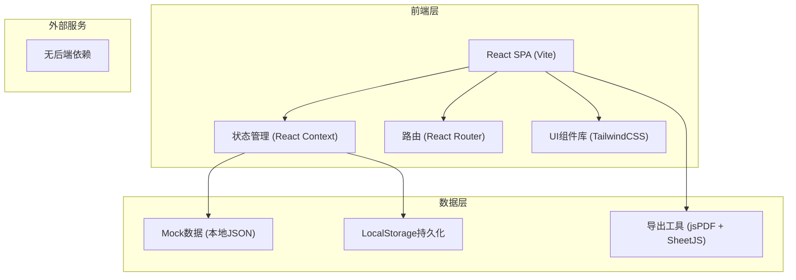

## 1. 架构设计



## 2. 技术描述

- 前端：React@18 + TypeScript + TailwindCSS@3 + Vite@5
- 状态管理：React Context + useReducer（无需Redux，数据规模小）
- 路由：React Router v6
- 数据：内置Mock数据 + LocalStorage持久化用户操作
- 导出：jsPDF（PDF导出）+ SheetJS/xlsx（Excel导出）
- 初始化工具：npm create vite@latest

## 3. 路由定义

| Route | 页面 | 说明 |
|-------|------|------|
| / | 总览页 | 时间轴 + 分类筛选 |
| /record/:id | 详情页 | 状态回看 + 异常解释 |
| /review | 复盘页 | 复盘生成 + 复核清单 + 导出 |
| /guide | 操作指引 | 收尾操作说明 |

## 4. 数据模型

### 4.1 类型定义

```typescript
// 记录状态类型
type RecordStatus = 'confirmed' | 'pending' | 'modified';

// 数据来源类型
type DataSource = 'weather' | 'pilot' | 'photo';

// 变更类型
type ChangeType = 'create' | 'supplement' | 'modify';

// 飞行架次记录
interface FlightRecord {
  id: string;
  flightNo: string;          // 架次编号
  flightDate: string;        // 飞行日期
  location: string;          // 作业区域
  status: RecordStatus;      // 记录状态
  hasReturnPoint: boolean;   // 返航点是否正常
  weatherData: WeatherData;
  pilotNote: PilotNote;
  photos: PhotoData[];
  changeLogs: ChangeLog[];
  anomalies: Anomaly[];
}

// 气象数据
interface WeatherData {
  id: string;
  uploadTime: string;        // 上传时间
  screenshotUrl: string;     // 截图路径
  temperature: number;
  humidity: number;
  windSpeed: number;
  rainfall: number;
  isSupplement: boolean;     // 是否补录
}

// 飞手备注
interface PilotNote {
  id: string;
  pilotName: string;
  noteTime: string;          // 备注时间
  flightStartTime: string;   // 实际起飞时间
  flightEndTime: string;     // 实际降落时间
  content: string;           // 备注内容
  isSupplement: boolean;     // 是否补录
  delayHours?: number;       // 延迟小时数
}

// 巡检照片
interface PhotoData {
  id: string;
  uploadTime: string;
  photoUrl: string;
  locationTag: string;       // 位置标记
  pestType?: string;         // 病虫害类型
  severity?: 'low' | 'medium' | 'high';
  isManuallyModified: boolean;  // 是否手工改动
  modifiedBy?: string;
  modifiedTime?: string;
  modifyReason?: string;     // 改动原因
}

// 变更日志
interface ChangeLog {
  id: string;
  timestamp: string;
  operator: string;
  changeType: ChangeType;    // 创建/补录/修改
  field: string;             // 变更字段
  oldValue?: string;
  newValue: string;
  description: string;       // 变更说明
}

// 异常记录
interface Anomaly {
  id: string;
  type: 'missing_return_point' | 'delayed_note' | 'modified_photo' | 'weather_mismatch';
  severity: 'warning' | 'error';
  description: string;
  handlingRule: string;      // 处理口径
}

// 复盘报告
interface ReviewReport {
  generatedAt: string;
  totalRecords: number;
  confirmedCount: number;
  pendingCount: number;
  modifiedCount: number;
  records: {
    confirmed: FlightRecord[];
    pending: FlightRecord[];
    modified: FlightRecord[];
  };
  handlingSummary: string;
  reviewedBy: string;
}
```

### 4.2 Mock数据结构

内置5条典型样例数据，覆盖：
1. 正常记录（气象/飞手/照片同步）
2. 气象截图早到 + 飞手备注晚补（待补）
3. 巡检照片手工改动（人工改过）
4. 返航点丢失 + 照片改动（复合异常）
5. 气象与实际飞行不匹配（异常）

## 5. 核心组件结构

```
src/
├── components/
│   ├── layout/
│   │   ├── Sidebar.tsx        // 左侧导航
│   │   └── Header.tsx         // 顶部栏
│   ├── timeline/
│   │   ├── Timeline.tsx       // 时间轴主组件
│   │   └── TimelineItem.tsx   // 单条时间轴项
│   ├── record/
│   │   ├── StatusBadge.tsx    // 状态标签
│   │   ├── ChangeLogTable.tsx // 变更日志表
│   │   └── AnomalyCard.tsx    // 异常解释卡片
│   └── review/
│       ├── StatusSection.tsx  // 分类区块
│       ├── ReviewChecklist.tsx // 复核清单
│       └── ExportButtons.tsx  // 导出按钮组
├── context/
│   └── RecordContext.tsx      // 全局状态
├── data/
│   └── mockData.ts            // Mock数据
├── pages/
│   ├── Overview.tsx           // 总览页
│   ├── RecordDetail.tsx       // 详情页
│   ├── Review.tsx             // 复盘页
│   └── Guide.tsx              // 操作指引
├── types/
│   └── index.ts               // 类型定义
├── utils/
│   ├── export.ts              // 导出工具
│   └── status.ts              // 状态工具
└── App.tsx
```
