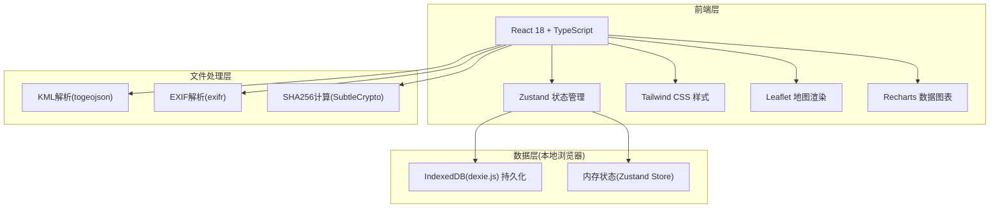
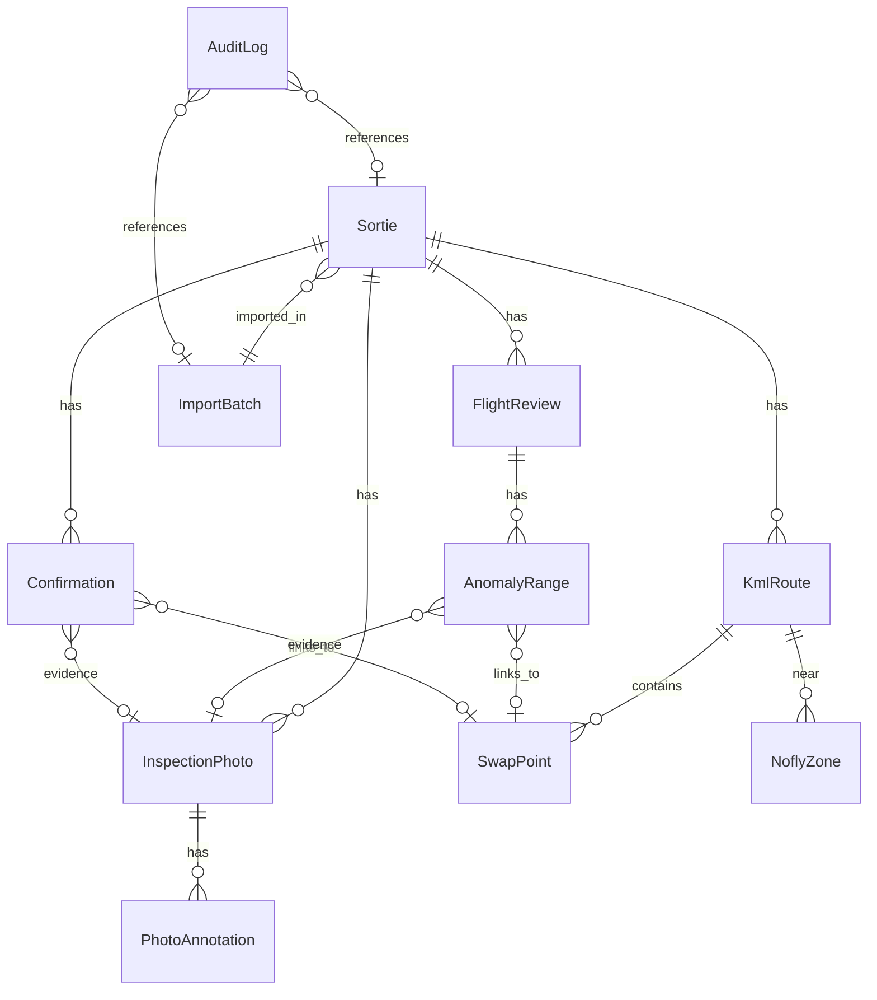

## 1. 架构设计



纯前端架构，所有数据存储在浏览器 IndexedDB 中，无需后端服务。文件处理（KML解析、EXIF提取、重复检测）均在客户端完成，确保外场断网可用。

## 2. 技术说明

- 前端：React@18 + TypeScript + Tailwind CSS@3 + Vite
- 初始化工具：vite-init
- 后端：无（纯前端，数据持久化至 IndexedDB）
- 数据库：IndexedDB（通过 dexie.js 封装）
- 地图渲染：Leaflet + react-leaflet（KML轨迹渲染）
- 图表：Recharts（飞行复盘折线图）
- KML解析：@tmcw/togeojson（KML转GeoJSON）
- EXIF解析：exifr（照片元数据提取）
- 状态管理：Zustand
- Mock数据：内置模拟数据集用于演示

## 3. 路由定义

| 路由 | 用途 |
|------|------|
| / | 换电总览页，展示所有架次的换电结论列表 |
| /evidence/:sortieId | 证据链详情页，展示指定架次的四联面板 |
| /import | 数据导入页，批量上传与冲突处理 |
| /export | 筛选导出页，多维筛选与报告导出 |

## 4. API定义

无后端API。所有数据操作通过 Zustand Store + Dexie.js IndexedDB 完成。

### 4.1 核心数据类型

```typescript
interface Sortie {
  id: string;
  sortieNo: string;
  batteryId: string;
  timestamp: number;
  status: "normal" | "pending" | "abnormal";
  anomalyTags: AnomalyTag[];
  importBatchId: string;
}

type AnomalyTag = "battery_cycle_error" | "nofly_zone_edge" | "rth_point_lost" | "other";

interface InspectionPhoto {
  id: string;
  sortieId: string;
  fileName: string;
  fileHash: string;
  thumbnailBlob: Blob;
  fullImageBlob: Blob;
  exifTimestamp: number | null;
  exifGps: { lat: number; lng: number } | null;
  annotations: PhotoAnnotation[];
}

interface PhotoAnnotation {
  id: string;
  photoId: string;
  x: number;
  y: number;
  text: string;
  createdAt: number;
}

interface KmlRoute {
  id: string;
  sortieId: string;
  fileName: string;
  fileHash: string;
  geoJson: GeoJSON.FeatureCollection;
  swapPoints: SwapPoint[];
  noflyZones: NoflyZone[];
  rthPoint: { lat: number; lng: number } | null;
}

interface SwapPoint {
  id: string;
  kmlRouteId: string;
  lat: number;
  lng: number;
  altitude: number;
  timestamp: number;
}

interface NoflyZone {
  id: string;
  kmlRouteId: string;
  geometry: GeoJSON.Polygon;
  minDistance: number;
}

interface Confirmation {
  id: string;
  sortieId: string;
  status: "confirmed" | "rejected" | "pending";
  evidenceType: "photo" | "kml_segment";
  evidenceId: string;
  operator: string;
  timestamp: number;
  note: string;
}

interface FlightReview {
  id: string;
  sortieId: string;
  dataPoints: ReviewDataPoint[];
  anomalyRanges: AnomalyRange[];
}

interface ReviewDataPoint {
  timestamp: number;
  voltage: number;
  altitude: number;
  speed: number;
}

interface AnomalyRange {
  startTimestamp: number;
  endTimestamp: number;
  type: AnomalyTag;
  linkedPhotoId: string | null;
  linkedKmlSegmentId: string | null;
}

interface ImportBatch {
  id: string;
  timestamp: number;
  fileCount: number;
  fileHashes: string[];
  status: "active" | "reverted";
}

interface AuditLog {
  id: string;
  action: "import" | "confirm" | "revert" | "export" | "status_change";
  operator: string;
  timestamp: number;
  detail: string;
  sortieId?: string;
  batchId?: string;
}
```

## 5. 服务器架构图

无后端服务器。

## 6. 数据模型

### 6.1 数据模型定义



### 6.2 IndexedDB 索引定义

```sql
-- Dexie.js 版本迁移定义
-- 表名: sorties, 索引: [sortieNo, batteryId, status, timestamp, importBatchId]
-- 表名: inspectionPhotos, 索引: [sortieId, fileHash, exifTimestamp]
-- 表名: kmlRoutes, 索引: [sortieId, fileHash]
-- 表名: confirmations, 索引: [sortieId, status, timestamp]
-- 表名: flightReviews, 索引: [sortieId]
-- 表名: importBatches, 索引: [status, timestamp]
-- 表名: auditLogs, 索引: [action, timestamp, sortieId, batchId]
```
