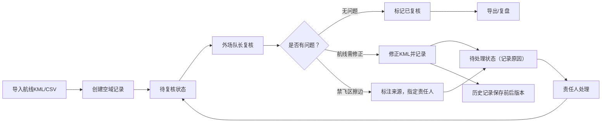

## 1. 产品概述

"赛事空域协同"是一个面向赛事飞行团队的空域管理工具，解决传统表格管理中电池循环错算、历史记录混乱、航线修改无迹可寻等问题。通过Three.js三维可视化和本地状态管理，实现赛事空域记录的全生命周期追踪。

- **核心问题**：表格管理依赖人工备注，时间一长数据对不上；航线KML修改前后无历史对比；禁飞区擦边处理无明确追踪
- **目标用户**：赛事飞行团队、外场队长、飞手、复盘人员
- **核心价值**：每条记录可溯源、状态可追踪、修改留痕、禁飞区问题明确责任人

## 2. 核心功能

### 2.1 用户角色

| 角色 | 操作方式 | 核心权限 |
|------|----------|----------|
| 飞手 | 本地操作 | 导入航线KML、添加飞手备注 |
| 外场队长 | 本地操作 | 复核记录、修正航线KML、标记状态 |
| 复盘人员 | 本地操作 | 查看历史、导出数据、飞行复盘 |

### 2.2 功能模块

1. **空域记录总览**：记录列表、状态筛选、搜索、三维空域可视化
2. **记录详情**：来源信息、当前状态、修改历史、航线对比
3. **导入功能**：KML航线导入、CSV批量导入、图片附件导入
4. **复核修正**：状态流转、航线修正、禁飞区擦边处理、责任人指定
5. **历史追踪**：修改时间线、KML前后对比、操作人记录
6. **导出功能**：CSV导出、JSON导出、KML导出

### 2.3 页面详情

| 页面名称 | 模块名称 | 功能描述 |
|---------|----------|----------|
| 总览页 | 记录列表 | 显示所有空域协同记录，支持按状态/日期筛选 |
| 总览页 | 3D空域可视化 | Three.js展示航线、禁飞区、高度层，支持交互 |
| 总览页 | 统计卡片 | 待处理数、已复核数、擦边警告数、电池循环数 |
| 详情页 | 记录基本信息 | 来源、创建时间、当前状态、电池循环 |
| 详情页 | 航线可视化 | 3D展示航线轨迹，支持前后版本对比 |
| 详情页 | 历史时间线 | 所有修改操作的时间线，含操作人和原因 |
| 详情页 | 禁飞区处理 | 擦边来源标注（飞手备注/巡检照片）、下一步责任人 |
| 详情页 | 操作面板 | 复核通过、标记待处理、修正航线、添加备注 |
| 导入弹窗 | 文件导入 | 支持KML/CSV/JSON导入，预览导入数据 |
| 导出弹窗 | 数据导出 | 选择导出格式和范围，生成下载文件 |

## 3. 核心流程

**主要用户流程**：
1. 飞手导入飞行航线KML，系统自动创建记录并标记为"待复核"
2. 外场队长查看记录，检查航线与禁飞区关系
3. 如发现航线KML需要修正，队长手动调整并保存，系统自动记录前后版本差异
4. 如发现禁飞区擦边，标注擦边来源（飞手备注/巡检照片），指定下一步处理人
5. 所有操作进入历史时间线，可随时追溯
6. 复盘时可查看完整历史，导出所需数据格式

## 4. 用户界面设计

### 4.1 设计风格

- **主色调**：深空蓝 (#0F172A) 作为背景，航空橙 (#F97316) 作为强调色，警告红 (#EF4444) 标记擦边问题
- **辅助色**：成功绿 (#10B981)、待处理黄 (#F59E0B)、信息蓝 (#3B82F6)
- **设计风格**：航空科技感、深色主题、数据密集型界面、精准专业
- **字体**：JetBrains Mono（等宽，适合数据展示）+ Orbitron（标题，科技感）
- **按钮风格**：直角、细边框、悬停时背景色填充过渡
- **布局风格**：左侧导航 + 主内容区（列表+3D视图分栏）+ 右侧详情抽屉
- **图标风格**：线性图标，航空相关元素（飞机、航线、禁飞区标识）

### 4.2 页面设计概述

| 页面名称 | 模块名称 | UI元素 |
|---------|----------|--------|
| 总览页 | 顶部状态栏 | 电池循环计数器、待处理提醒、用户标识 |
| 总览页 | 记录列表 | 斑马纹表格、状态标签、悬停高亮、行内快捷操作 |
| 总览页 | 3D空域视图 | Three.js场景、航线着色、禁飞区半透明、高度刻度 |
| 总览页 | 统计卡片 | 渐变背景、大号数字、趋势箭头、状态图标 |
| 详情页 | 头部信息 | 记录ID、状态徽章、来源标签、操作按钮组 |
| 详情页 | 历史时间线 | 垂直时间线、版本对比按钮、操作人头像、原因备注 |
| 详情页 | 航线对比 | 左右分屏或叠加显示，不同颜色区分版本 |
| 详情页 | 禁飞区处理卡片 | 来源标识、责任人选择、处理说明输入框 |

### 4.3 响应性

- **Desktop-first**：桌面端为主要使用场景，三栏布局（导航+内容+详情）
- **平板适配**：收起导航，两栏布局（列表+3D视图），详情改为底部抽屉
- **移动端**：列表视图优先，3D视图可切换全屏，详情全屏弹窗
- **触摸优化**：按钮最小44x44px，滑动操作支持时间线浏览

### 4.4 3D场景指导

- **环境**：深色太空背景 + 微弱星点 + 地平线光晕
- **光照**：平行光模拟太阳光 + 环境光保证基本可见度 + 航线自发光
- **相机**：透视相机，初始俯视角45度，支持轨道控制、缩放、平移
- **构图**：航线为中心焦点，禁飞区用半透明红色棱柱标出，地面用网格辅助
- **交互**：点击航线高亮并显示详情，悬停显示高度信息，滚轮缩放
- **动画**：航线绘制动画（从起点到终点）、禁飞区呼吸效果、选中物体脉冲高亮
- **后处理**：Bloom效果让航线发光更明显，轻微泛光提升科技感
- **性能**：单条航线不超过1000个顶点，总物体数控制在50以内

## 5. 数据完整性要求

- 每条记录必须包含：ID、来源、创建时间、当前状态、电池循环数
- 每次状态变更必须记录：操作人、时间、原因备注
- KML修改必须保存：修改前版本、修改后版本、修改人、修改时间
- 禁飞区擦边必须记录：擦边位置、来源类型（飞手备注/巡检照片）、责任人、处理状态
- 所有数据本地存储在IndexedDB，支持导出备份
