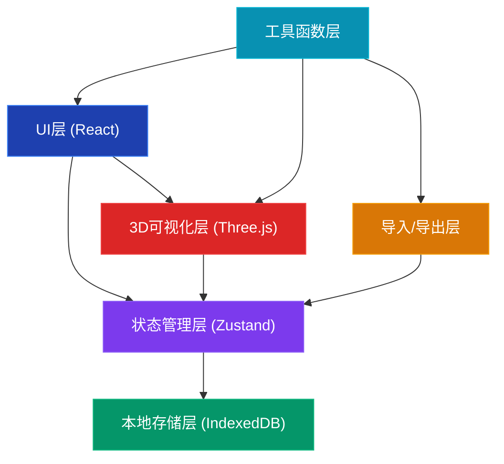
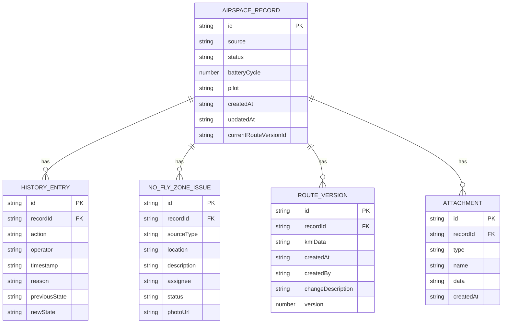

## 1. 架构设计



## 2. 技术描述

- **前端框架**：React@18 + TypeScript + Vite
- **状态管理**：Zustand（轻量级，适合本地状态）+ Immer（不可变更新）
- **UI样式**：TailwindCSS@3
- **3D可视化**：three @0.160 + @react-three/fiber + @react-three/drei + @react-three/postprocessing
- **本地存储**：IndexedDB（通过idb库封装）
- **KML解析**：@tmcw/togeojson + @types/geojson
- **图标**：Lucide React
- **日期处理**：date-fns

## 3. 目录结构

```
src/
├── components/          # React组件
│   ├── layout/         # 布局组件（导航、侧边栏）
│   ├── records/        # 记录相关组件（列表、卡片、详情）
│   ├── three/          # Three.js相关组件
│   ├── modals/         # 弹窗组件（导入、导出、确认）
│   └── ui/             # 基础UI组件（按钮、标签、时间线）
├── store/              # Zustand状态管理
│   ├── useRecordsStore.ts
│   └── useUiStore.ts
├── hooks/              # 自定义Hooks
│   ├── useIndexedDB.ts
│   └── useKMLParser.ts
├── types/              # TypeScript类型定义
│   └── index.ts
├── utils/              # 工具函数
│   ├── kml.ts          # KML解析/导出
│   ├── export.ts       # 导出功能
│   ├── import.ts       # 导入功能
│   └── geo.ts          # 地理计算
├── mock/               # Mock数据
│   └── initialData.ts
├── App.tsx
├── main.tsx
└── index.css
```

## 4. 路由定义

| Route | 页面 | 功能 |
|-------|------|------|
| / | 总览页 | 记录列表 + 3D空域视图 + 统计卡片 |
| /record/:id | 详情页 | 记录详情 + 历史时间线 + 航线对比 |

## 5. 数据模型

### 5.1 数据模型ER图



### 5.2 TypeScript类型定义

```typescript
export type RecordStatus = 'pending_review' | 'reviewed' | 'pending_processing' | 'resolved';

export type NoFlyZoneSourceType = 'pilot_note' | 'inspection_photo';

export type IssueStatus = 'open' | 'in_progress' | 'resolved';

export interface Coordinate {
  lat: number;
  lng: number;
  alt: number;
}

export interface RouteData {
  coordinates: Coordinate[];
  name: string;
  description?: string;
}

export interface AirspaceRecord {
  id: string;
  source: string;
  status: RecordStatus;
  batteryCycle: number;
  pilot: string;
  createdAt: string;
  updatedAt: string;
  currentRouteVersionId: string;
  pendingReason?: string;
}

export interface HistoryEntry {
  id: string;
  recordId: string;
  action: 'create' | 'status_change' | 'route_modify' | 'issue_create' | 'issue_resolve' | 'note_add';
  operator: string;
  timestamp: string;
  reason?: string;
  previousState?: string;
  newState?: string;
  metadata?: Record<string, any>;
}

export interface NoFlyZoneIssue {
  id: string;
  recordId: string;
  sourceType: NoFlyZoneSourceType;
  location: Coordinate;
  description: string;
  assignee: string;
  status: IssueStatus;
  photoUrl?: string;
  createdAt: string;
  resolvedAt?: string;
}

export interface RouteVersion {
  id: string;
  recordId: string;
  kmlData: string;
  routeData: RouteData;
  createdAt: string;
  createdBy: string;
  changeDescription?: string;
  version: number;
}

export interface Attachment {
  id: string;
  recordId: string;
  type: 'kml' | 'csv' | 'image' | 'json';
  name: string;
  data: string;
  createdAt: string;
}
```

### 5.3 IndexedDB Schema

```javascript
// 数据库名: airspace-coordination
// 版本: 1

const stores = {
  records: { keyPath: 'id', indexes: ['status', 'createdAt', 'pilot'] },
  history: { keyPath: 'id', indexes: ['recordId', 'timestamp', 'action'] },
  issues: { keyPath: 'id', indexes: ['recordId', 'status', 'assignee'] },
  routeVersions: { keyPath: 'id', indexes: ['recordId', 'version'] },
  attachments: { keyPath: 'id', indexes: ['recordId', 'type'] }
};
```

## 6. 核心功能实现方案

### 6.1 状态管理 (Zustand Store)

```typescript
// store/useRecordsStore.ts
interface RecordsState {
  records: AirspaceRecord[];
  selectedRecordId: string | null;
  loading: boolean;
  
  // Actions
  fetchRecords: () => Promise<void>;
  addRecord: (record: Omit<AirspaceRecord, 'id' | 'createdAt' | 'updatedAt'>) => Promise<void>;
  updateRecordStatus: (id: string, status: RecordStatus, reason?: string) => Promise<void>;
  addRouteVersion: (recordId: string, kmlData: string, description: string) => Promise<void>;
  addNoFlyZoneIssue: (recordId: string, issue: Omit<NoFlyZoneIssue, 'id' | 'recordId' | 'createdAt'>) => Promise<void>;
  addHistoryEntry: (entry: Omit<HistoryEntry, 'id' | 'timestamp'>) => Promise<void>;
}
```

### 6.2 KML解析与导出

- 解析：使用 @tmcw/togeojson 将KML转换为GeoJSON，再提取坐标
- 导出：将 RouteData 序列化为KML格式

### 6.3 Three.js 3D可视化

- 使用 @react-three/fiber 管理Three.js场景
- 航线：使用 LineGeometry + LineMaterial 实现发光效果
- 禁飞区：使用 CylinderGeometry 半透明红色棱柱
- 地面：GridHelper 配合自定义材质
- 交互：OrbitControls 实现相机控制，Raycaster 实现点击选中

### 6.4 历史对比功能

- 选中两个航线版本，在3D场景中用不同颜色同时显示
- 计算坐标差异，高亮显示变化的航点

### 6.5 导入导出格式

- 支持导入：.kml, .csv, .json
- 支持导出：.kml（单条航线）, .csv（记录列表）, .json（完整数据备份）

## 7. 初始Mock数据

包含5条示例记录，覆盖不同状态：
- 2条待复核
- 2条已复核
- 1条待处理（含禁飞区擦边问题）
- 每条记录含2个航线版本用于对比演示
