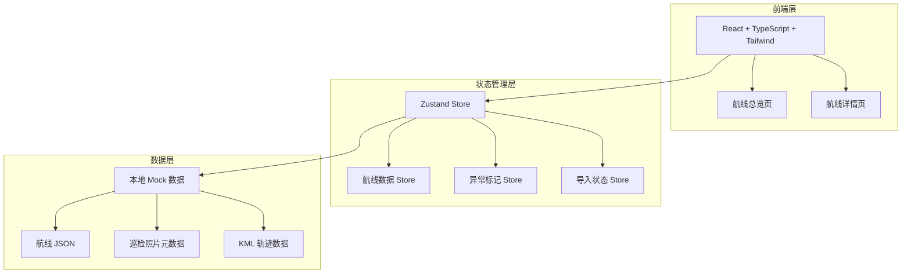
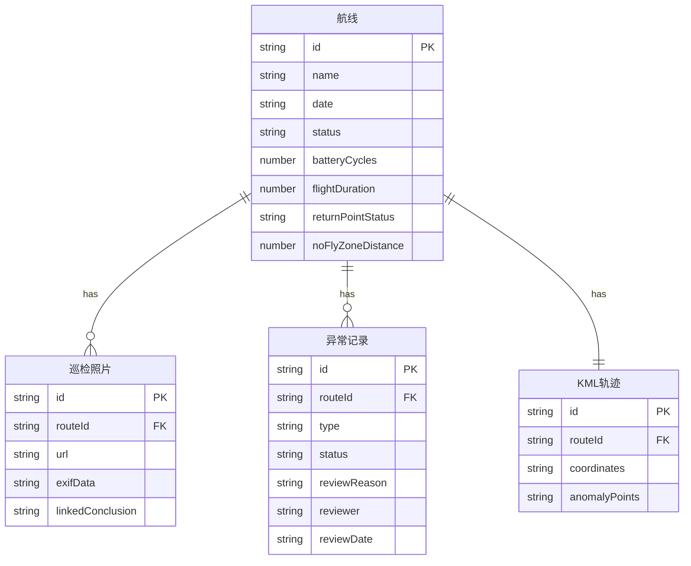

## 1. 架构设计



## 2. 技术说明

- **前端**：React@18 + TypeScript + Tailwind CSS@3 + Vite
- **初始化工具**：vite-init（react-ts 模板）
- **状态管理**：Zustand
- **路由**：react-router-dom@6
- **后端**：无（纯前端，使用 Mock 数据）
- **图标**：lucide-react

## 3. 路由定义

| 路由 | 用途 |
|------|------|
| `/` | 航线总览页：航线列表、状态筛选、导入、导出 |
| `/route/:id` | 航线详情页：飞行数据、异常标记、照片溯源、KML 可视化、复核操作 |

## 4. 数据模型

### 4.1 数据模型定义



### 4.2 TypeScript 类型定义

```typescript
type RouteStatus = "normal" | "pending" | "abnormal"
type AnomalyType = "battery_cycle_error" | "return_point_lost" | "no_fly_zone_edge"
type AnomalyStatus = "pending" | "confirmed" | "rejected"

interface Route {
  id: string
  name: string
  date: string
  status: RouteStatus
  batteryCycles: number
  expectedCycles: number
  flightDuration: number
  returnPointStatus: "ok" | "lost" | "low_altitude"
  noFlyZoneDistance: number
}

interface InspectionPhoto {
  id: string
  routeId: string
  url: string
  exifData: string
  linkedConclusion: string
  timestamp: string
}

interface AnomalyRecord {
  id: string
  routeId: string
  type: AnomalyType
  status: AnomalyStatus
  description: string
  reviewReason: string
  reviewer: string
  reviewDate: string
  sourceLinks: string[]
}

interface KMLTrack {
  id: string
  routeId: string
  coordinates: [number, number][]
  anomalyPoints: { index: number; type: AnomalyType }[]
}
```

## 5. 核心业务逻辑

### 5.1 异常自动检测

导入航线数据时，自动执行以下检测：
- **电池循环错算**：`Math.abs(batteryCycles - expectedCycles) > 2` → 生成异常记录
- **返航点丢失**：`returnPointStatus !== "ok"` → 生成异常记录
- **禁飞区擦边**：`noFlyZoneDistance < 50` → 生成异常记录

检测结果自动将航线状态设为"待确认"，并生成对应的异常记录（含检测原因描述和溯源链接）。

### 5.2 导入工作流

- **覆盖导入**：同 ID 航线数据完全替换，异常记录保留历史但标记为"已覆盖"
- **追加导入**：新航线直接加入，已有航线按版本号合并
- **撤回**：撤销最近一次导入操作，恢复导入前状态

### 5.3 筛选导出

支持按状态、日期范围、异常类型组合筛选，导出为 CSV 文件，包含航线基本信息和异常记录摘要。
