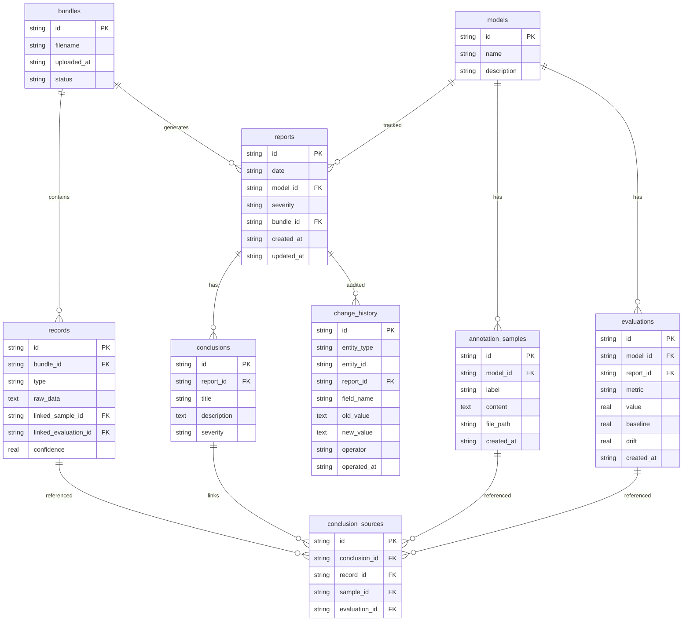

## 1. 架构设计

```mermaid
flowchart TB
    subgraph "前端层"
        "React + TailwindCSS"
        "Zustand 状态管理"
        "React Router"
    end
    subgraph "后端层"
        "Express + TypeScript"
        "材料包解析引擎"
        "变更审计中间件"
    end
    subgraph "数据层"
        "SQLite 数据库"
        "文件存储（材料包/标注样本）"
    end
    "前端层" -->|"REST API"| "后端层"
    "后端层" -->|"SQL/文件读写"| "数据层"
```

## 2. 技术说明

- 前端：React@18 + TailwindCSS@3 + Vite + Zustand
- 初始化工具：vite-init
- 后端：Express@4 + TypeScript（ESM）
- 数据库：SQLite（better-sqlite3），适合单机部署，无需额外数据库服务
- 文件存储：本地文件系统，材料包和标注样本存于 `uploads/` 目录

## 3. 路由定义

| 路由 | 用途 |
|------|------|
| `/` | 日报总览页，列表+趋势图 |
| `/import` | 材料包导入页，上传+解析+清洗 |
| `/report/:id` | 日报详情页，结论总表+溯源 |
| `/history` | 变更历史页，diff+一致性校验 |
| `/guide` | 收尾指南页，放置指引+复核清单 |

## 4. API 定义

### 4.1 材料包相关

```typescript
interface MaterialBundle {
  id: string;
  filename: string;
  uploadedAt: string;
  status: 'parsing' | 'parsed' | 'confirmed';
  summary: {
    normal: number;
    lateArrival: number;
    duplicate: number;
    correction: number;
  };
}

// POST /api/bundles - 上传材料包
// GET  /api/bundles - 获取材料包列表
// GET  /api/bundles/:id - 获取材料包详情
// POST /api/bundles/:id/confirm - 确认入库

interface MaterialRecord {
  id: string;
  bundleId: string;
  type: 'normal' | 'late_arrival' | 'duplicate' | 'correction';
  rawData: Record<string, unknown>;
  linkedSampleId?: string;
  linkedEvaluationId?: string;
  correctedFrom?: string;
  confidence: number;
}
```

### 4.2 日报相关

```typescript
interface DriftReport {
  id: string;
  date: string;
  modelId: string;
  modelName: string;
  severity: 'low' | 'medium' | 'high' | 'critical';
  bundleId: string;
  conclusions: Conclusion[];
  createdAt: string;
  updatedAt: string;
}

interface Conclusion {
  id: string;
  reportId: string;
  title: string;
  description: string;
  severity: 'low' | 'medium' | 'high' | 'critical';
  linkedSampleIds: string[];
  linkedEvaluationIds: string[];
  sourceRecordIds: string[];
}

// GET  /api/reports - 获取日报列表（支持筛选）
// GET  /api/reports/:id - 获取日报详情（含结论及溯源）
// POST /api/reports - 手动创建日报
```

### 4.3 标注样本与评估表

```typescript
interface AnnotationSample {
  id: string;
  modelId: string;
  label: string;
  content: string;
  filePath?: string;
  createdAt: string;
}

interface EvaluationRecord {
  id: string;
  modelId: string;
  reportId: string;
  metric: string;
  value: number;
  baseline: number;
  drift: number;
  createdAt: string;
}

// GET  /api/samples/:id - 获取标注样本详情
// GET  /api/evaluations/:id - 获取评估记录详情
```

### 4.4 变更历史

```typescript
interface ChangeRecord {
  id: string;
  entityType: 'conclusion' | 'evaluation' | 'feedback';
  entityId: string;
  reportId: string;
  fieldName: string;
  oldValue: string;
  newValue: string;
  operator: string;
  operatedAt: string;
}

interface ConsistencyCheck {
  consistent: boolean;
  mismatches: {
    conclusionId: string;
    evaluationId: string;
    field: string;
    conclusionValue: string;
    evaluationValue: string;
  }[];
}

// GET  /api/changes - 获取变更历史（支持筛选）
// POST /api/changes - 记录变更（手动修正时自动调用）
// GET  /api/consistency/:reportId - 一致性校验
```

### 4.5 收尾指南

```typescript
interface GuideSection {
  id: string;
  title: string;
  steps: {
    description: string;
    action?: string;
    link?: string;
  }[];
}

// GET /api/guide - 获取收尾指南内容
```

## 5. 服务器架构

```mermaid
flowchart LR
    "Controller 层" --> "Service 层"
    "Service 层" --> "Repository 层"
    "Repository 层" --> "SQLite"
```

- **Controller 层**：路由处理、请求校验、响应格式化
- **Service 层**：业务逻辑（材料包解析、去重算法、一致性校验）
- **Repository 层**：数据库操作封装

## 6. 数据模型

### 6.1 数据模型定义



### 6.2 数据定义语言

```sql
CREATE TABLE models (
  id TEXT PRIMARY KEY,
  name TEXT NOT NULL,
  description TEXT
);

CREATE TABLE bundles (
  id TEXT PRIMARY KEY,
  filename TEXT NOT NULL,
  uploaded_at TEXT NOT NULL DEFAULT (datetime('now')),
  status TEXT NOT NULL DEFAULT 'parsing'
);

CREATE TABLE records (
  id TEXT PRIMARY KEY,
  bundle_id TEXT NOT NULL REFERENCES bundles(id),
  type TEXT NOT NULL CHECK(type IN ('normal', 'late_arrival', 'duplicate', 'correction')),
  raw_data TEXT NOT NULL,
  linked_sample_id TEXT REFERENCES annotation_samples(id),
  linked_evaluation_id TEXT REFERENCES evaluations(id),
  confidence REAL NOT NULL DEFAULT 1.0
);

CREATE TABLE reports (
  id TEXT PRIMARY KEY,
  date TEXT NOT NULL,
  model_id TEXT NOT NULL REFERENCES models(id),
  severity TEXT NOT NULL CHECK(severity IN ('low', 'medium', 'high', 'critical')),
  bundle_id TEXT REFERENCES bundles(id),
  created_at TEXT NOT NULL DEFAULT (datetime('now')),
  updated_at TEXT NOT NULL DEFAULT (datetime('now'))
);

CREATE TABLE conclusions (
  id TEXT PRIMARY KEY,
  report_id TEXT NOT NULL REFERENCES reports(id) ON DELETE CASCADE,
  title TEXT NOT NULL,
  description TEXT NOT NULL,
  severity TEXT NOT NULL CHECK(severity IN ('low', 'medium', 'high', 'critical'))
);

CREATE TABLE conclusion_sources (
  id TEXT PRIMARY KEY,
  conclusion_id TEXT NOT NULL REFERENCES conclusions(id) ON DELETE CASCADE,
  record_id TEXT REFERENCES records(id),
  sample_id TEXT REFERENCES annotation_samples(id),
  evaluation_id TEXT REFERENCES evaluations(id)
);

CREATE TABLE annotation_samples (
  id TEXT PRIMARY KEY,
  model_id TEXT NOT NULL REFERENCES models(id),
  label TEXT NOT NULL,
  content TEXT NOT NULL,
  file_path TEXT,
  created_at TEXT NOT NULL DEFAULT (datetime('now'))
);

CREATE TABLE evaluations (
  id TEXT PRIMARY KEY,
  model_id TEXT NOT NULL REFERENCES models(id),
  report_id TEXT REFERENCES reports(id),
  metric TEXT NOT NULL,
  value REAL NOT NULL,
  baseline REAL NOT NULL,
  drift REAL NOT NULL,
  created_at TEXT NOT NULL DEFAULT (datetime('now'))
);

CREATE TABLE change_history (
  id TEXT PRIMARY KEY,
  entity_type TEXT NOT NULL CHECK(entity_type IN ('conclusion', 'evaluation', 'feedback')),
  entity_id TEXT NOT NULL,
  report_id TEXT REFERENCES reports(id),
  field_name TEXT NOT NULL,
  old_value TEXT NOT NULL,
  new_value TEXT NOT NULL,
  operator TEXT NOT NULL,
  operated_at TEXT NOT NULL DEFAULT (datetime('now'))
);

CREATE INDEX idx_records_bundle ON records(bundle_id);
CREATE INDEX idx_records_type ON records(type);
CREATE INDEX idx_reports_date ON reports(date);
CREATE INDEX idx_reports_model ON reports(model_id);
CREATE INDEX idx_conclusions_report ON conclusions(report_id);
CREATE INDEX idx_conclusion_sources_conclusion ON conclusion_sources(conclusion_id);
CREATE INDEX idx_evaluations_report ON evaluations(report_id);
CREATE INDEX idx_change_history_report ON change_history(report_id);
CREATE INDEX idx_change_history_entity ON change_history(entity_type, entity_id);
```
