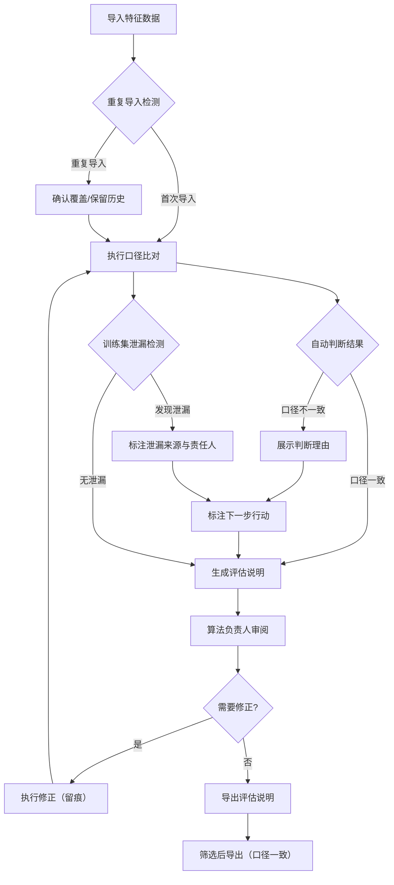

## 1. 产品概述

特征口径对账是一款面向算法团队的特征工程合规审查工具，解决特征口径不一致、标签漏映射无留痕、训练集泄漏难以追溯等核心痛点。目标用户为算法工程师（日常操作）和算法负责人（审阅评估说明），核心价值在于让每一次口径变更都可追溯、可撤回、可导出，且评估说明对非技术读者友好。

## 2. 核心功能

### 2.1 用户角色

| 角色 | 核心权限 |
|------|----------|
| 算法工程师 | 导入数据、执行对账、修正标签映射、撤回操作、筛选导出 |
| 算法负责人 | 查看评估说明、审阅对账结论、导出报告 |

### 2.2 功能模块

1. **对账主界面**：特征口径对比表、筛选条件面板、操作留痕时间线
2. **评估说明页面**：自动生成的对账结论摘要、判断理由展示、下一步行动项
3. **操作留痕页面**：全量操作日志、撤回修正记录、标签漏映射告警
4. **训练集泄漏检测**：泄漏来源标注（评估表/线上反馈）、责任人指引

### 2.3 页面详情

| 页面名称 | 模块名称 | 功能描述 |
|----------|----------|----------|
| 对账主界面 | 特征口径对比表 | 展示特征名称、训练口径、线上口径、是否一致、不一致原因 |
| 对账主界面 | 筛选条件面板 | 按特征名、口径状态、时间范围筛选；筛选条件变更后屏幕与导出范围同步 |
| 对账主界面 | 操作留痕时间线 | 侧边栏展示每次导入、修正、撤回的记录，含操作人、时间、变更详情 |
| 对账主界面 | 重复导入检测 | 重复导入时弹出确认，保留历史版本并标记差异 |
| 评估说明页面 | 对账结论摘要 | 自动生成文字版评估说明，包含口径一致率、异常项统计 |
| 评估说明页面 | 判断理由展示 | 每条自动判断结论附带判断依据和规则说明 |
| 评估说明页面 | 下一步行动项 | 针对异常项给出具体操作建议和负责人 |
| 操作留痕页面 | 操作日志 | 全量增删改查日志，支持按操作类型、时间范围检索 |
| 操作留痕页面 | 撤回修正 | 支持对历史操作进行撤回，撤回本身也留痕 |
| 操作留痕页面 | 标签漏映射告警 | 检测到标签未映射时生成告警，标注漏映射字段和建议补全方式 |
| 训练集泄漏检测 | 泄漏来源标注 | 泄漏检测命中时标注来源（评估表/线上反馈），附数据样本 |
| 训练集泄漏检测 | 责任人指引 | 泄漏事件标注下一步应联系的责任人和处理流程 |

## 3. 核心流程

用户通过导入数据启动对账，系统自动执行口径比对和泄漏检测，异常结果生成评估说明供负责人审阅，所有操作全程留痕可追溯。

## 4. 用户界面设计

### 4.1 设计风格

- **主色调**：深灰（zinc-900）为底，琥珀色（amber-500）为强调色，警示用红色（red-500）
- **辅助色**：石板灰（slate）系列用于表格和卡片背景
- **按钮风格**：圆角微凸（rounded-lg），主要操作用实色填充，次要操作用边框描边
- **字体**：标题用 JetBrains Mono（数据/工程感），正文用 Noto Sans SC（中文可读性）
- **布局风格**：左侧固定侧边栏（操作留痕时间线）+ 右侧主内容区（表格/评估说明）
- **图标风格**：线性图标（lucide-react），统一 16px 尺寸

### 4.2 页面设计概览

| 页面名称 | 模块名称 | UI元素 |
|----------|----------|--------|
| 对账主界面 | 特征口径对比表 | 表格：斑马纹行、状态标签（一致/不一致/待确认）、悬停高亮 |
| 对账主界面 | 筛选条件面板 | 顶部粘性面板：下拉选择器、日期范围、搜索框、重置按钮 |
| 对账主界面 | 操作留痕时间线 | 左侧侧边栏：垂直时间线、节点图标区分操作类型、展开详情 |
| 评估说明页面 | 对账结论摘要 | 卡片布局：大数字指标+趋势箭头、文字段落说明 |
| 评估说明页面 | 判断理由展示 | 可折叠面板：判断结论+展开查看规则依据 |
| 评估说明页面 | 下一步行动项 | 清单卡片：优先级标记、负责人头像、截止时间 |
| 操作留痕页面 | 撤回修正 | 操作按钮+确认弹窗、撤回后红色删除线标记 |
| 训练集泄漏检测 | 泄漏告警 | 顶部横幅告警：红色背景、来源标签、一键跳转责任人 |

### 4.3 响应式设计

- 桌面优先设计，最小宽度 1024px
- 侧边栏可折叠，窄屏时转为抽屉式
- 表格支持横向滚动

## 5. 关键约束

1. **口径一致性**：重复导入、撤回修正、筛选导出三个动作的口径定义必须一致，导出的评估说明范围与当前屏幕筛选条件严格对应
2. **留痕不可篡改**：所有操作日志仅追加，不可编辑删除，撤回操作本身生成新日志条目
3. **判断理由透明**：自动判断结论必须附带可展开的判断依据文本，不得仅显示结论
4. **评估说明自解释**：评估说明页面不依赖代码知识，每个结论需包含"是什么、为什么、下一步怎么办"
5. **状态持久化**：刷新、重启、切换筛选条件后，当前屏幕展示的数据范围与导出文件的数据范围严格一致
6. **泄漏事件不吞没**：训练集泄漏检测命中时必须展示告警，标注来源（评估表/线上反馈）并指明下一步联系人
