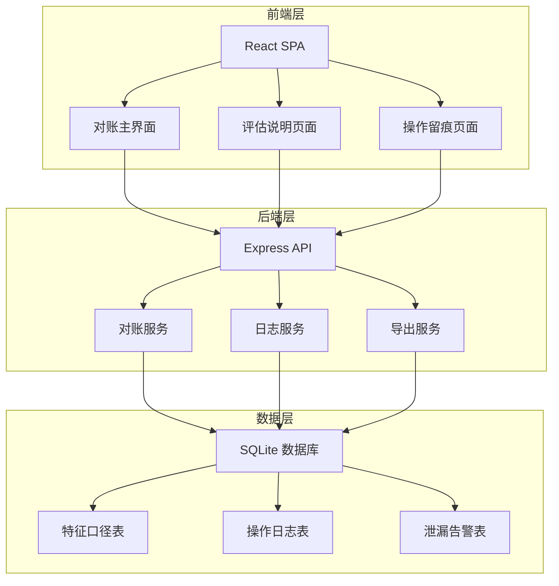
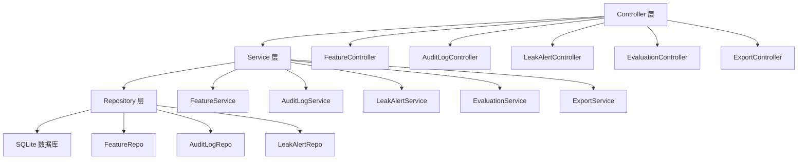
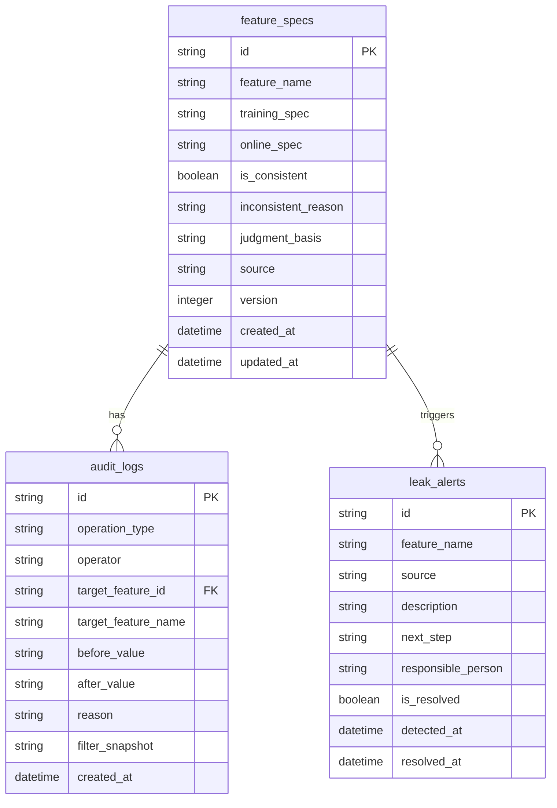

## 1. 架构设计



## 2. 技术说明

- **前端**：React@18 + TailwindCSS@3 + Vite + Zustand
- **初始化工具**：vite-init
- **后端**：Express@4 + TypeScript (ESM)
- **数据库**：SQLite（通过 better-sqlite3）
- **图标库**：lucide-react

## 3. 路由定义

| 路由 | 用途 |
|------|------|
| / | 对账主界面：特征口径对比表 + 筛选面板 + 操作时间线 |
| /evaluation | 评估说明页面：对账结论 + 判断理由 + 下一步行动 |
| /audit-log | 操作留痕页面：全量日志 + 撤回修正 + 漏映射告警 |
| /leak-detection | 训练集泄漏检测：泄漏来源 + 责任人指引 |

## 4. API 定义

### 4.1 数据类型

```typescript
interface FeatureSpec {
  id: string
  featureName: string
  trainingSpec: string
  onlineSpec: string
  isConsistent: boolean | null
  inconsistentReason: string | null
  judgmentBasis: string | null
  source: "import" | "manual" | "correction"
  version: number
  createdAt: string
  updatedAt: string
}

interface AuditLog {
  id: string
  operationType: "import" | "correction" | "rollback" | "filter_export" | "leak_detected"
  operator: string
  targetFeatureId: string | null
  targetFeatureName: string | null
  beforeValue: string | null
  afterValue: string | null
  reason: string | null
  filterSnapshot: string | null
  createdAt: string
}

interface LeakAlert {
  id: string
  featureName: string
  source: "evaluation_table" | "online_feedback"
  description: string
  nextStep: string
  responsiblePerson: string
  isResolved: boolean
  detectedAt: string
  resolvedAt: string | null
}

interface EvaluationReport {
  generatedAt: string
  filterConditions: Record<string, unknown>
  totalFeatures: number
  consistentCount: number
  inconsistentCount: number
  pendingCount: number
  leakAlertCount: number
  conclusions: EvaluationConclusion[]
}

interface EvaluationConclusion {
  featureName: string
  conclusion: string
  reason: string
  nextStep: string
  severity: "info" | "warning" | "critical"
}

interface FilterState {
  featureName: string
  status: "all" | "consistent" | "inconsistent" | "pending"
  dateRange: [string, string] | null
}
```

### 4.2 API 端点

| 方法 | 路径 | 用途 |
|------|------|------|
| GET | /api/features | 获取特征列表（支持筛选参数） |
| POST | /api/features/import | 导入特征数据（含重复检测） |
| PUT | /api/features/:id/correct | 修正特征口径 |
| POST | /api/features/:id/rollback | 撤回修正 |
| GET | /api/audit-logs | 获取操作日志 |
| GET | /api/leak-alerts | 获取泄漏告警 |
| PUT | /api/leak-alerts/:id/resolve | 标记泄漏已处理 |
| GET | /api/evaluation | 生成评估说明 |
| GET | /api/export | 导出评估说明（CSV/JSON） |

### 4.3 请求/响应示例

**POST /api/features/import**
```typescript
interface ImportRequest {
  features: Array<{
    featureName: string
    trainingSpec: string
    onlineSpec: string
  }>
  operator: string
}

interface ImportResponse {
  imported: number
  duplicates: Array<{
    featureName: string
    existingVersion: number
    action: "skipped" | "overwritten" | "versioned"
  }>
  auditLogId: string
}
```

**GET /api/evaluation**
```typescript
interface EvaluationQuery {
  featureName?: string
  status?: string
  dateFrom?: string
  dateTo?: string
}

// 响应同 EvaluationReport
```

**GET /api/export**
```typescript
interface ExportQuery {
  format: "csv" | "json"
  featureName?: string
  status?: string
  dateFrom?: string
  dateTo?: string
}
```

## 5. 服务端架构图



## 6. 数据模型

### 6.1 数据模型定义



### 6.2 数据定义语言

```sql
CREATE TABLE feature_specs (
  id TEXT PRIMARY KEY,
  feature_name TEXT NOT NULL,
  training_spec TEXT NOT NULL,
  online_spec TEXT NOT NULL,
  is_consistent INTEGER,
  inconsistent_reason TEXT,
  judgment_basis TEXT,
  source TEXT NOT NULL DEFAULT 'import',
  version INTEGER NOT NULL DEFAULT 1,
  created_at TEXT NOT NULL DEFAULT (datetime('now')),
  updated_at TEXT NOT NULL DEFAULT (datetime('now'))
);

CREATE INDEX idx_feature_specs_name ON feature_specs(feature_name);
CREATE INDEX idx_feature_specs_consistent ON feature_specs(is_consistent);
CREATE INDEX idx_feature_specs_source ON feature_specs(source);

CREATE TABLE audit_logs (
  id TEXT PRIMARY KEY,
  operation_type TEXT NOT NULL,
  operator TEXT NOT NULL,
  target_feature_id TEXT,
  target_feature_name TEXT,
  before_value TEXT,
  after_value TEXT,
  reason TEXT,
  filter_snapshot TEXT,
  created_at TEXT NOT NULL DEFAULT (datetime('now')),
  FOREIGN KEY (target_feature_id) REFERENCES feature_specs(id)
);

CREATE INDEX idx_audit_logs_type ON audit_logs(operation_type);
CREATE INDEX idx_audit_logs_created ON audit_logs(created_at);

CREATE TABLE leak_alerts (
  id TEXT PRIMARY KEY,
  feature_name TEXT NOT NULL,
  source TEXT NOT NULL,
  description TEXT NOT NULL,
  next_step TEXT NOT NULL,
  responsible_person TEXT NOT NULL,
  is_resolved INTEGER NOT NULL DEFAULT 0,
  detected_at TEXT NOT NULL DEFAULT (datetime('now')),
  resolved_at TEXT
);

CREATE INDEX idx_leak_alerts_resolved ON leak_alerts(is_resolved);
CREATE INDEX idx_leak_alerts_source ON leak_alerts(source);
```
