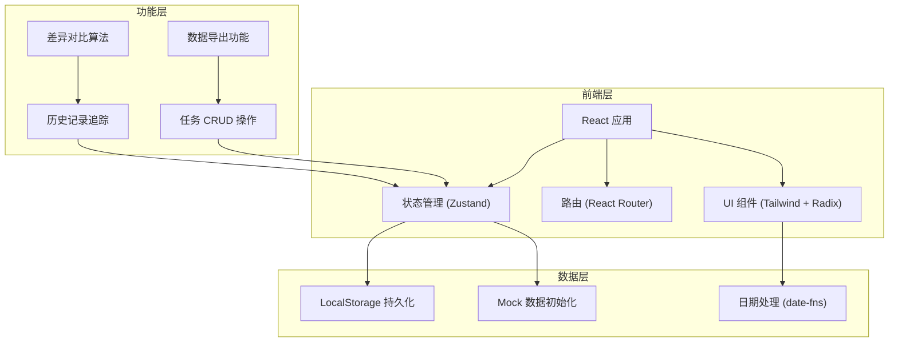
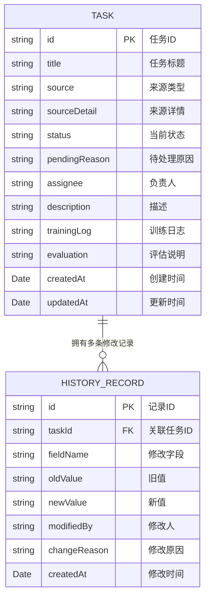

## 1. 架构设计



## 2. 技术描述

- **前端框架**：React@18 + TypeScript
- **构建工具**：Vite@5
- **样式方案**：TailwindCSS@3 + Radix UI 组件
- **状态管理**：Zustand (轻量级状态管理)
- **路由管理**：React Router@6
- **日期处理**：date-fns
- **图标库**：Lucide React
- **数据持久化**：LocalStorage (无需后端)
- **差异对比**：自定义 diff 算法

## 3. 路由定义

| 路由 | 用途 |
|------|------|
| / | 任务列表页 - 展示所有训练任务 |
| /tasks/:id | 任务详情页 - 查看任务信息和历史 |
| /tasks/new | 新建任务页 - 创建新训练任务 |
| /tasks/:id/edit | 编辑任务页 - 修改任务信息 |
| /guide | 使用指南页 - 操作说明和最佳实践 |

## 4. 数据模型

### 4.1 数据模型定义



### 4.2 TypeScript 类型定义

```typescript
type TaskStatus = 'pending' | 'in_progress' | 'completed' | 'archived';
type TaskSource = 'online_feedback' | 'config_file' | 'manual_edit' | 'other';

interface Task {
  id: string;
  title: string;
  source: TaskSource;
  sourceDetail: string;
  status: TaskStatus;
  pendingReason: string;
  assignee: string;
  description: string;
  trainingLog: string;
  evaluation: string;
  createdAt: string;
  updatedAt: string;
}

interface HistoryRecord {
  id: string;
  taskId: string;
  fieldName: string;
  oldValue: string;
  newValue: string;
  modifiedBy: string;
  changeReason: string;
  createdAt: string;
}
```

## 5. 核心功能实现方案

### 5.1 历史记录追踪
- 封装 `withHistory` 高阶函数，每次修改任务时自动生成历史记录
- 对比字段前后差异，仅记录实际变更的字段
- 支持多字段批量修改时生成多条历史记录

### 5.2 训练日志差异对比
- 实现基于行的 diff 算法
- 新增行：绿色背景 + 左侧 + 标记
- 删除行：红色背景 + 删除线 + 左侧 - 标记
- 未变更行：正常显示

### 5.3 数据导出
- 支持导出评估说明为 Markdown 格式
- 包含任务基本信息、修改历史摘要、评估结论

### 5.4 本地存储策略
- 使用 LocalStorage 存储 tasks 和 historyRecords
- 初始化时检查是否存在数据，不存在则加载 mock 数据
- 每次修改后自动同步到 LocalStorage
