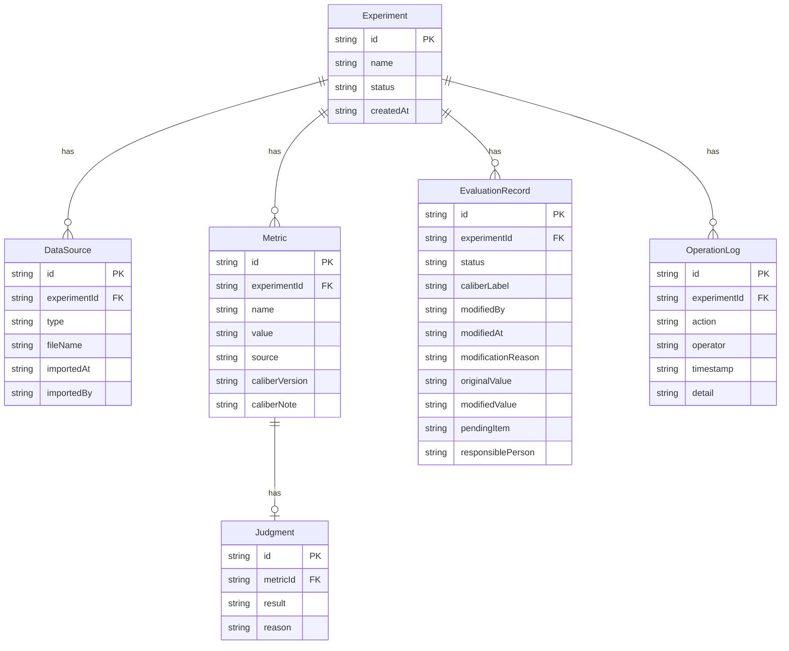

## 1. 架构设计

```mermaid
flowchart TB
    subgraph "前端层"
        "实验看板页" --- "数据管理页" --- "评估说明页"
    end
    subgraph "数据层"
        "Mock 数据服务" --- "本地状态管理"
    end
    "前端层" --> "数据层"
```

纯前端单页应用，数据存储在浏览器本地（localStorage），使用 mock 数据模拟后端服务。后续如需接入真实后端，只需替换数据层接口即可。

## 2. 技术说明

- 前端：React@18 + TailwindCSS@3 + Vite
- 初始化工具：Vite (npm create vite@latest)
- 后端：无（纯前端，mock 数据）
- 数据库：无（localStorage 持久化 + 内存状态管理）
- 状态管理：React Context + useReducer
- 图标：Phosphor React
- 字体：JetBrains Mono + Noto Sans SC（Google Fonts CDN）

## 3. 路由定义

| 路由 | 用途 |
|------|------|
| / | 实验看板页，数据流水线视图、指标比对、自动判断、筛选导出 |
| /manage | 数据管理页，导入、重复检测、撤回修正、操作日志 |
| /evaluation | 评估说明页，已确认/待补/人工改动记录分区展示 |

## 4. 数据模型

### 4.1 数据模型定义



### 4.2 数据定义语言

```typescript
type DataSourceType = "evaluation" | "online_feedback" | "config"

type RecordStatus = "confirmed" | "pending" | "manual_modified" | "importing"

interface Experiment {
  id: string
  name: string
  status: RecordStatus
  createdAt: string
}

interface DataSource {
  id: string
  experimentId: string
  type: DataSourceType
  fileName: string
  importedAt: string
  importedBy: string
}

interface Metric {
  id: string
  experimentId: string
  name: string
  value: string
  source: DataSourceType
  caliberVersion: string
  caliberNote: string
  caliberChanged: boolean
  caliberChangeSource: DataSourceType | null
  caliberChangeNextStep: string | null
}

interface Judgment {
  id: string
  metricId: string
  result: "pass" | "fail"
  reason: string
}

interface EvaluationRecord {
  id: string
  experimentId: string
  status: RecordStatus
  caliberLabel: string
  modifiedBy: string | null
  modifiedAt: string | null
  modificationReason: string | null
  originalValue: string | null
  modifiedValue: string | null
  pendingItem: string | null
  responsiblePerson: string | null
}

interface OperationLog {
  id: string
  experimentId: string
  action: "import" | "rollback" | "modify" | "confirm" | "reject"
  operator: string
  timestamp: string
  detail: string
}
```

## 5. 关键交互逻辑

### 5.1 重复导入检测

导入数据时按 `experimentId + sourceType + fileName` 三元组去重：
- 完全匹配：提示"数据已存在"，选择覆盖/跳过/撤回修正
- 部分匹配：提示"存在相似数据"，展示差异供确认

### 5.2 撤回修正流程

撤回操作生成一条 `OperationLog(action="rollback")`，将对应 `DataSource` 标记为已撤回，关联 `Metric` 和 `EvaluationRecord` 状态回退至上一版本。修正后重新导入，生成新的 `OperationLog(action="modify")`。

### 5.3 口径变更检测

当同一指标名在不同来源中出现不同的 `caliberVersion` 时：
- 标记 `caliberChanged = true`
- 记录 `caliberChangeSource`（评估表 or 线上反馈）
- 生成 `caliberChangeNextStep` 文字（如"请联系张三补全线上反馈口径"）
- 在看板页以黄色横幅展示
- 自动写入待补记录

### 5.4 筛选导出

筛选条件：来源类型、记录状态、时间范围。导出内容与看板当前筛选结果一致，导出为 CSV 格式，包含处理口径标注列。

## 6. 组件结构

```
src/
├── components/
│   ├── Layout/
│   │   ├── Sidebar.tsx
│   │   └── AppLayout.tsx
│   ├── Dashboard/
│   │   ├── PipelineView.tsx
│   │   ├── MetricComparison.tsx
│   │   ├── AutoJudgment.tsx
│   │   ├── CaliberChangeBanner.tsx
│   │   └── FilterBar.tsx
│   ├── DataManage/
│   │   ├── ImportZone.tsx
│   │   ├── DuplicateReport.tsx
│   │   ├── RollbackModal.tsx
│   │   └── OperationTimeline.tsx
│   └── Evaluation/
│       ├── ConfirmedList.tsx
│       ├── PendingList.tsx
│       ├── ModifiedList.tsx
│       └── CaliberTag.tsx
├── context/
│   └── AppContext.tsx
├── data/
│   └── mockData.ts
├── pages/
│   ├── Dashboard.tsx
│   ├── DataManage.tsx
│   └── Evaluation.tsx
├── types/
│   └── index.ts
├── App.tsx
└── main.tsx
```
