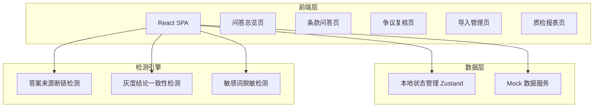
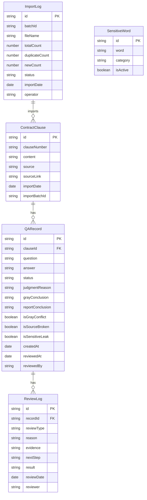

## 1. 架构设计

## 2. 技术说明

- 前端：React@18 + TypeScript + TailwindCSS@3 + Vite
- 初始化工具：Vite (react-ts template)
- 状态管理：Zustand（轻量级，适合中型应用）
- 后端：无（纯前端 + Mock 数据）
- 数据库：无（使用 localStorage 持久化 + 内存 Mock 数据）
- 图表库：Recharts
- 文件处理：xlsx（Excel导入/导出）、papaparse（CSV解析）
- 日期处理：date-fns

## 3. 路由定义

| 路由 | 用途 |
|------|------|
| / | 问答总览页，仪表盘展示关键指标 |
| /qa | 条款问答页，问答记录列表与判断详情 |
| /review | 争议复核页，争议记录复核操作 |
| /import | 导入管理页，批量导入与操作日志 |
| /report | 质检报表页，周报与争议明细 |

## 4. 数据模型

### 4.1 数据模型定义

### 4.2 数据定义

**QARecord.status 枚举值：**
- `normal` - 正常：三重检测全部通过
- `pending` - 待确认：至少一项检测未通过
- `confirmed` - 已确认：经人工复核确认为正常
- `rejected` - 已驳回：经人工复核需修正
- `known_issue` - 已知问题：标记为已知问题，定期复查

**争议类型 (ReviewLog.reviewType)：**
- `gray_conflict` - 灰度结论与报表不一致
- `source_broken` - 答案来源断链
- `sensitive_leak` - 敏感词漏脱敏

**检测规则：**
1. 答案来源断链检测：sourceLink 非空但无法访问或指向无效地址
2. 灰度结论一致性检测：grayConclusion 与 reportConclusion 不一致
3. 敏感词脱敏检测：answer 中包含 SensitiveWord 表中 isActive=true 的词汇且未脱敏处理

**操作口径一致性保证：**
- 每次导入生成唯一 batchId，关联所有导入的条款
- 撤回操作依据 batchId 恢复到导入前状态
- 导出操作应用当前筛选条件，确保导出数据与列表展示一致
- 所有操作记录 ImportLog，不可删除只能撤回
