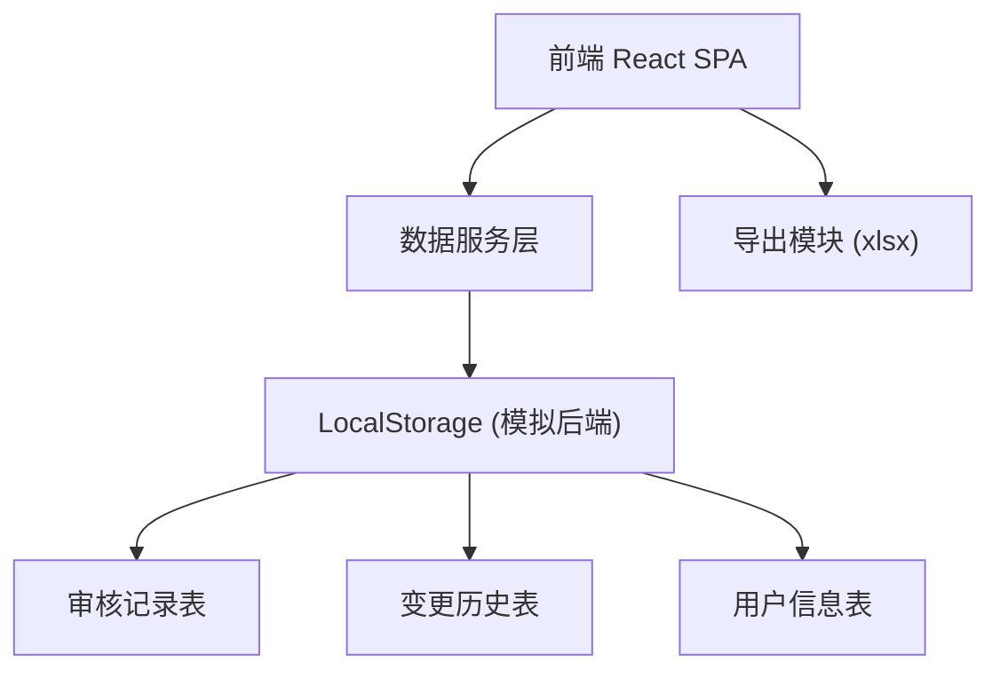
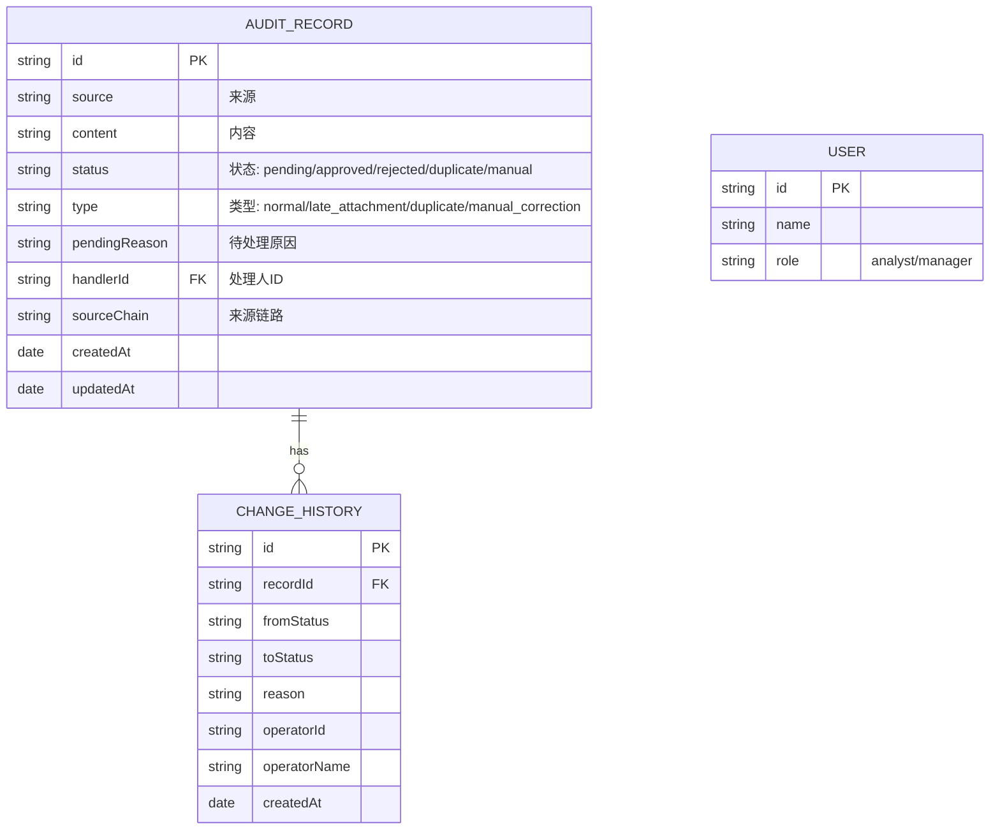

## 1. 架构设计



## 2. 技术选型

- **前端框架**: React@18 + TypeScript
- **构建工具**: Vite@5
- **样式方案**: TailwindCSS@3
- **路由管理**: React Router@6
- **状态管理**: Zustand
- **UI组件**: 自定义组件 (无第三方UI库)
- **数据持久化**: LocalStorage (模拟后端API)
- **导出功能**: xlsx (Excel导出)

## 3. 路由定义

| 路由路径 | 页面用途 |
|----------|----------|
| / | 审核记录列表页（首页） |
| /record/:id | 记录详情页 |
| /weekly-report | 质检周报页 |

## 4. 数据模型

### 4.1 数据模型定义



### 4.2 TypeScript 类型定义

```typescript
type RecordStatus = 'pending' | 'approved' | 'rejected' | 'duplicate' | 'manual';
type RecordType = 'normal' | 'late_attachment' | 'duplicate' | 'manual_correction';
type UserRole = 'analyst' | 'manager';

interface AuditRecord {
  id: string;
  source: string;
  content: string;
  status: RecordStatus;
  type: RecordType;
  pendingReason: string;
  handlerId: string | null;
  sourceChain: string;
  createdAt: string;
  updatedAt: string;
}

interface ChangeHistory {
  id: string;
  recordId: string;
  fromStatus: RecordStatus | null;
  toStatus: RecordStatus;
  reason: string;
  operatorId: string;
  operatorName: string;
  createdAt: string;
}

interface User {
  id: string;
  name: string;
  role: UserRole;
}
```

## 5. 核心业务规则

### 5.1 幂等性保证
- 数据导入时基于 `id + source` 做去重判断
- 批量处理操作生成操作ID，避免重复执行
- 状态变更时检查当前状态是否匹配预期状态

### 5.2 审计留痕
- 每次状态变更必须记录：变更前后状态、原因、操作人、时间
- 不允许物理删除，只允许逻辑删除
- 来源字段不可修改，只能追加来源链路

### 5.3 周报一致性
- 导出周报时携带当前筛选条件的快照
- 周报数据范围与列表页当前显示范围完全一致
- 分页状态在刷新/切换页面后保持一致

## 6. 目录结构

```
src/
├── components/
│   ├── layout/
│   ├── table/
│   ├── filter/
│   └── timeline/
├── pages/
│   ├── RecordList/
│   ├── RecordDetail/
│   └── WeeklyReport/
├── store/
│   ├── useRecordStore.ts
│   └── useFilterStore.ts
├── types/
│   └── index.ts
├── utils/
│   ├── export.ts
│   └── idempotent.ts
└── mock/
    └── initialData.ts
```
