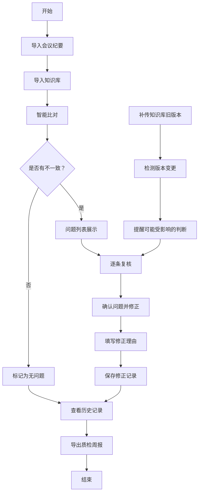

## 1. 产品概述

会议纪要纠偏系统是一款面向一线运营同事的本地办公工具，解决会议纪要与知识库信息不对称、答案来源断链、历史追溯困难等问题。通过导入、复核、修正、历史追溯和导出全流程打通，让一线同事愿意主动使用，降低沟通成本，保证信息传递的准确性。

- 核心问题：运营分析师发现会议纪要与知识库信息不一致，但知识库导出版本无人留底，无法追溯
- 目标用户：一线运营同事、运营分析师、交接班团队
- 核心价值：让纠偏过程可追溯、错误提示人性化、交接班无需翻聊天记录

## 2. 核心功能

### 2.1 用户角色

| 角色 | 注册方式 | 核心权限 |
|------|----------|----------|
| 一线运营 | 本地直接使用，无需注册 | 导入纪要、复核、修正、查看历史、导出周报 |
| 运营分析师 | 本地直接使用，无需注册 | 所有运营权限 + 知识库版本管理 + 变更对比 |

### 2.2 功能模块

1. **导入页面**：会议纪要导入、知识库导入、版本记录
2. **复核页面**：智能比对、问题列表、逐条审核、来源追溯
3. **修正页面**：内容编辑、修正备注、提交确认
4. **历史记录**：版本对比、操作日志、变更详情
5. **导出页面**：质检周报导出、原始数据导出

### 2.3 页面详情

| 页面名称 | 模块名称 | 功能描述 |
|---------|----------|----------|
| 导入页面 | 会议纪要导入 | 支持 TXT/MD/CSV 格式，拖拽上传，解析后展示内容预览 |
| 导入页面 | 知识库导入 | 支持多版本导入，自动记录版本号和导入时间，版本冲突时提醒 |
| 导入页面 | 导入反馈 | 友好错误提示，如"这个文件格式我看不懂哦，试试 TXT 或 MD 格式？"而非堆栈信息 |
| 复核页面 | 智能比对 | 自动比对会议纪要与知识库，标记不一致项，列出差异点 |
| 复核页面 | 问题列表 | 卡片式展示每条问题，包含问题描述、原文、知识库原文、置信度 |
| 复核页面 | 来源追溯 | 点击可跳转至对应知识库原文位置，显示完整上下文 |
| 修正页面 | 内容编辑 | 支持富文本编辑修正内容，自动保留修改痕迹 |
| 修正页面 | 修正备注 | 必填修正理由，便于后续追溯 |
| 历史记录 | 版本对比 | 高亮显示两个版本的差异，支持知识库旧版本与新版本对比 |
| 历史记录 | 变更提醒 | 补传知识库旧版本时，醒目提醒"检测到知识库版本变更，以下判断可能受影响" |
| 历史记录 | 操作日志 | 记录每一步操作人、操作时间、操作内容 |
| 导出页面 | 质检周报 | 导出包含问题列表、修正情况、待跟进事项的周报，重点是可追溯 |
| 导出页面 | 原始数据 | 支持导出完整比对数据，便于二次分析 |

## 3. 核心流程

### 3.1 主要用户流程

一线运营同事收到会议纪要后，导入系统进行智能复核。系统自动比对知识库内容，标记出不一致的地方。运营同事逐条审核，确认问题后进行修正并填写理由。所有操作都会被记录，交接班时导出质检周报，下一班同事可以直接查看，无需翻阅聊天记录。如果后续补传了旧版本的知识库，系统会自动提醒哪些之前的判断可能因为知识库更新而需要重新复核。

## 4. 用户界面设计

### 4.1 设计风格

- **主色调**：沉稳的藏蓝色 (#1e3a5f)，传递专业可靠的感觉
- **辅助色**：柔和的橙色 (#f97316) 用于提醒和警告，绿色 (#10b981) 表示正确，红色 (#ef4444) 表示错误
- **背景色**：浅灰蓝色 (#f0f4f8)，护眼且专业
- **按钮风格**：圆角矩形，轻微阴影，悬停时有微放大和颜色加深效果
- **字体**：标题使用思源黑体 Bold，正文使用思源黑体 Regular，确保中文显示清晰
- **布局风格**：左右分栏，左侧导航 + 右侧内容区，卡片式布局，信息层次分明
- **图标风格**：线性图标，统一 24px 尺寸，颜色与主色调呼应

### 4.2 页面设计概述

| 页面名称 | 模块名称 | UI 元素 |
|---------|----------|---------|
| 导入页面 | 上传区域 | 大尺寸拖拽上传区，虚线边框，拖入时高亮，上传后显示文件卡片 |
| 导入页面 | 版本列表 | 时间线式展示历史导入版本，高亮当前激活版本 |
| 复核页面 | 问题卡片 | 三色标签（严重/一般/提示），展开显示详细对比，支持一键跳转修正 |
| 复核页面 | 比对视图 | 左右分栏对比，差异部分高亮显示，鼠标悬停显示完整上下文 |
| 修正页面 | 编辑器 | 分栏布局，左侧原文，右侧编辑区，实时预览修正效果 |
| 历史记录 | 时间轴 | 垂直时间轴展示操作记录，点击展开详情，支持筛选 |
| 历史记录 | 变更提醒 | 顶部固定黄色警告条，醒目提示"知识库已更新，请复核以下内容" |
| 导出页面 | 导出选项 | 卡片式选择导出类型，预览导出内容，一键下载 |

### 4.3 响应式设计

- 桌面端优先设计，支持 1280px 及以上分辨率
- 平板端自适应，左右分栏变为上下布局
- 错误提示和警告信息在所有尺寸下都保持醒目
- 触摸设备优化按钮尺寸，最小 44px 点击区域

### 4.4 动画与交互

- 页面加载：内容区域淡入，导航项依次滑入
- 上传交互：文件拖入时边框呼吸灯效果
- 问题标记：发现问题时卡片轻微抖动吸引注意
- 变更提醒：黄色警告条从顶部滑入，带脉冲动画
- 按钮交互：点击时缩放 0.98，释放时回弹
