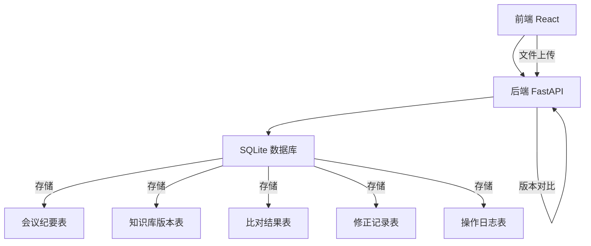
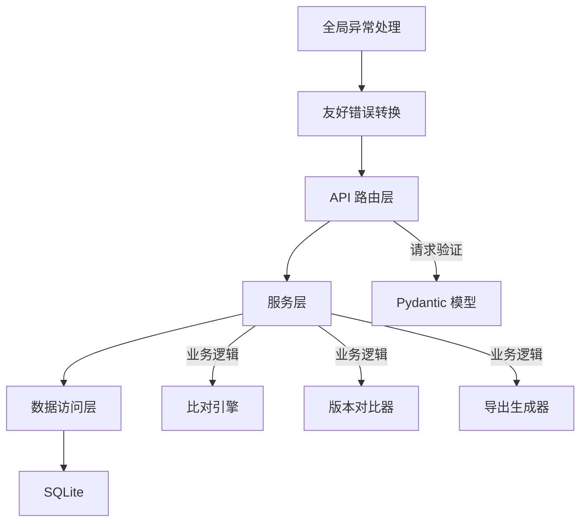
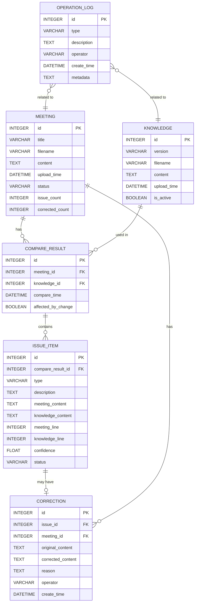

## 1. 架构设计



## 2. 技术描述

- **前端**: React@18 + TypeScript + tailwindcss@3 + vite@5 + react-router-dom@6 + lucide-react
- **后端**: FastAPI@0.115 + Python@3.11 + SQLAlchemy@2 + Pydantic@2
- **数据库**: SQLite（本地文件存储，无需额外安装）
- **初始化工具**: 
  - 前端: npm create vite@latest
  - 后端: Python venv 虚拟环境

## 3. 路由定义

### 前端路由

| 路由 | 页面 | 说明 |
|------|------|------|
| / | 首页 | 快速导入入口和功能导航 |
| /import | 导入页面 | 会议纪要和知识库导入 |
| /review | 复核页面 | 问题列表和比对详情 |
| /correct/:id | 修正页面 | 内容编辑和修正提交 |
| /history | 历史记录 | 操作日志和版本对比 |
| /export | 导出页面 | 质检周报和数据导出 |

### 后端 API 路由

| 方法 | 路由 | 说明 |
|------|------|------|
| POST | /api/meeting/upload | 上传会议纪要 |
| GET | /api/meeting | 获取会议纪要列表 |
| GET | /api/meeting/{id} | 获取单个会议纪要详情 |
| POST | /api/knowledge/upload | 上传知识库版本 |
| GET | /api/knowledge | 获取知识库版本列表 |
| GET | /api/knowledge/{id} | 获取知识库版本详情 |
| POST | /api/compare/{meeting_id} | 执行智能比对 |
| GET | /api/compare/{meeting_id} | 获取比对结果 |
| POST | /api/correction | 提交修正记录 |
| GET | /api/correction/{meeting_id} | 获取修正记录 |
| GET | /api/history | 获取操作历史 |
| GET | /api/history/compare/{knowledge_id} | 知识库版本变更对比 |
| GET | /api/export/weekly/{meeting_id} | 导出质检周报 |
| GET | /api/export/raw/{meeting_id} | 导出原始数据 |

## 4. API 定义

### 类型定义

```typescript
// 会议纪要
interface Meeting {
  id: number;
  title: string;
  filename: string;
  content: string;
  upload_time: string;
  status: 'pending' | 'comparing' | 'completed' | 'issues_found';
  issue_count: number;
  corrected_count: number;
}

// 知识库版本
interface Knowledge {
  id: number;
  version: string;
  filename: string;
  content: string;
  upload_time: string;
  is_active: boolean;
  changes?: ChangeItem[];
}

// 比对结果
interface CompareResult {
  id: number;
  meeting_id: number;
  knowledge_id: number;
  issues: IssueItem[];
  compare_time: string;
  affected_by_knowledge_change?: boolean;
}

// 问题项
interface IssueItem {
  id: number;
  type: 'critical' | 'warning' | 'info';
  description: string;
  meeting_content: string;
  knowledge_content: string;
  meeting_location: { line: number; char: number };
  knowledge_location: { line: number; char: number };
  confidence: number;
  status: 'pending' | 'confirmed' | 'resolved' | 'ignored';
}

// 修正记录
interface Correction {
  id: number;
  issue_id: number;
  meeting_id: number;
  original_content: string;
  corrected_content: string;
  reason: string;
  operator: string;
  create_time: string;
}

// 操作日志
interface OperationLog {
  id: number;
  type: 'upload' | 'compare' | 'correct' | 'export' | 'knowledge_upload';
  description: string;
  operator: string;
  create_time: string;
  metadata?: Record<string, any>;
}

// 版本变更项
interface ChangeItem {
  type: 'added' | 'deleted' | 'modified';
  content: string;
  location: { line: number; char: number };
  affected_issue_ids: number[];
}

// 通用响应
interface ApiResponse<T> {
  success: boolean;
  data?: T;
  message: string;
  user_friendly_message: string;
}
```

### 错误处理规范

所有 API 错误响应必须包含 `user_friendly_message` 字段，使用人性化语言：

```json
{
  "success": false,
  "message": "FileNotFoundError: knowledge_v1.md not found",
  "user_friendly_message": "找不到这个知识库文件哦，看看是不是文件名记错了？"
}
```

## 5. 服务端架构



### 目录结构

```
backend/
├── app/
│   ├── main.py              # FastAPI 入口
│   ├── api/                 # 路由层
│   │   ├── meeting.py
│   │   ├── knowledge.py
│   │   ├── compare.py
│   │   ├── correction.py
│   │   ├── history.py
│   │   └── export.py
│   ├── services/            # 服务层
│   │   ├── meeting_service.py
│   │   ├── knowledge_service.py
│   │   ├── compare_service.py
│   │   ├── correction_service.py
│   │   └── export_service.py
│   ├── repositories/        # 数据访问层
│   │   ├── meeting_repo.py
│   │   ├── knowledge_repo.py
│   │   └── base.py
│   ├── models/              # SQLAlchemy 模型
│   │   ├── meeting.py
│   │   ├── knowledge.py
│   │   ├── compare.py
│   │   ├── correction.py
│   │   └── operation_log.py
│   ├── schemas/             # Pydantic 模型
│   │   ├── meeting.py
│   │   ├── knowledge.py
│   │   ├── compare.py
│   │   ├── correction.py
│   │   └── common.py
│   ├── core/                # 核心组件
│   │   ├── database.py
│   │   ├── config.py
│   │   ├── exceptions.py
│   │   └── error_messages.py
│   └── utils/               # 工具函数
│       ├── text_compare.py
│       ├── version_compare.py
│       └── file_parser.py
├── data/                    # SQLite 数据库文件
├── uploads/                 # 上传文件存储
└── requirements.txt
```

## 6. 数据模型

### 6.1 ER 图



### 6.2 DDL 语句

```sql
CREATE TABLE meeting (
    id INTEGER PRIMARY KEY AUTOINCREMENT,
    title VARCHAR(255) NOT NULL,
    filename VARCHAR(255) NOT NULL,
    content TEXT NOT NULL,
    upload_time DATETIME DEFAULT CURRENT_TIMESTAMP,
    status VARCHAR(20) DEFAULT 'pending',
    issue_count INTEGER DEFAULT 0,
    corrected_count INTEGER DEFAULT 0
);

CREATE TABLE knowledge (
    id INTEGER PRIMARY KEY AUTOINCREMENT,
    version VARCHAR(50) NOT NULL,
    filename VARCHAR(255) NOT NULL,
    content TEXT NOT NULL,
    upload_time DATETIME DEFAULT CURRENT_TIMESTAMP,
    is_active BOOLEAN DEFAULT 1
);

CREATE TABLE compare_result (
    id INTEGER PRIMARY KEY AUTOINCREMENT,
    meeting_id INTEGER NOT NULL,
    knowledge_id INTEGER NOT NULL,
    compare_time DATETIME DEFAULT CURRENT_TIMESTAMP,
    affected_by_change BOOLEAN DEFAULT 0,
    FOREIGN KEY (meeting_id) REFERENCES meeting(id),
    FOREIGN KEY (knowledge_id) REFERENCES knowledge(id)
);

CREATE TABLE issue_item (
    id INTEGER PRIMARY KEY AUTOINCREMENT,
    compare_result_id INTEGER NOT NULL,
    type VARCHAR(20) NOT NULL,
    description TEXT NOT NULL,
    meeting_content TEXT NOT NULL,
    knowledge_content TEXT NOT NULL,
    meeting_line INTEGER,
    meeting_char INTEGER,
    knowledge_line INTEGER,
    knowledge_char INTEGER,
    confidence FLOAT DEFAULT 0.0,
    status VARCHAR(20) DEFAULT 'pending',
    FOREIGN KEY (compare_result_id) REFERENCES compare_result(id)
);

CREATE TABLE correction (
    id INTEGER PRIMARY KEY AUTOINCREMENT,
    issue_id INTEGER NOT NULL,
    meeting_id INTEGER NOT NULL,
    original_content TEXT NOT NULL,
    corrected_content TEXT NOT NULL,
    reason TEXT NOT NULL,
    operator VARCHAR(100) DEFAULT '本地用户',
    create_time DATETIME DEFAULT CURRENT_TIMESTAMP,
    FOREIGN KEY (issue_id) REFERENCES issue_item(id),
    FOREIGN KEY (meeting_id) REFERENCES meeting(id)
);

CREATE TABLE operation_log (
    id INTEGER PRIMARY KEY AUTOINCREMENT,
    type VARCHAR(20) NOT NULL,
    description TEXT NOT NULL,
    operator VARCHAR(100) DEFAULT '本地用户',
    create_time DATETIME DEFAULT CURRENT_TIMESTAMP,
    metadata TEXT
);

CREATE INDEX idx_meeting_status ON meeting(status);
CREATE INDEX idx_knowledge_active ON knowledge(is_active);
CREATE INDEX idx_issue_status ON issue_item(status);
CREATE INDEX idx_operation_time ON operation_log(create_time);
```
