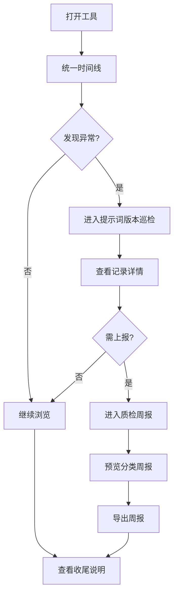

## 1. 产品概述

面向运营分析师的轻量级提示词版本巡检工具，将灰度发布记录、质检评分表和客服对话串联到统一时间线上查看，帮助分析师快速定位提示词变更的影响链路和异常记录。

- 核心价值：减少分析师在多个系统间来回切换的成本，让"谁改了什么、为什么进了待处理"一目了然
- 目标用户：运营分析师（日常巡检）、业务负责人（查看质检周报）

## 2. 核心功能

### 2.1 用户角色

| 角色 | 使用方式 | 核心权限 |
|------|----------|----------|
| 运营分析师 | 直接访问 | 浏览时间线、标记记录状态、导出周报 |
| 业务负责人 | 查看周报 | 查看已分类的质检周报 |

### 2.2 功能模块

1. **统一时间线页面**：灰度记录、质检表、客服对话三条数据流合并到同一时间轴
2. **提示词版本巡检**：每条记录显示来源、当前状态、修改人、待处理原因，支持摄入含正常/晚到/重复/人工更正的混合数据包
3. **质检周报导出**：按已确认/待补/人工改过分类输出，含处理口径
4. **收尾说明**：简要操作指引（放灰度样例、查漏脱敏、导出前复核）

### 2.3 页面详情

| 页面名称 | 模块名称 | 功能描述 |
|----------|----------|----------|
| 统一时间线 | 时间轴主体 | 按时间倒序展示灰度记录、质检评分、客服对话三种卡片，可按类型筛选 |
| 统一时间线 | 筛选面板 | 按记录类型、状态（已确认/待补/人工改过）、日期范围筛选 |
| 提示词版本巡检 | 巡检列表 | 展示所有巡检记录，每条显示来源系统、当前状态、最近修改人、待处理原因标签 |
| 提示词版本巡检 | 记录详情抽屉 | 侧滑展开单条记录完整信息，含变更历史 |
| 提示词版本巡检 | 数据摄入 | 上传混合数据包，自动标记晚到附件、重复项、人工更正 |
| 质检周报 | 周报预览 | 按已确认/待补/人工改过分 Tab 展示，每条带处理口径说明 |
| 质检周报 | 导出功能 | 导出为 HTML 格式周报 |
| 收尾说明 | 操作指引 | 三段式指引：放灰度记录样例、查敏感词漏脱敏、导出前复核步骤 |

## 3. 核心流程

运营分析师打开工具后，默认进入统一时间线页面，可以纵向浏览灰度记录、质检评分和客服对话的合并时间轴。当发现异常或需要系统化检查时，切换到"提示词版本巡检"页面，浏览所有记录的来源、状态和修改历史。如需上报，进入"质检周报"页面预览并导出分类周报。收尾说明页面提供操作备忘。

## 4. 用户界面设计

### 4.1 设计风格

- 主色：石板灰（slate-700）搭配琥珀色（amber-500）强调
- 辅色：翡翠绿（emerald-500）标记已确认，玫红（rose-400）标记待补，天蓝（sky-400）标记人工改过
- 按钮风格：圆角小号按钮，微妙阴影
- 字体：Noto Sans SC 正文，JetBrains Mono 数据/代码片段
- 布局：左侧窄导航 + 右侧主内容区，桌面优先
- 图标：lucide-react 线性图标

### 4.2 页面设计概览

| 页面名称 | 模块名称 | UI 元素 |
|----------|----------|----------|
| 统一时间线 | 时间轴主体 | 竖向时间线，左侧时间刻度，右侧卡片流（灰度=amber边框、质检=emerald边框、对话=sky边框） |
| 统一时间线 | 筛选面板 | 顶部横向筛选条，Chips 式多选 |
| 提示词版本巡检 | 巡检列表 | 表格式列表，行末状态标签（pill shape），来源列带系统图标 |
| 提示词版本巡检 | 记录详情 | 右侧抽屉（Drawer），暗色半透明遮罩 |
| 提示词版本巡检 | 数据摄入 | 拖拽上传区 + 摄入结果摘要面板 |
| 质检周报 | 周报预览 | 三 Tab 布局，每 Tab 内为简化表格 + 处理口径文字 |
| 质检周报 | 导出按钮 | 固定在页面右上角 |
| 收尾说明 | 操作指引 | 三段编号卡片，步骤式排列 |

### 4.3 响应式

桌面优先设计，最小支持 1280px 宽度。移动端暂不做适配，运营分析师主要在办公电脑使用。

### 4.4 3D 场景

不适用
