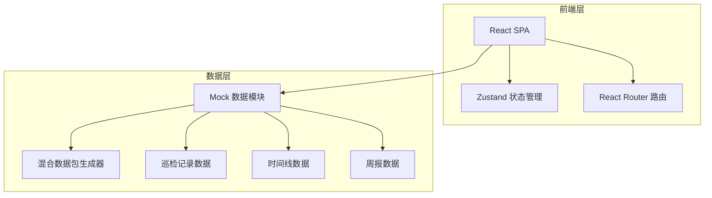
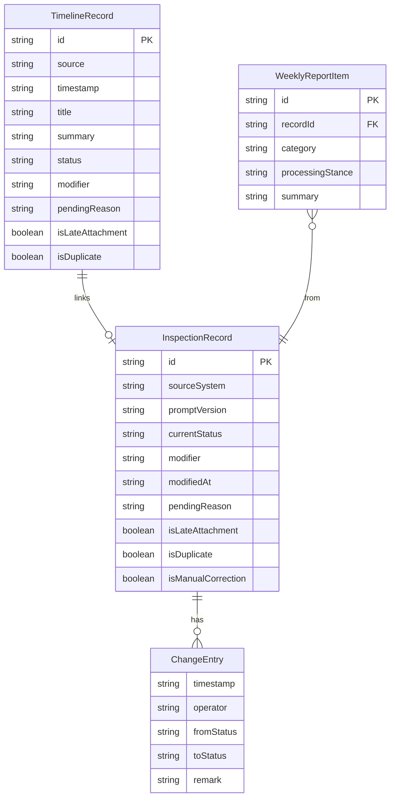

## 1. 架构设计



纯前端架构，所有数据通过 Mock 模块提供。无需后端服务和数据库。

## 2. 技术说明

- 前端：React@18 + TypeScript + Tailwind CSS@3 + Vite
- 初始化工具：vite-init（react-ts 模板）
- 状态管理：Zustand
- 路由：react-router-dom
- 后端：无
- 数据库：无，使用 Mock 数据

## 3. 路由定义

| 路由 | 用途 |
|------|------|
| `/` | 重定向到 `/timeline` |
| `/timeline` | 统一时间线页面 |
| `/inspection` | 提示词版本巡检页面 |
| `/weekly-report` | 质检周报页面 |
| `/guide` | 收尾说明页面 |

## 4. API 定义

无后端 API。数据通过 Zustand store 和 Mock 数据模块提供。

### 4.1 数据类型定义

```typescript
type RecordSource = "grayscale" | "quality_check" | "customer_service"
type RecordStatus = "confirmed" | "pending" | "manual_corrected"

interface TimelineRecord {
  id: string
  source: RecordSource
  timestamp: string
  title: string
  summary: string
  status: RecordStatus
  modifier?: string
  pendingReason?: string
  isLateAttachment?: boolean
  isDuplicate?: boolean
  tags: string[]
}

interface InspectionRecord {
  id: string
  sourceSystem: string
  sourceIcon: string
  promptVersion: string
  currentStatus: RecordStatus
  modifier: string
  modifiedAt: string
  pendingReason?: string
  changeHistory: ChangeEntry[]
  isLateAttachment?: boolean
  isDuplicate?: boolean
  isManualCorrection?: boolean
}

interface ChangeEntry {
  timestamp: string
  operator: string
  fromStatus: RecordStatus
  toStatus: RecordStatus
  remark: string
}

interface WeeklyReportItem {
  id: string
  recordId: string
  category: "confirmed" | "pending" | "manual_corrected"
  processingStance: string
  summary: string
  source: RecordSource
  timestamp: string
}
```

## 5. 服务端架构

不适用

## 6. 数据模型

### 6.1 数据模型定义



### 6.2 数据定义语言

不适用（纯前端 Mock 数据）
