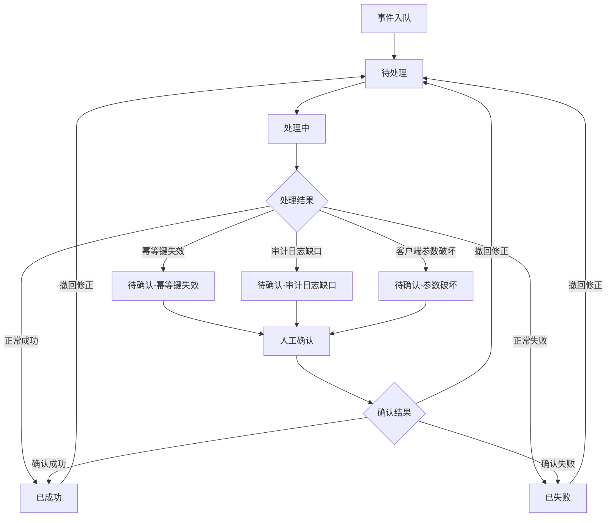
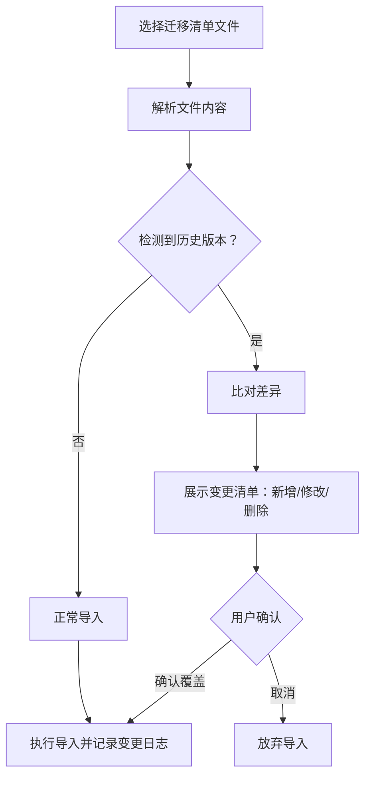
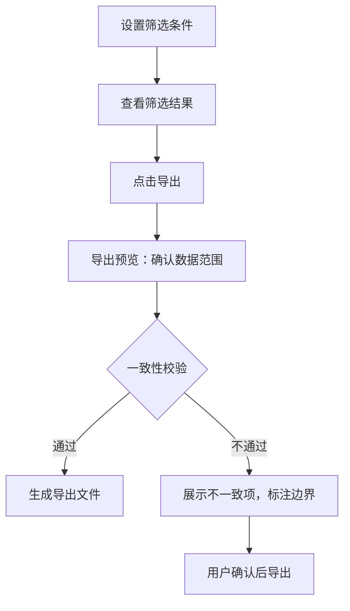

## 1. 产品概述

Webhook补偿队列管理工具，面向后端、运维和接入方开发人员，解决幂等键失效后结果不可确认、重复导入覆盖判断、异常状态混入正常结果等核心痛点。产品强调状态回看、异常解释和导出一致性，而非装饰性功能。

- 核心问题：幂等键失效导致同一事件多次投递后，无人敢确认最终结果；审计日志缺口、旧客户端参数被破坏等异常被混入正常结果
- 目标用户：后端开发、运维工程师、接入方开发

## 2. 核心功能

### 2.1 用户角色

| 角色 | 使用方式 | 核心权限 |
|------|----------|----------|
| 后端开发 | 直接使用 | 查看队列、标记确认、撤回修正、导出 |
| 运维工程师 | 直接使用 | 查看队列、批量操作、导出、导入迁移清单 |
| 接入方开发 | 受限使用 | 查看己方事件、确认己方结果 |

### 2.2 功能模块

1. **补偿队列主页**：队列列表、多维度筛选、状态标签、异常高亮
2. **事件详情与状态回看**：事件完整生命周期、每次状态变更的时间线和原因
3. **异常解释面板**：对审计日志缺口、幂等键失效、旧客户端参数破坏三种异常的专门解释与标记
4. **导入与版本管理**：重复导入检测、迁移清单版本变更提醒、差异标注
5. **撤回修正**：对已确认/已失败事件进行撤回，修正后重新入队
6. **筛选导出**：按筛选条件导出，保证导出数据与界面展示口径一致

### 2.3 页面详情

| 页面名称 | 模块名称 | 功能描述 |
|----------|----------|----------|
| 补偿队列主页 | 队列列表 | 展示所有补偿事件，含ID、幂等键、状态、异常标记、创建时间、最后更新时间 |
| 补偿队列主页 | 筛选面板 | 按状态、异常类型、时间范围、接入方、幂等键搜索筛选 |
| 补偿队列主页 | 批量操作栏 | 批量标记待确认、批量导出、批量重试 |
| 补偿队列主页 | 导入入口 | 导入迁移清单，触发版本比对和差异提醒 |
| 事件详情页 | 状态时间线 | 展示事件从创建到当前的所有状态变更，每步含操作人、时间、原因 |
| 事件详情页 | 异常解释 | 对异常类型给出原因说明、影响范围、建议处理方式 |
| 事件详情页 | 撤回修正 | 撤回当前状态，填写修正原因，事件回到待确认状态 |
| 导出预览页 | 导出配置 | 选择导出格式、确认筛选条件、预览导出数据范围 |
| 导出预览页 | 一致性校验 | 校验导出数据与当前筛选条件的一致性，标注边界情况 |

## 3. 核心流程

### 3.1 事件生命周期

事件从进入补偿队列开始，经历待处理→处理中→成功/失败/待确认等状态。异常情况（幂等键失效、审计日志缺口、旧客户端参数破坏）会强制标记为"待确认"，不进入成功或失败终态。

### 3.2 导入迁移清单流程

### 3.3 筛选导出流程

## 4. 用户界面设计

### 4.1 设计风格

- 主色调：深灰(#18181B) + 琥珀色(#F59E0B)作为异常警示色 + 翠绿(#10B981)作为正常状态色
- 辅助色：红色(#EF4444)用于失败/严重异常，蓝灰(#64748B)用于待确认
- 按钮风格：圆角矩形(8px)，扁平化，异常操作用描边样式区分
- 字体：等宽字体用于ID和幂等键展示，无衬线字体用于正文
- 布局风格：左侧固定筛选面板 + 右侧主内容区，表格为主
- 图标风格：线条图标（lucide-react），克制使用

### 4.2 页面设计概览

| 页面名称 | 模块名称 | UI元素 |
|----------|----------|--------|
| 补偿队列主页 | 队列列表 | 表格布局，行含状态色条，异常行高亮底色，悬停展开摘要 |
| 补偿队列主页 | 筛选面板 | 左侧固定面板，折叠式分组，多选标签筛选 |
| 补偿队列主页 | 批量操作栏 | 表格顶部固定栏，选中后显示，含操作按钮和计数 |
| 补偿队列主页 | 导入入口 | 右上角按钮，点击弹出模态框，含拖拽上传区域 |
| 事件详情页 | 状态时间线 | 左侧竖向时间线，节点含状态图标，右侧展示详情 |
| 事件详情页 | 异常解释 | 卡片式，左侧异常类型图标，右侧原因+影响+建议 |
| 事件详情页 | 撤回修正 | 底部固定操作栏，撤回按钮+原因输入框 |
| 导出预览页 | 导出配置 | 左侧配置面板，右侧数据预览表格 |
| 导出预览页 | 一致性校验 | 顶部警告条，列出不一致项 |

### 4.3 响应式设计

- 桌面优先设计，最小宽度1024px
- 筛选面板在大屏固定，中屏可折叠
- 表格在窄屏启用横向滚动
- 详情页在窄屏切换为全屏模态

### 4.4 状态标签设计

| 状态 | 标签颜色 | 说明 |
|------|----------|------|
| 待处理 | zinc/灰色 | 刚入队，未开始处理 |
| 处理中 | amber/琥珀色 | 正在处理 |
| 已成功 | emerald/翠绿 | 正常完成 |
| 已失败 | red/红色 | 处理失败 |
| 待确认-幂等键失效 | amber/琥珀色 + 虚线边框 | 幂等键冲突，需人工确认 |
| 待确认-审计日志缺口 | amber/琥珀色 + 虚线边框 | 日志不完整，需人工确认 |
| 待确认-参数破坏 | amber/琥珀色 + 虚线边框 | 客户端参数异常，需人工确认 |
| 已撤回 | slate/石板灰 | 已被撤回，等待重新处理 |
