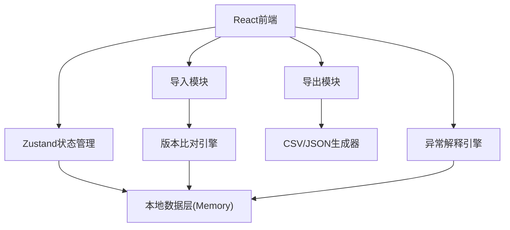
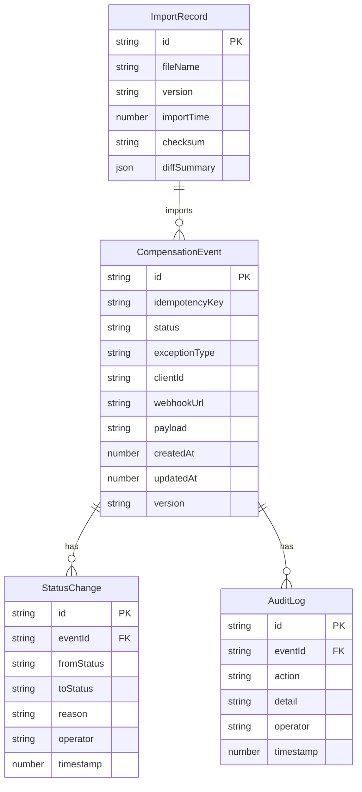

## 1. 架构设计

纯前端架构，无后端依赖。所有数据存储在Zustand store的内存中，通过localStorage持久化。导出功能在前端生成文件，导入功能在前端解析和比对。

## 2. 技术说明

- 前端：React@18 + TypeScript + Tailwind CSS@3 + Vite
- 初始化工具：vite-init
- 后端：无（纯前端，数据mock）
- 数据持久化：localStorage + Zustand persist middleware
- 状态管理：Zustand
- 图标：lucide-react
- 路由：react-router-dom

## 3. 路由定义

| 路由 | 用途 |
|------|------|
| / | 补偿队列主页，展示事件列表和筛选 |
| /event/:id | 事件详情页，展示状态时间线和异常解释 |
| /export | 导出预览页，配置导出并校验一致性 |

## 4. 数据模型

### 4.1 数据模型定义

### 4.2 数据定义

#### CompensationEvent

| 字段 | 类型 | 说明 |
|------|------|------|
| id | string | 事件唯一ID，格式 evt_xxxx |
| idempotencyKey | string | 幂等键 |
| status | enum | pending / processing / success / failed / pending_confirm_idempotency / pending_confirm_audit_gap / pending_confirm_param_corrupted / revoked |
| exceptionType | enum | none / idempotency_key_collision / audit_log_gap / client_param_corrupted |
| clientId | string | 接入方标识 |
| webhookUrl | string | 目标Webhook地址 |
| payload | string | 请求体JSON |
| createdAt | number | 创建时间戳 |
| updatedAt | number | 最后更新时间戳 |
| version | string | 数据版本号，用于导入比对 |

#### StatusChange

| 字段 | 类型 | 说明 |
|------|------|------|
| id | string | 变更记录ID |
| eventId | string | 关联事件ID |
| fromStatus | string | 变更前状态 |
| toStatus | string | 变更后状态 |
| reason | string | 变更原因 |
| operator | string | 操作人 |
| timestamp | number | 变更时间戳 |

#### ImportRecord

| 字段 | 类型 | 说明 |
|------|------|------|
| id | string | 导入记录ID |
| fileName | string | 文件名 |
| version | string | 清单版本 |
| importTime | number | 导入时间戳 |
| checksum | string | 文件校验和 |
| diffSummary | object | 差异摘要 {added: number, modified: number, removed: number, details: DiffItem[]} |

#### AuditLog

| 字段 | 类型 | 说明 |
|------|------|------|
| id | string | 日志ID |
| eventId | string | 关联事件ID |
| action | string | 操作类型 |
| detail | string | 操作详情 |
| operator | string | 操作人 |
| timestamp | number | 操作时间戳 |

## 5. 核心算法

### 5.1 幂等键失效检测

当导入或处理事件时，检查是否已存在相同idempotencyKey的事件且状态不为终态（已成功/已失败），若存在则标记为pending_confirm_idempotency。

### 5.2 版本差异比对

导入迁移清单时，按idempotencyKey逐条比对：
- 新增：清单中有但本地无的key
- 修改：清单中有且本地也有，但payload或status不同的key
- 删除：本地有但清单中无的key

差异结果以弹窗展示，用户逐项确认后才执行覆盖。

### 5.3 导出一致性校验

导出时：
1. 记录当前筛选条件的快照
2. 重新按筛选条件查询数据
3. 比对查询结果与导出数据是否一致
4. 若不一致（如导出过程中数据变更），标注边界项

### 5.4 异常分类规则

| 异常类型 | 触发条件 | 标记策略 |
|----------|----------|----------|
| 幂等键失效 | 相同幂等键存在多条未终态事件 | 强制标记待确认，不自动合并 |
| 审计日志缺口 | 事件的状态变更记录存在时间间隔>5分钟的空白 | 标记待确认，在异常解释中列出空白时段 |
| 客户端参数破坏 | payload中的必需字段缺失或格式异常 | 标记待确认，在异常解释中列出缺失/异常字段 |
