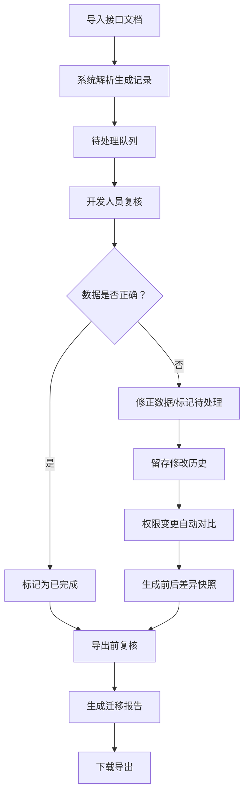

## 1. 产品概述
库存预占释放可视化管理系统，解决旧接口文档与调用日志不同步、权限变更追溯难的问题。面向平台开发人员，提供导入、复核、修正、历史追溯和导出的完整工作流。

- 核心价值：将分散的接口文档、调用日志、权限变更统一管理，每条记录可追溯来源、状态、修改人和原因
- 目标用户：平台开发团队、技术负责人

## 2. 核心 Features

### 2.1 用户角色

| 角色 | 登录方式 | 核心权限 |
|------|----------|----------|
| 平台开发 | 本地直接访问 | 导入接口文档、复核数据、修正记录、查看历史、导出报告 |
| 技术负责人 | 本地直接访问 | 查看全量数据、审批修正、查看审计历史 |

### 2.2 Feature 模块

1. **数据看板页**：Three.js 3D库存状态可视化、关键指标统计、待处理列表
2. **数据管理页**：导入接口文档、记录列表、搜索筛选、批量操作
3. **记录详情页**：来源信息、当前状态、修改历史、待处理原因
4. **复核修正页**：待复核列表、修正表单、权限变更对比
5. **历史追溯页**：全量操作日志、权限变更前后对比、幂等键失效记录
6. **导出报告页**：迁移报告生成、复核确认、导出下载

### 2.3 页面详情

| 页面名称 | 模块名称 | Feature 描述 |
|----------|----------|--------------|
| 数据看板 | 3D可视化 | Three.js 库存立方体展示，不同颜色代表不同状态，点击可查看详情 |
| 数据看板 | 统计卡片 | 总数、待处理、已完成、异常数、今日新增等关键指标 |
| 数据管理 | 导入功能 | 支持JSON/CSV格式导入旧接口文档，自动解析并生成记录 |
| 数据管理 | 记录列表 | 展示来源、状态、创建时间、操作人，支持搜索筛选排序 |
| 记录详情 | 信息展示 | 完整展示接口参数、调用日志、当前状态流转时间线 |
| 记录详情 | 修改历史 | 展示每次修改的前后值、操作人、时间、原因 |
| 复核修正 | 待处理队列 | 按优先级展示需要复核的记录，标记问题类型 |
| 复核修正 | 权限变更对比 | 平台开发修改权限表时，自动对比前后差异并留存 |
| 历史追溯 | 操作日志 | 全量操作记录，支持按操作类型、时间、操作人筛选 |
| 历史追溯 | 幂等键失效 | 专门展示幂等键失效的记录，便于排查问题 |
| 导出报告 | 报告生成 | 自动生成迁移报告，包含数据统计、异常记录、处理建议 |
| 导出报告 | 复核确认 | 导出前必须经过复核步骤，确认关键数据无误 |

## 3. 核心流程

用户导入旧接口文档 → 系统解析生成待处理记录 → 开发人员复核数据 → 发现问题可修正或标记待处理 → 所有操作留存历史 → 权限变更自动对比 → 导出前二次复核 → 生成迁移报告

## 4. 用户界面设计

### 4.1 设计风格

- **主色调**：深空蓝 (#0F172A) 作为背景，科技感青色 (#06B6D4) 作为主色，警示橙 (#F59E0B) 标记待处理，成功绿 (#10B981) 标记完成，危险红 (#EF4444) 标记异常
- **按钮风格**：圆角4px，轻微投影，hover时有发光效果
- **字体**：标题使用 JetBrains Mono，正文使用 Inter，等宽字体用于展示代码和数据
- **布局风格**：左侧导航 + 右侧内容区，卡片式布局，数据表格使用斑马纹
- **图标风格**：线性图标，与主色调一致，状态使用彩色圆点标识

### 4.2 页面设计概述

| 页面名称 | 模块名称 | UI 元素 |
|----------|----------|----------|
| 数据看板 | 3D可视化 | 全屏Three.js场景，悬浮控制面板，状态图例 |
| 数据看板 | 统计卡片 | 渐变色背景，数字动画，趋势箭头 |
| 数据管理 | 导入区域 | 拖拽上传区域，格式说明，导入进度条 |
| 数据管理 | 记录列表 | 分页表格，行高亮，批量操作复选框 |
| 记录详情 | 时间线 | 垂直时间线，状态节点，操作详情展开 |
| 记录详情 | 变更对比 | 左右分栏对比，差异高亮标注 |
| 复核修正 | 待处理队列 | 卡片式列表，优先级标签，快捷操作按钮 |
| 历史追溯 | 操作日志 | 时间筛选器，操作类型标签，搜索框 |
| 导出报告 | 报告预览 | 分页预览，目录导航，复核确认按钮 |

### 4.3 响应式

桌面优先设计，支持1280px及以上分辨率。平板和移动端自动调整布局，3D可视化在小屏幕降级为2D图表展示。

### 4.4 3D 场景指引

- **环境/氛围**：深色科技风格，星空背景，蓝色霓虹光效
- **光照设置**：环境光 + 方向光 + 点光源，立方体有自发光材质
- **摄像机设置**：透视相机，支持轨道控制，可旋转缩放查看
- **构图和焦点**：中心区域展示主库存立方体群，右侧悬浮控制面板
- **交互和动画**：立方体hover时放大高亮，点击时弹出详情面板，状态变化时有颜色过渡动画
- **后处理效果**：Bloom发光效果，轻微抗锯齿
- **性能预算**：最多同时渲染200个立方体，超出时自动聚合显示

## 5. 收尾说明（平台开发指南）

### 5.1 放置旧接口文档样例
将旧接口文档JSON/CSV文件放入 `public/samples/` 目录，文件名格式：`接口名_版本号_日期.json`。系统启动时会自动扫描该目录并在导入页面展示样例列表。

### 5.2 查看幂等键失效
在左侧导航栏点击「历史追溯」→ 选择「幂等键失效」标签页。页面会列出所有幂等键失效的记录，包含：接口名、调用时间、失效原因、重试次数。点击记录可查看完整调用日志。

### 5.3 导出迁移报告前复核
1. 进入「导出报告」页面，选择需要导出的时间范围
2. 点击「生成预览」，系统会先进行数据完整性检查
3. 检查通过后，在「复核确认」步骤需要：
   - 确认关键指标（待处理数、异常数、完成率）
   - 抽查至少3条异常记录的处理情况
   - 确认权限变更记录完整
4. 全部确认无误后，点击「确认并导出」按钮下载报告
