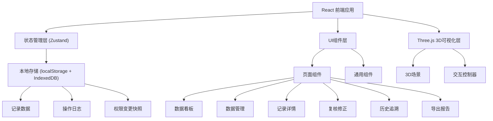
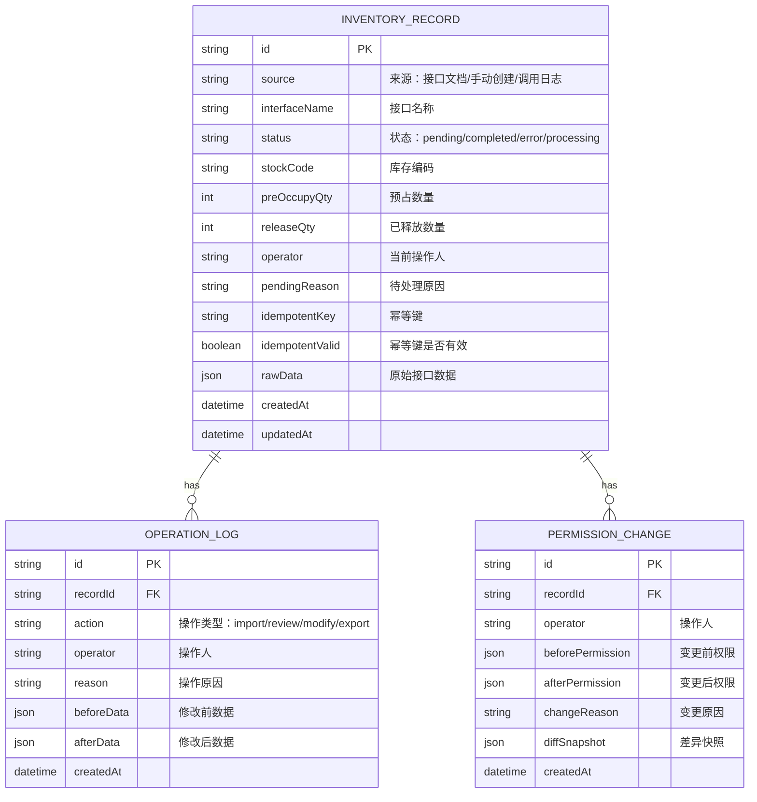

## 1. 架构设计



## 2. 技术描述

- **前端框架**: React@18 + TypeScript
- **构建工具**: Vite@5
- **样式方案**: TailwindCSS@3
- **状态管理**: Zustand@4 (轻量级，适合本地状态)
- **3D可视化**: three@0.160 + @react-three/fiber@8 + @react-three/drei@9
- **路由**: react-router-dom@6
- **图标**: lucide-react
- **数据存储**: localStorage (小数据) + IndexedDB (大数据/文件)
- **后端**: 无，纯前端本地运行
- **Mock数据**: 内置样例数据，开箱即用

## 3. 路由定义

| 路由 | 页面 | 说明 |
|------|------|------|
| / | 数据看板 | 首页，3D可视化 + 统计卡片 + 待处理列表 |
| /records | 数据管理 | 记录列表 + 导入功能 + 搜索筛选 |
| /records/:id | 记录详情 | 单条记录完整信息 + 修改历史 |
| /review | 复核修正 | 待处理队列 + 修正表单 + 权限对比 |
| /history | 历史追溯 | 操作日志 + 幂等键失效 + 权限变更历史 |
| /export | 导出报告 | 报告预览 + 复核确认 + 导出下载 |

## 4. 数据模型

### 4.1 数据模型定义



### 4.2 TypeScript 类型定义

```typescript
type RecordStatus = 'pending' | 'completed' | 'error' | 'processing';
type OperationAction = 'import' | 'review' | 'modify' | 'export' | 'permission_change';

interface InventoryRecord {
  id: string;
  source: 'api_doc' | 'manual' | 'call_log';
  interfaceName: string;
  status: RecordStatus;
  stockCode: string;
  preOccupyQty: number;
  releaseQty: number;
  operator: string;
  pendingReason?: string;
  idempotentKey: string;
  idempotentValid: boolean;
  rawData: Record<string, any>;
  createdAt: string;
  updatedAt: string;
}

interface OperationLog {
  id: string;
  recordId: string;
  action: OperationAction;
  operator: string;
  reason: string;
  beforeData?: Record<string, any>;
  afterData?: Record<string, any>;
  createdAt: string;
}

interface PermissionChange {
  id: string;
  recordId: string;
  operator: string;
  beforePermission: Record<string, any>;
  afterPermission: Record<string, any>;
  changeReason: string;
  diffSnapshot: Record<string, any>;
  createdAt: string;
}
```

## 5. 状态管理设计

### 5.1 Store 结构

```typescript
interface AppState {
  // 记录数据
  records: InventoryRecord[];
  // 操作日志
  operationLogs: OperationLog[];
  // 权限变更
  permissionChanges: PermissionChange[];
  // 当前筛选条件
  filters: {
    status?: RecordStatus;
    source?: string;
    keyword?: string;
    dateRange?: [string, string];
  };
  // 当前选中记录
  selectedRecordId?: string;
  // Actions
  addRecord: (record: Omit<InventoryRecord, 'id' | 'createdAt' | 'updatedAt'>) => void;
  updateRecord: (id: string, updates: Partial<InventoryRecord>, operator: string, reason: string) => void;
  updateRecordStatus: (id: string, status: RecordStatus, operator: string, reason: string) => void;
  importRecords: (records: Omit<InventoryRecord, 'id' | 'createdAt' | 'updatedAt'>[], operator: string) => void;
  changePermission: (recordId: string, beforePerm: any, afterPerm: any, operator: string, reason: string) => void;
  exportReport: (filters: any) => Blob;
  setFilters: (filters: any) => void;
  setSelectedRecord: (id: string | undefined) => void;
}
```

## 6. 核心功能实现要点

### 6.1 导入功能
- 支持 JSON/CSV 格式解析
- 导入时自动生成唯一ID和幂等键
- 校验幂等键是否已存在，避免重复导入
- 导入过程生成操作日志

### 6.2 复核修正
- 展示待处理队列，按优先级排序
- 修正时自动对比前后数据差异
- 权限变更时自动生成前后快照和差异
- 所有修改必须填写原因

### 6.3 历史追溯
- 操作日志按时间倒序展示
- 专门筛选幂等键失效记录
- 权限变更支持左右分栏对比
- 支持按操作类型、时间、操作人筛选

### 6.4 导出报告
- 导出前必须经过复核步骤
- 生成JSON和Excel两种格式
- 报告包含：数据统计、异常记录、权限变更、处理建议
- 导出操作记录到日志

### 6.5 Three.js 可视化
- 每个库存记录对应一个立方体
- 立方体颜色映射状态：青色-处理中、绿色-完成、橙色-待处理、红色-异常
- 立方体高度映射预占数量
- 支持点击查看详情、hover高亮
- Bloom后处理效果增强科技感

## 7. 本地数据持久化

- 使用 localStorage 存储配置和小数据
- 使用 IndexedDB 存储大量记录和文件数据
- 应用启动时自动从本地加载数据
- 支持数据导出备份和导入恢复
- 内置10条样例数据，首次访问自动初始化
