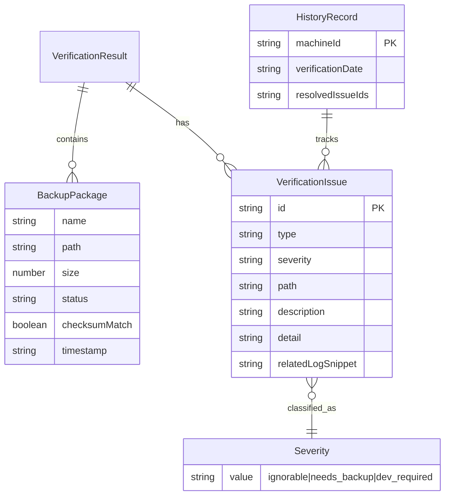

## 1. 架构设计

```mermaid
flowchart TD
    subgraph "前端层"
        "React App" --> "核验引擎 (Worker)"
        "React App" --> "状态管理 (Zustand)"
        "React App" --> "报告生成器"
    end
    subgraph "数据层"
        "目录快照 JSON" --> "核验引擎 (Worker)"
        "校验值清单 CSV" --> "核验引擎 (Worker)"
        "失败日志 TXT" --> "核验引擎 (Worker)"
        "回滚记录 JSON" --> "核验引擎 (Worker)"
    end
    subgraph "持久化层"
        "状态管理 (Zustand)" --> "LocalStorage"
        "LocalStorage" --> "历史核验记录"
    end
    "核验引擎 (Worker)" --> "问题清单"
    "问题清单" --> "报告生成器"
    "历史核验记录" --> "历史对比"
```

纯前端应用，无需后端服务。核验逻辑在浏览器内完成，历史数据持久化到 LocalStorage。

## 2. 技术选型

- **前端框架**：React@18 + TypeScript
- **样式方案**：Tailwind CSS@3
- **构建工具**：Vite
- **状态管理**：Zustand（轻量，支持持久化中间件）
- **图表**：Recharts
- **图标**：Lucide React
- **后端**：无（纯前端）
- **数据库**：LocalStorage（历史核验记录持久化）
- **Mock 数据**：内置模拟数据集，演示完整核验流程

## 3. 路由定义

| 路由 | 用途 |
|------|------|
| `/` | 核验工作台：数据源加载 + 一键核验 + 状态总览 |
| `/issues` | 问题清单：按严重度分类的异常条目 |
| `/history` | 历史对比：跨周核验遗留问题追踪 |
| `/report` | 报告导出：预览 + 导出 Markdown |

## 4. API 定义

无后端 API。数据通过文件上传（FileReader API）读入前端。

### 4.1 数据源接口

```typescript
interface DirectorySnapshot {
  path: string;
  files: FileInfo[];
  timestamp: string;
}

interface FileInfo {
  name: string;
  path: string;
  size: number;
  modified: string;
  checksum?: string;
}

interface ChecksumManifest {
  entries: ChecksumEntry[];
}

interface ChecksumEntry {
  path: string;
  algorithm: string;
  expected: string;
  actual?: string;
  match?: boolean;
}

interface FailureLog {
  entries: LogEntry[];
}

interface LogEntry {
  timestamp: string;
  level: 'ERROR' | 'WARN' | 'INFO';
  message: string;
  source?: string;
  path?: string;
}

interface RollbackRecord {
  entries: RollbackEntry[];
}

interface RollbackEntry {
  timestamp: string;
  targetPath: string;
  reason: string;
  preChecksum?: string;
  postChecksum?: string;
  completed: boolean;
}
```

### 4.2 核验结果接口

```typescript
type Severity = 'ignorable' | 'needs_backup' | 'dev_required';

interface VerificationIssue {
  id: string;
  type: 'missing_file' | 'corrupted_archive' | 'duplicate_backup' | 'stale_checksum' | 'path_with_spaces' | 'rollback_residual';
  severity: Severity;
  path: string;
  description: string;
  detail: IssueDetail;
  relatedLogSnippet?: string;
  timestamp: string;
}

interface IssueDetail {
  expectedPath?: string;
  actualPath?: string;
  expectedChecksum?: string;
  actualChecksum?: string;
  duplicateTimestamps?: string[];
  rollbackTimestamp?: string;
}

interface VerificationResult {
  machineId: string;
  timestamp: string;
  summary: {
    total: number;
    normal: number;
    missingFile: number;
    corrupted: number;
    duplicate: number;
    staleChecksum: number;
    other: number;
  };
  issues: VerificationIssue[];
  packages: BackupPackage[];
}

interface BackupPackage {
  name: string;
  path: string;
  size: number;
  status: 'ok' | 'missing' | 'corrupted' | 'duplicate' | 'stale_checksum' | 'error';
  checksumMatch?: boolean;
  timestamp: string;
  issues: string[];
}

interface HistoryRecord {
  machineId: string;
  verificationDate: string;
  issues: VerificationIssue[];
  resolvedIssueIds: string[];
}
```

## 5. 服务端架构

不适用（纯前端应用）

## 6. 数据模型

### 6.1 数据模型定义



### 6.2 数据存储

LocalStorage 键设计：
- `bv_history_{machineId}` — 该机器的历史核验记录数组
- `bv_current_result` — 当前核验结果
- `bv_data_sources` — 已加载的数据源元信息
