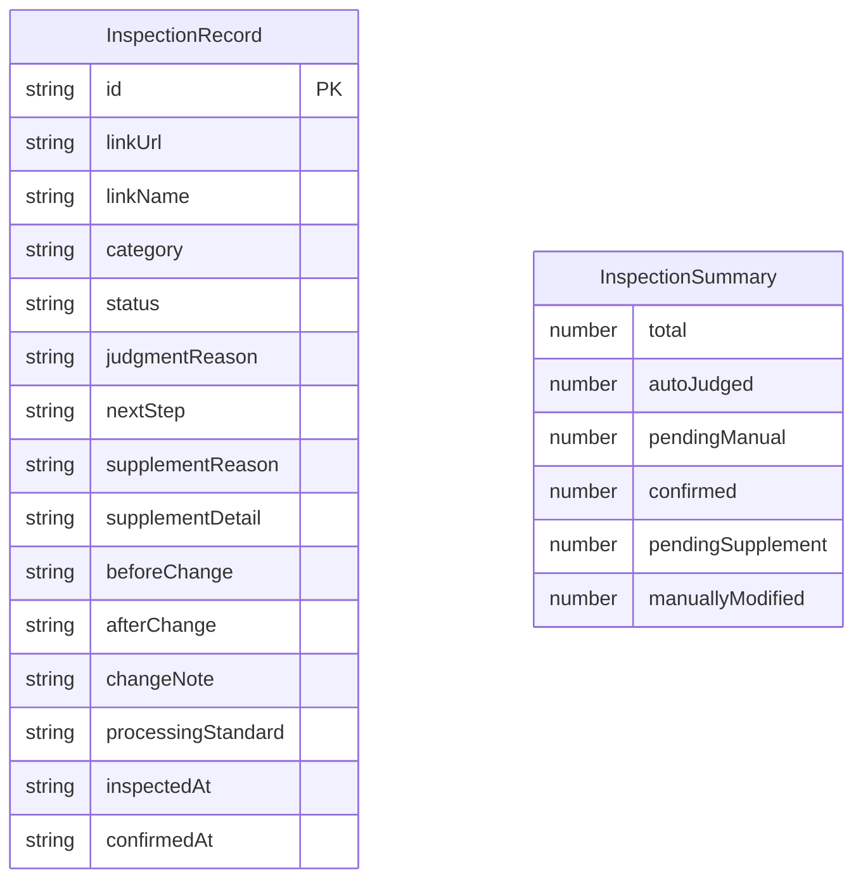

## 1. 架构设计

```mermaid
flowchart TB
    subgraph "前端层"
        "A[巡检仪表盘]"
        "B[运行账本]"
        "C[配置与说明]"
    end
    subgraph "状态管理层"
        "D[Zustand Store"
        "巡检数据 / 分类状态 / 判断理由"]
    end
    subgraph "数据层"
        "E[Mock 数据引擎"
        "自动判断逻辑 / 分类规则"]
    end
    "A" --> "D"
    "B" --> "D"
    "C" --> "D"
    "D" --> "E"
```

## 2. 技术说明

- 前端：React@18 + TailwindCSS@3 + Vite + TypeScript
- 初始化工具：vite-init（react-ts 模板）
- 后端：无（纯前端，使用 Mock 数据模拟巡检逻辑）
- 数据库：无（使用 Zustand 内存状态 + localStorage 持久化）

## 3. 路由定义

| 路由 | 用途 |
|------|------|
| `/` | 重定向到仪表盘 |
| `/dashboard` | 巡检仪表盘：判断结果、快速筛选、执行状态 |
| `/ledger` | 运行账本：已确认/待补/人工改过三栏 + 导出 |
| `/guide` | 配置与说明：样例指引、风险说明、复核流程 |

## 4. API 定义

无后端 API。所有数据通过前端 Mock 引擎生成，核心接口定义如下：

```typescript
type RecordCategory = 'supplement' | 'conclusion_changed' | 'confirmed'

type SupplementReason = 'config_early' | 'log_late'

type RecordStatus = 'confirmed' | 'pending_supplement' | 'manually_modified'

interface InspectionRecord {
  id: string
  linkUrl: string
  linkName: string
  category: RecordCategory
  status: RecordStatus
  judgmentReason: string
  nextStep: string
  supplementReason?: SupplementReason
  supplementDetail?: string
  beforeChange?: string
  afterChange?: string
  changeNote?: string
  processingStandard: string
  inspectedAt: string
  confirmedAt?: string
}

interface InspectionSummary {
  total: number
  autoJudged: number
  pendingManual: number
  confirmed: number
  pendingSupplement: number
  manuallyModified: number
}
```

## 5. 服务端架构

不适用（纯前端项目）

## 6. 数据模型

### 6.1 数据模型定义



### 6.2 数据定义语言

不适用（使用 TypeScript 类型定义 + localStorage 存储）
