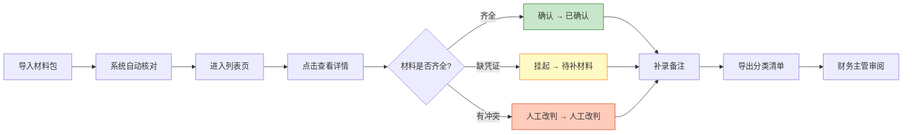

## 1. 产品概述

给结算会计阿宁用的"基金赎回预约排队"核对小工具，解决审批邮件里多份材料对不上、导出结果和原始材料脱节的问题。不求大而全，先把材料核对、状态管理和导出这几件事做扎实。

- 核心解决：审批邮件中的收款流水、退款申请、审批邮件原文、手写备注等多源材料的对齐核对
- 目标用户：结算会计（日常操作）、财务主管（导出审阅）
- 价值：材料核对有依据、状态流转有记录、导出结果可追溯

---

## 2. 核心功能

### 2.1 用户角色

| 角色 | 使用方式 | 核心权限 |
|------|----------|----------|
| 结算会计 | 桌面端浏览器操作 | 全量操作：查看列表/详情、改判状态、回退、补录备注、导出 |
| 财务主管 | 查看导出文件 | 审阅已导出的分类清单 |

### 2.2 功能模块

1. **预约排队列表页**：筛选、状态分类统计、快速操作入口
2. **预约详情页**：材料对照、冲突展示、备注补录、状态改判/回退
3. **导出功能**：按状态分类导出CSV，含排队原因和操作痕迹

### 2.3 页面详情

| 页面名称 | 模块名称 | 功能描述 |
|----------|----------|----------|
| 预约排队列表页 | 顶部统计区 | 已确认/待补材料/人工改判三类数量和金额统计 |
| 预约排队列表页 | 筛选区 | 按状态、金额范围、日期筛选 |
| 预约排队列表页 | 数据表格 | 序号、基金代码、申请金额、状态、来源、操作按钮 |
| 预约详情页 | 基本信息卡 | 基金代码、申请日期、预计到账日、申请人 |
| 预约详情页 | 材料对照区 | 并排展示：收款流水、退款申请、审批邮件原文、系统导入数据 |
| 预约详情页 | 冲突提示区 | 数据冲突时高亮展示两边证据和建议动作 |
| 预约详情页 | 备注区 | 历史备注时间线、新增备注输入框 |
| 预约详情页 | 操作区 | 改判状态、回退上一步、保存、导出单条 |

---

## 3. 核心流程

阿宁日常工作流程：先导入一批"基金赎回预约排队"材料 → 系统自动匹配和核对 → 阿宁逐条查看详情 → 材料齐全的确认、缺凭证的挂起待补、有冲突的人工改判 → 随时补录备注 → 月底导出分类清单给主管。

状态流转规则：
- 待补材料 → 补齐材料后可改判为"已确认"
- 人工改判 → 发现误判可回退到上一状态
- 已确认 → 有新证据可回退重新核对

---

## 4. 用户界面设计

### 4.1 设计风格

**风格定位：专业克制的财务工具风**，像同事写给同事看的清单，不花哨但信息密度合适。

- **主色调**：深墨蓝 `#1e3a5f`（专业稳重）
- **状态色**：
  - 已确认：深绿 `#2e7d32`
  - 待补材料：深琥珀 `#f57f17` 
  - 人工改判：深橙 `#d84315`
- **辅助色**：浅灰蓝背景 `#f5f7fa`，边框 `#e0e6ed`
- **字体**：标题用"Noto Serif SC"（有纸质感），正文用"Noto Sans SC"（清晰易读）
- **按钮**：直角微圆角（2px），扁平无渐变，hover时有轻微底色变化
- **布局**：卡片式分区，清晰的留白和分割线，信息层级靠字体粗细和间距区分

### 4.2 页面设计概述

| 页面名称 | 模块名称 | UI 元素 |
|----------|----------|---------|
| 列表页 | 顶部统计 | 三个状态卡片，各带数量和金额，底色对应状态色的浅色版 |
| 列表页 | 数据表格 | 斑马纹行，hover高亮，状态标签用圆角色块 |
| 详情页 | 材料对照 | 四栏等宽卡片，每栏顶部标来源，差异处用红框标出 |
| 详情页 | 冲突提示 | 黄色警告框，左右分列"审批邮件说"和"导入数据说"，下面给建议动作 |
| 详情页 | 备注时间线 | 左侧竖线，每个备注带时间和操作人，最新的在最上面 |

### 4.3 响应式

桌面端优先（会计用大屏），1200px以上最优。平板端自动折行，手机端可查看但不做主要优化。

---

## 5. 关键业务规则（特别强调）

1. **缺凭证挂起**：缺少收款流水或退款申请任一的，自动标记"待补材料"，金额不计入"已确认"统计
2. **冲突不自动处理**：审批邮件和导入数据不一致时，只展示两边证据和建议，绝不自动覆盖
3. **导出带原因**：每条导出记录必须包含"基金赎回预约排队原因"字段，不能只在页面显示
4. **操作留痕**：每次改判、回退、补备注都要记操作人和时间
5. **分类导出**：导出文件分三个sheet或三个文件：已确认、待补材料、人工改判
