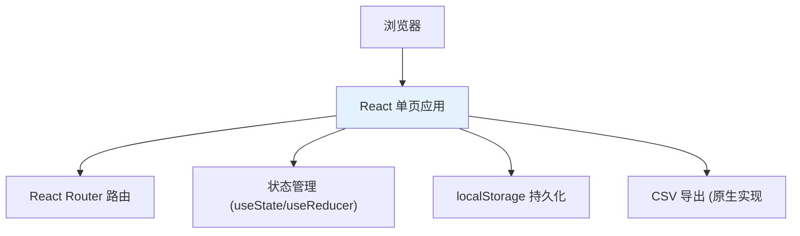
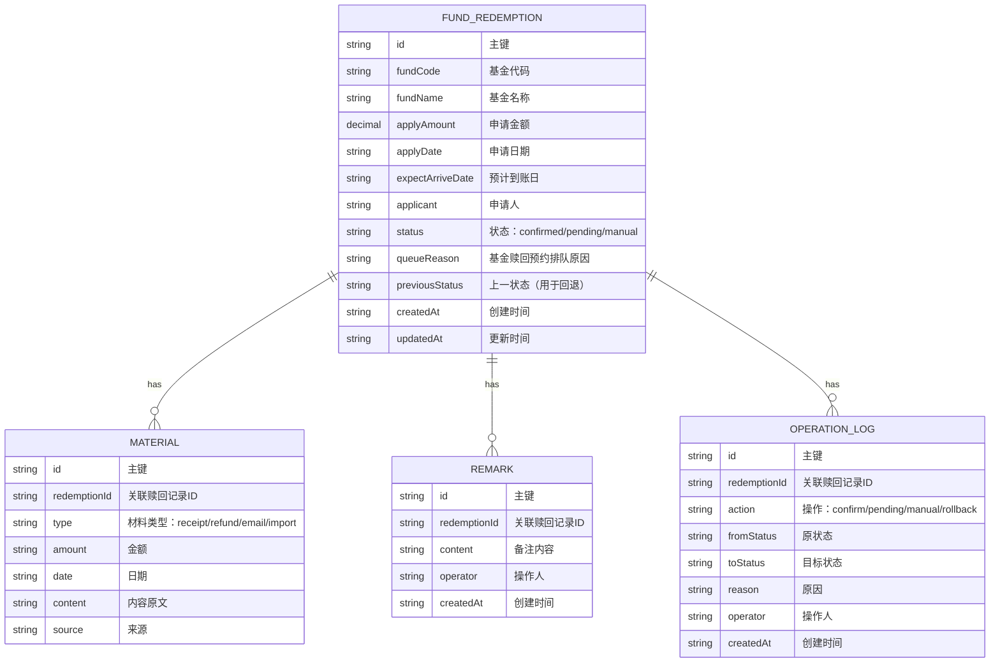

## 1. 架构设计

纯前端单页应用，数据存localStorage持久化，无需后端服务。



## 2. 技术选型

- **前端框架**：React@18 + TypeScript
- **构建工具**：Vite@5
- **样式方案**：TailwindCSS@3
- **路由**：React Router@6
- **图标**：Lucide React
- **数据持久化**：localStorage（模拟后端）
- **CSV导出**：原生实现，无需第三方库
- **日期处理**：date-fns（轻量）

## 3. 目录结构

```
src/
├── types/           # TypeScript 类型定义
├── data/           # Mock 数据和常量
├── hooks/           # 自定义 hooks
├── utils/           # 工具函数（CSV导出、金额格式化等）
├── components/      # 通用组件
├── pages/           # 页面组件
│   ├── List.tsx    # 预约排队列表页
│   └── Detail.tsx  # 预约详情页
├── App.tsx          # 主应用
├── main.tsx         # 入口
└── index.css        # 全局样式
```

## 4. 路由定义

| 路由 | 页面 | 说明 |
|-------|------|------|
| `/` | 预约排队列表页 | 默认路由，展示所有排队记录 |
| `/detail/:id` | 预约详情页 | 查看单条记录详情，支持改判、回退、补备注 |

## 5. 数据模型

### 5.1 数据实体关系



### 5.2 状态枚举

```typescript
type RedemptionStatus = 'confirmed' | 'pending' | 'manual';

type MaterialType = 'receipt' | 'refund' | 'email' | 'import';
```

### 5.3 核心类型定义

```typescript
interface FundRedemption {
  id: string;
  fundCode: string;
  fundName: string;
  applyAmount: number;
  applyDate: string;
  expectArriveDate: string;
  applicant: string;
  status: RedemptionStatus;
  queueReason: string;
  previousStatus?: RedemptionStatus;
  materials: Material[];
  remarks: Remark[];
  operationLogs: OperationLog[];
  createdAt: string;
  updatedAt: string;
}

interface Material {
  id: string;
  type: MaterialType;
  amount: number;
  date: string;
  content: string;
  source: string;
}

interface Remark {
  id: string;
  content: string;
  operator: string;
  createdAt: string;
}

interface OperationLog {
  id: string;
  action: string;
  fromStatus?: RedemptionStatus;
  toStatus: RedemptionStatus;
  reason: string;
  operator: string;
  createdAt: string;
}
```

## 6. Mock 数据说明

预置8条真实场景覆盖：

| 序号 | 场景 | 状态 | 说明 |
|------|------|------|------|
| 1 | 材料齐全一致 | confirmed | 正常已确认 |
| 2 | 缺收款流水 | pending | 待补材料 |
| 3 | 缺退款申请 | pending | 待补材料 |
| 4 | 金额冲突（邮件50万 vs 导入48万） | manual | 人工改判 |
| 5 | 日期冲突 | manual | 人工改判 |
| 6 | 材料齐全一致 | confirmed | 已确认 |
| 7 | 多份材料有差额 | manual | 人工改判 |
| 8 | 缺两项材料 | pending | 待补材料 |

每条数据包含真实的基金代码（如000001、110011等）、真实金额（如500,000.00）、真实日期格式。

## 7. 核心工具函数

| 函数 | 用途 |
|------|------|
| `formatCurrency` | 金额格式化：12345 → ¥12,345.00 |
| `formatDate` | 日期格式化：YYYY-MM-DD |
| `generateId` | 生成唯一ID |
| `exportToCSV` | 导出CSV，支持多sheet导出 |
| `detectConflicts` | 检测材料间的金额/日期冲突 |
| `getStatusLabel` | 状态转中文标签 |
| `getMaterialTypeLabel` | 材料类型转中文标签 |
| `calculateStats` | 计算分类统计（数量、金额） |

## 8. 关键交互说明

1. **冲突检测逻辑**：
   - 比较各材料的金额，差异超过¥0.01即标记冲突
   - 比较各材料的日期，不一致即标记冲突
   - 冲突展示：左侧"审批邮件说"vs右侧"导入数据说"
   - 建议动作：根据冲突类型给出建议（如"建议与渠道确认实际到账金额"）

2. **状态流转**：
   - 改判时记录previousStatus
   - 回退时恢复previousStatus
   - 每次操作写operationLogs

3. **导出逻辑**：
   - 按状态分三个CSV文件导出
   - 每条必含：基金代码、基金名称、申请金额、状态、排队原因、最后操作人、最后操作时间
   - 文件名格式：`基金赎回预约排队_已确认_YYYYMMDD.csv`
