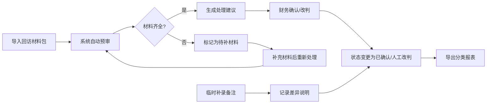

# 私募投资者回访留痕工具 - 产品需求文档

## 1. 产品概述

为门店财务老曹打造的轻量化对账辅助工具，解决私募投资者回访材料的留痕管理问题，确保月底对账时各类材料能够准确核对。通过结构化管理收款流水、退款申请、审批邮件和手写备注，实现处理过程的可追溯。

- 核心价值：让对账过程有据可查，处理建议清晰可执行，历史判断一目了然
- 目标用户：门店财务人员（老曹）、财务主管

## 2. 核心功能

### 2.1 用户角色

| 角色 | 核心权限 |
|------|----------|
| 门店财务（老曹） | 导入材料、查看列表、处理记录、添加备注、改判、回退、导出 |
| 财务主管 | 查看列表、导出报表、查看处理历史 |

### 2.2 功能模块

1. **回访记录列表页**：记录列表展示、状态筛选、搜索、批量操作
2. **记录详情页**：完整材料展示、处理建议、操作历史、添加备注、改判/回退
3. **数据导出**：按状态分类导出Excel报表

### 2.3 页面详情

| 页面名称 | 模块名称 | 功能描述 |
|-----------|-------------|---------------------|
| 记录列表页 | 顶部工具栏 | 状态筛选（全部/已确认/待补材料/人工改判）、搜索、导出按钮、统计卡片 |
| 记录列表页 | 记录列表 | 表格展示核心信息（投资者、金额、状态、处理人、时间）、操作入口 |
| 记录详情页 | 材料面板 | 收款流水、退款申请、审批邮件、手写备注的分组展示 |
| 记录详情页 | 处理建议 | 系统自动生成的业务化处理建议，可人工修改 |
| 记录详情页 | 操作历史 | 完整留痕：原始来源、每次处理时间、操作人、变更内容 |
| 记录详情页 | 操作区 | 确认、挂起、改判、回退、添加备注按钮 |

## 3. 核心流程

### 业务场景覆盖
1. **顺利处理场景**：材料齐全 → 系统建议合理 → 财务一键确认
2. **返工场景**：材料缺失 → 挂起待补 → 补充材料 → 重新处理 → 人工改判

## 4. 用户界面设计

### 4.1 设计风格
- **主色调**：深蓝 #1e3a5f（专业、稳重），辅助色：墨绿 #2d5a27（已确认）、琥珀 #b45309（待补材料）、紫红 #7c2d12（人工改判）
- **按钮风格**：圆角矩形，简洁边框，hover时轻微提亮
- **字体**：系统无衬线字体，正文14px，标题16-18px
- **布局风格**：卡片式分区，顶部导航+左侧（如有）+主内容区，大量留白保证财务数据可读性
- **图标风格**：线性简约图标，避免花哨

### 4.2 页面设计概述

| 页面名称 | 模块名称 | UI 元素 |
|-----------|-------------|-------------|
| 记录列表页 | 统计卡片 | 三个状态卡片并排，大数字+标签，颜色区分状态 |
| 记录列表页 | 数据表格 | 斑马纹行，状态标签带颜色圆点，操作按钮悬浮显示 |
| 记录详情页 | 材料时间线 | 按时间顺序展示各类材料，左侧时间轴，右侧内容卡片 |
| 记录详情页 | 操作历史 | 可折叠面板，每条记录显示操作类型、时间、差异说明 |
| 记录详情页 | 处理建议框 | 浅蓝背景边框，建议内容清晰列出，可编辑保存 |

### 4.3 响应性
- 桌面端优先设计（1280px及以上）
- 平板自适应：表格横向滚动，统计卡片换行
- 移动设备：卡片堆叠展示，简化操作按钮

## 5. 数据处理规则

### 5.1 状态流转规则
- **待处理**：新导入未处理
- **已确认**：材料齐全且财务确认
- **待补材料**：缺失关键凭证，挂起不参与金额统计
- **人工改判**：财务手动修改过系统建议

### 5.2 留痕要求
- 每条操作记录：操作类型、操作人、操作时间、原始值、新值、差异说明
- 保留原始来源材料，不可删除
- 回退功能可撤销至上一状态

### 5.3 导出格式
- 分三个Sheet：已确认、待补材料、人工改判
- 包含完整处理历史摘要
- 金额按状态分别汇总
