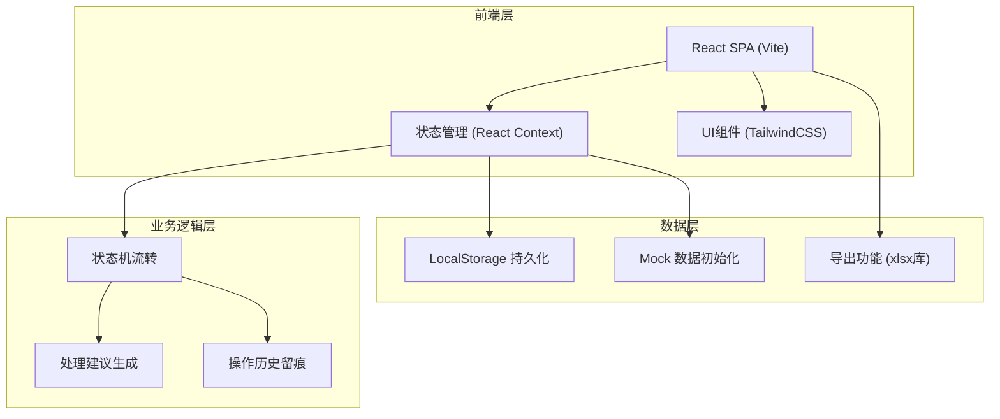
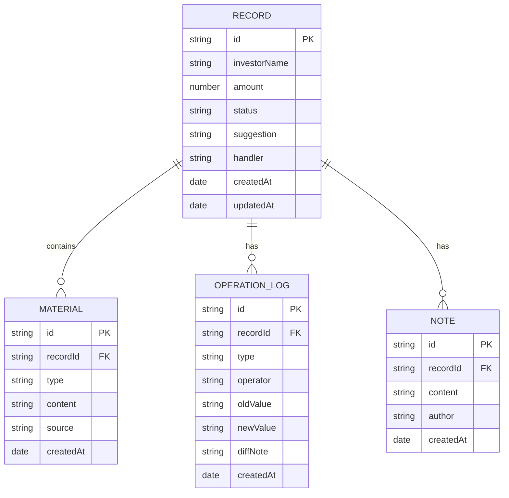

# 私募投资者回访留痕工具 - 技术架构文档

## 1. 架构设计



## 2. 技术选型说明

- **前端框架**: React@18 + TypeScript + Vite
  - 理由：组件化开发效率高，TypeScript保证数据类型安全
- **样式方案**: TailwindCSS@3
  - 理由：快速构建专业、简洁的财务类界面
- **状态管理**: React Context + useReducer
  - 理由：中等复杂度应用，无需引入Redux
- **数据持久化**: LocalStorage
  - 理由：单机工具，无需后端，数据本地存储
- **导出功能**: SheetJS (xlsx)
  - 理由：成熟的Excel导出库，支持多Sheet

## 3. 路由定义

| 路由 | 页面 | 功能 |
|-------|------|------|
| / | 记录列表页 | 展示所有回访记录，支持筛选、搜索、导出 |
| /record/:id | 记录详情页 | 查看材料、处理建议、操作历史、执行操作 |

## 4. 数据模型

### 4.1 ER 图



### 4.2 状态枚举

```typescript
enum RecordStatus {
  PENDING = 'pending',      // 待处理
  CONFIRMED = 'confirmed',  // 已确认
  PENDING_MATERIAL = 'pending_material', // 待补材料
  MANUAL_ADJUSTED = 'manual_adjusted'    // 人工改判
}

enum MaterialType {
  PAYMENT = 'payment',      // 收款流水
  REFUND = 'refund',        // 退款申请
  APPROVAL = 'approval',    // 审批邮件
  HANDWRITTEN = 'handwritten' // 手写备注
}

enum OperationType {
  CREATE = 'create',
  CONFIRM = 'confirm',
  SUSPEND = 'suspend',
  ADJUST = 'adjust',
  ROLLBACK = 'rollback',
  ADD_NOTE = 'add_note'
}
```

## 5. 核心业务逻辑

### 5.1 状态机流转

```
待处理 → 已确认 (材料齐全，财务确认)
待处理 → 待补材料 (材料缺失)
待处理 → 人工改判 (财务修改建议后确认)
待补材料 → 已确认 (补充材料后确认)
待补材料 → 人工改判 (补充材料后改判)
任意状态 → 可回退至上一状态
```

### 5.2 处理建议生成规则

根据材料完整性和匹配度自动生成：
- 材料齐全且金额匹配：建议"确认入账"
- 材料齐全但金额不匹配：建议"人工核对差异"
- 缺失收款流水：建议"请联系运营提供收款凭证"
- 缺失审批邮件：建议"请补充领导审批邮件截图"

### 5.3 操作留痕规则

每次操作必须记录：
- 操作类型和时间
- 操作人（默认"老曹"）
- 变更前后的值对比
- 差异说明（必填）

## 6. 目录结构

```
src/
├── components/
│   ├── layout/
│   │   ├── Header.tsx
│   │   └── StatusBadge.tsx
│   ├── record/
│   │   ├── RecordList.tsx
│   │   ├── RecordCard.tsx
│   │   ├── FilterBar.tsx
│   │   └── StatCard.tsx
│   └── detail/
│       ├── MaterialTimeline.tsx
│       ├── SuggestionPanel.tsx
│       ├── OperationHistory.tsx
│       └── ActionBar.tsx
├── context/
│   └── RecordContext.tsx
├── types/
│   └── index.ts
├── utils/
│   ├── statusMachine.ts
│   ├── suggestionGenerator.ts
│   ├── exportUtil.ts
│   └── mockData.ts
├── pages/
│   ├── ListPage.tsx
│   └── DetailPage.tsx
├── App.tsx
└── main.tsx
```

## 7. Mock 数据设计

预置两条典型样例记录：

**样例1（顺利处理）**：
- 投资者：张三
- 金额：500,000元
- 材料：收款流水、退款申请（无）、审批邮件、手写备注（齐全）
- 流程：系统建议确认 → 老曹确认 → 状态变为"已确认"

**样例2（返工场景）**：
- 投资者：李四
- 金额：300,000元
- 材料：收款流水（缺失）、退款申请、审批邮件、手写备注
- 流程：系统检测缺材料 → 标记"待补材料" → 补充材料 → 老曹改判金额 → 状态变为"人工改判"
