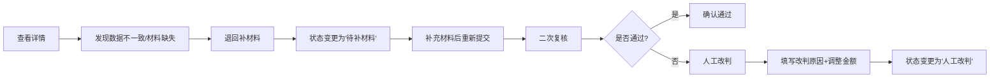
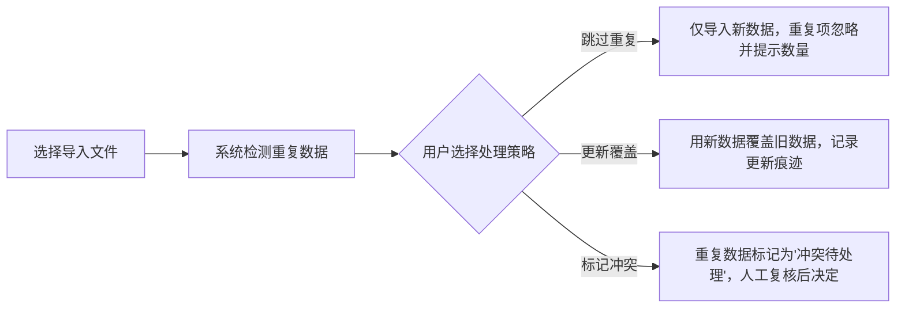

## 1. 产品概述

社区团购佣金清分复核系统，为风控复核员林姐提供一站式佣金核对工具，解决同一笔钱被多批次重复认领的问题，无需手工二次对账。

- **核心问题**：月底对账时人工翻表效率低，易出现重复认领、数据口径不一致等问题
- **目标用户**：风控复核员（日常操作）、财务主管（导出审阅）
- **产品价值**：将手工对账效率提升80%，处理痕迹可追溯，降低财务风险

## 2. 核心功能

### 2.1 用户角色

| 角色 | 登录方式 | 核心权限 |
|------|----------|----------|
| 风控复核员 | 系统登录 | 列表查看、详情查看、改判、回退、导入、导出 |
| 财务主管 | 系统登录 | 列表查看、详情查看、按状态导出 |

### 2.2 功能模块

1. **清分列表页**：数据列表、筛选、导入、导出、状态统计
2. **清分详情页**：收款流水、退款申请、审批邮件、手写备注、处理建议、操作按钮
3. **改判弹窗**：改判原因、调整金额、审批人选择
4. **回退弹窗**：回退原因、回退到指定状态
5. **导入弹窗**：文件选择、重复处理策略选择（跳过/更新/冲突）、导入预览

### 2.3 页面详情

| 页面名称 | 模块名称 | 功能描述 |
|----------|----------|----------|
| 清分列表页 | 顶部状态栏 | 已确认/待补材料/人工改判 三类状态数量统计卡片 |
| 清分列表页 | 筛选区 | 按状态、批次号、日期范围、商户名称筛选 |
| 清分列表页 | 数据列表 | 展示批次号、商户名称、清分金额、状态、来源、处理时间、操作人、操作按钮 |
| 清分列表页 | 导入功能 | 支持Excel导入，重复数据可选择跳过/覆盖/标记冲突，导入后展示处理结果 |
| 清分列表页 | 导出功能 | 按状态分类导出，已确认/待补材料/人工改判分Sheet导出 |
| 清分详情页 | 基础信息 | 批次号、商户名称、清分金额、当前状态、原始来源、处理时间、操作人 |
| 清分详情页 | 收款流水 | 交易流水号、交易时间、交易金额、支付渠道、附言 |
| 清分详情页 | 退款申请 | 申请单号、申请时间、申请金额、退款原因、申请人 |
| 清分详情页 | 审批邮件 | 邮件主题、发件人、收件人、发送时间、邮件内容预览 |
| 清分详情页 | 手写备注 | 历史备注列表，支持新增备注 |
| 清分详情页 | 处理建议 | 业务友好的操作提醒，标明当前风险点及推荐处理方式 |
| 清分详情页 | 操作区 | 改判、回退、确认、退回补材料按钮 |

## 3. 核心流程

### 3.1 正常处理流程

### 3.2 返工处理流程

### 3.3 重复导入处理流程

## 4. 用户界面设计

### 4.1 设计风格

- **设计基调**：专业严谨的政务/财务系统风格，采用"严谨克制"的设计语言
- **主色调**：深海军蓝 `#1e3a5f`（专业、可信）
- **辅助色**：
  - 已确认：森林绿 `#2d6a4f`
  - 待补材料：琥珀橙 `#e85d04`
  - 人工改判：墨紫色 `#5a189a`
  - 冲突待处理：砖红色 `#9d0208`
- **字体**：
  - 标题：Noto Serif SC（宋体风格，专业稳重）
  - 正文：Noto Sans SC（清晰易读）
  - 数字/金额：JetBrains Mono（等宽字体，便于核对）
- **按钮风格**：直角、细边框、扁平化，操作按钮有明确的颜色区分
- **布局风格**：顶部导航 + 左侧筛选 + 右侧数据区，表格为主体，信息密度适中
- **图标风格**：线性简约图标，避免花哨的彩色图标

### 4.2 页面设计概述

| 页面名称 | 模块名称 | UI 元素 |
|----------|----------|---------|
| 清分列表页 | 顶部状态栏 | 三张状态卡片，带数字和环比变化，卡片有细微渐变背景 |
| 清分列表页 | 筛选区 | 下拉选择器、日期范围选择器、搜索框，紧凑排列 |
| 清分列表页 | 数据表格 | 斑马纹、行悬停高亮、状态标签带颜色圆点、操作列固定在右侧 |
| 清分详情页 | 信息分区 | 卡片式分区，每个区域有明确标题和分割线，金额用大号等宽字体 |
| 清分详情页 | 处理建议 | 浅黄色背景的提示框，带灯泡图标，文字为业务人员易懂的自然语言 |
| 清分详情页 | 操作痕迹 | 时间线样式展示处理历史，每条记录含操作人、时间、动作、备注 |

### 4.3 响应式设计

- **桌面优先**：以1440px宽度为基准设计
- **平板适配**：筛选区可折叠，表格支持横向滚动
- **移动适配**：列表改为卡片式展示，详情页垂直堆叠

### 4.4 交互细节

- 表格行悬停时显示操作按钮
- 状态标签有轻微的呼吸动画提示未处理项
- 改判/回退弹框有二次确认
- 导入时实时显示进度条和处理结果统计
- 导出时生成预览，确认后下载

## 5. 样例数据设计

### 5.1 数据覆盖场景

1. **顺利处理记录**：数据完整，三单一致，可直接确认通过
2. **人工确认记录**：收款流水与清分金额有小额差异，需人工判断
3. **旧口径补录记录**：从月底对账表补入，来源标注为"历史对账表补录"，口径与现有标准有差异

### 5.2 状态流转样例

| 批次号 | 商户 | 清分金额 | 状态 | 来源 | 处理说明 |
|--------|------|----------|------|------|----------|
| SQT-2026-0523-001 | 鲜果园社区团购 | ¥12,580.00 | 已确认 | 系统导入 | 三单一致，顺利通过 |
| SQT-2026-0523-002 | 邻里优选 | ¥8,320.50 | 待补材料 | 系统导入 | 缺审批邮件附件，已退回 |
| SQT-2026-0430-008 | 惠民团购 | ¥15,600.00 | 人工改判 | 月底对账表补录 | 旧口径计算，人工确认差额¥320元 |

### 5.3 脏数据处理样例

- 重复批次号：导入时检测到批次号已存在，按用户选择策略处理
- 金额为负：标记为异常数据，提示"清分金额不能为负，请核对"
- 缺少必要字段：标记为"待补材料"，高亮缺失字段
- 收款流水与清分金额差异超过5%：显示红色警告，强制人工确认
