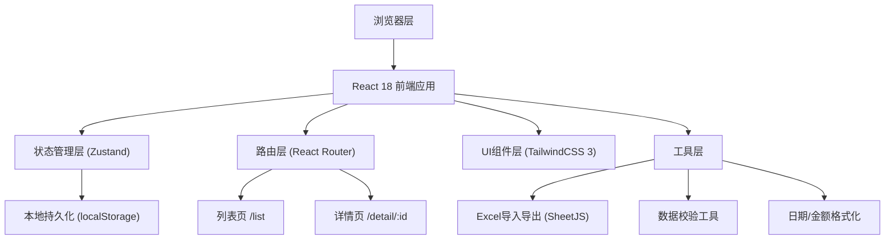
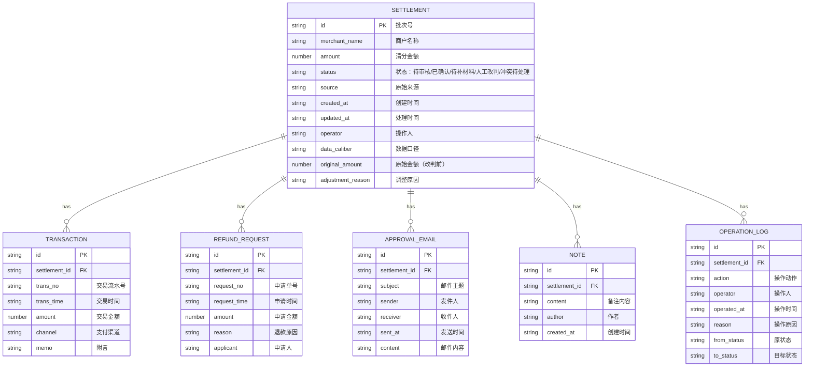
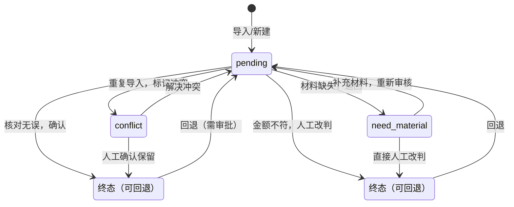

## 1. 架构设计



## 2. 技术描述

- **前端框架**：React@18.2.0 + TypeScript@5.4
- **构建工具**：Vite@5.2
- **样式方案**：TailwindCSS@3.4 + PostCSS
- **路由管理**：React Router@6.22
- **状态管理**：Zustand@4.5（轻量级，避免Redux过度设计）
- **本地存储**：localStorage + 版本迁移机制
- **Excel处理**：xlsx@0.18.5（SheetJS社区版）
- **图标库**：Lucide React（线性简约图标）
- **后端**：无（纯前端应用，数据存储在浏览器localStorage）
- **数据库**：localStorage模拟，数据结构为JSON

## 3. 路由定义

| 路由路径 | 页面组件 | 用途 |
|----------|----------|------|
| `/` | `SettlementList` | 重定向到清分列表页 |
| `/list` | `SettlementList` | 清分列表页，包含筛选、导入、导出 |
| `/detail/:id` | `SettlementDetail` | 清分详情页，包含改判、回退操作 |
| `*` | `NotFound` | 404页面 |

## 4. 数据模型

### 4.1 ER图



### 4.2 TypeScript 类型定义

```typescript
export type SettlementStatus = 
  | 'pending'      // 待审核
  | 'confirmed'    // 已确认
  | 'need_material' // 待补材料
  | 'manual_adjust' // 人工改判
  | 'conflict';    // 冲突待处理

export type DataSource = 
  | 'system_import' // 系统导入
  | 'manual_entry'  // 手工录入
  | 'historical_reconciliation'; // 月底对账表补录

export interface Transaction {
  id: string;
  transNo: string;
  transTime: string;
  amount: number;
  channel: string;
  memo: string;
}

export interface RefundRequest {
  id: string;
  requestNo: string;
  requestTime: string;
  amount: number;
  reason: string;
  applicant: string;
}

export interface ApprovalEmail {
  id: string;
  subject: string;
  sender: string;
  receiver: string;
  sentAt: string;
  content: string;
}

export interface Note {
  id: string;
  content: string;
  author: string;
  createdAt: string;
}

export interface OperationLog {
  id: string;
  action: string;
  operator: string;
  operatedAt: string;
  reason: string;
  fromStatus: SettlementStatus | null;
  toStatus: SettlementStatus;
}

export interface Settlement {
  id: string;
  merchantName: string;
  amount: number;
  originalAmount?: number;
  status: SettlementStatus;
  source: DataSource;
  dataCaliber: string;
  createdAt: string;
  updatedAt: string;
  operator: string;
  adjustmentReason?: string;
  transactions: Transaction[];
  refundRequests: RefundRequest[];
  approvalEmails: ApprovalEmail[];
  notes: Note[];
  operationLogs: OperationLog[];
}

export interface ImportStrategy = 'skip' | 'update' | 'conflict';

export interface ImportResult {
  total: number;
  success: number;
  skipped: number;
  updated: number;
  conflict: number;
  errors: string[];
}

export interface ValidationIssue {
  severity: 'warning' | 'error';
  field: string;
  message: string;
  suggestion: string;
}
```

## 5. 核心模块设计

### 5.1 Store 设计 (Zustand)

```typescript
interface SettlementStore {
  settlements: Settlement[];
  filters: {
    status: SettlementStatus | 'all';
    keyword: string;
    dateRange: [string, string] | null;
  };
  loading: boolean;
  
  // CRUD
  fetchSettlements: () => Promise<void>;
  getSettlementById: (id: string) => Settlement | undefined;
  addSettlement: (data: Omit<Settlement, 'id' | 'createdAt' | 'updatedAt'>) => void;
  updateSettlement: (id: string, data: Partial<Settlement>) => void;
  
  // 业务操作
  confirmSettlement: (id: string, operator: string) => void;
  requestMaterial: (id: string, operator: string, reason: string) => void;
  manualAdjust: (id: string, operator: string, newAmount: number, reason: string) => void;
  rollback: (id: string, operator: string, reason: string, targetStatus: SettlementStatus) => void;
  
  // 导入导出
  importData: (file: File, strategy: ImportStrategy) => Promise<ImportResult>;
  exportData: (status?: SettlementStatus) => void;
  
  // 筛选
  setFilters: (filters: Partial<SettlementStore['filters']>) => void;
  getFilteredSettlements: () => Settlement[];
  
  // 校验
  validateSettlement: (settlement: Settlement) => ValidationIssue[];
  getProcessingSuggestion: (settlement: Settlement) => string;
}
```

### 5.2 工具函数模块

| 模块 | 函数 | 用途 |
|------|------|------|
| `amount.ts` | `formatCurrency` | 金额格式化（¥12,580.00） |
| `amount.ts` | `calculateDiffPercent` | 计算金额差异百分比 |
| `date.ts` | `formatDateTime` | 日期时间格式化 |
| `date.ts` | `generateBatchNo` | 生成批次号 |
| `validator.ts` | `validateSettlementData` | 清分数据完整性校验 |
| `validator.ts` | `detectDuplicates` | 重复数据检测 |
| `excel.ts` | `importFromExcel` | Excel导入解析 |
| `excel.ts` | `exportToExcel` | Excel分Sheet导出 |
| `suggestion.ts` | `generateSuggestion` | 根据数据状态生成业务处理建议 |

## 6. Mock 数据设计

### 6.1 初始化数据

系统首次加载时自动注入3条样例数据，覆盖用户要求的三种场景：

1. **顺利处理记录**（SQT-2026-0523-001）：
   - 状态：`confirmed`（已确认）
   - 收款流水、退款申请、审批邮件三单一致
   - 操作日志包含完整的审核痕迹

2. **人工确认记录**（SQT-2026-0523-002）：
   - 状态：`need_material`（待补材料）
   - 缺少审批邮件附件
   - 收款流水金额与清分金额差异2.3%
   - 有一条手写备注说明情况

3. **旧口径补录记录**（SQT-2026-0430-008）：
   - 状态：`manual_adjust`（人工改判）
   - 来源：`historical_reconciliation`（月底对账表补录）
   - 数据口径标注为"2026年4月旧口径"
   - 原始金额¥15,280，改判后¥15,600，差额¥320
   - 有详细的改判原因和审批记录

### 6.2 脏数据测试样例

导入测试文件中包含以下异常数据，用于验证脏数据处理：

| 异常类型 | 测试数据 | 预期行为 |
|----------|----------|----------|
| 重复批次号 | 批次号 SQT-2026-0523-001 重复导入 | 根据用户选择策略处理 |
| 金额为负 | 清分金额 -¥500 | 标记错误，提示"清分金额不能为负" |
| 缺失必填字段 | 商户名称为空 | 标记为待补材料，高亮缺失字段 |
| 金额差异过大 | 流水¥10,000 vs 清分¥9,000（差10%） | 红色警告，强制人工确认 |
| 日期格式错误 | 交易时间 "2026/13/01" | 解析失败，标记为数据异常 |

### 6.3 处理建议生成规则

```typescript
function generateSuggestion(s: Settlement): string {
  if (s.transactions.length === 0) {
    return "💡 缺少收款流水：请联系运营岗补充该批次对应的银行收款凭证，核对无误后再确认。";
  }
  if (s.approvalEmails.length === 0) {
    return "💡 缺少审批邮件：该清分批次缺少部门经理审批邮件，请让商户补充审批材料。";
  }
  
  const transSum = s.transactions.reduce((sum, t) => sum + t.amount, 0);
  const refundSum = s.refundRequests.reduce((sum, r) => sum + r.amount, 0);
  const expected = transSum - refundSum;
  const diffPercent = Math.abs(s.amount - expected) / expected * 100;
  
  if (diffPercent > 5) {
    return `⚠️ 金额差异过大：清分金额与"流水-退款"差额${diffPercent.toFixed(1)}%，请务必核对后人工改判，禁止直接确认。`;
  }
  if (diffPercent > 0.5) {
    return `⚠️ 金额有细微差异（${diffPercent.toFixed(1)}%）：可能是手续费或抹零，确认业务含义后可人工改判。`;
  }
  if (s.source === 'historical_reconciliation') {
    return "ℹ️ 历史对账补录：此条数据来自月底对账表，采用旧口径计算，请确认口径一致性。";
  }
  
  return "✅ 三单核对一致：收款流水、退款申请、审批邮件齐全且金额匹配，可直接确认通过。";
}
```

## 7. 状态流转规则



**状态流转限制**：
- `confirmed` 和 `manual_adjust` 为终态，不可直接修改，只能通过"回退"操作回到 `pending`
- 回退操作必须填写回退原因，并记录操作日志
- 改判操作必须填写调整金额和改判原因，调整前后金额都需保留
