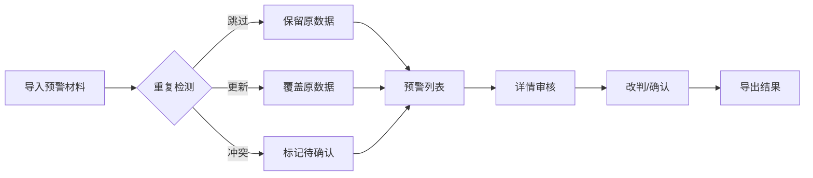

## 1. 产品概述
供应商票据池预警系统是为风控复核员林姐设计的票据复核工具，解决人工核对合同扫描件效率低、易出错的问题。
- 核心目标：实现票据预警的数字化管理，支持列表查看、详情审核、改判、回退、导出全流程
- 价值：减少人工核对工作量，保留原始备注信息，清晰展示差异，提供可执行的处理建议

## 2. 核心功能

### 2.1 用户角色
| 角色 | 注册方式 | 核心权限 |
|------|----------|----------|
| 风控复核员 | 系统内置 | 查看预警列表、审核详情、改判结果、回退状态、导出数据、导入材料 |

### 2.2 功能模块
1. **预警列表页**：票据预警总览、筛选搜索、批量操作、导入导出
2. **预警详情页**：完整信息展示、处理历史、差异对比、改判操作
3. **导入处理**：重复数据检测（跳过/更新/冲突）、差异报告生成

### 2.3 页面详情
| 页面名称 | 模块名称 | 功能描述 |
|----------|----------|----------|
| 预警列表页 | 顶部操作区 | 导入按钮、导出按钮、搜索框、状态筛选 |
| 预警列表页 | 数据表格 | 供应商名称、票据金额、预警类型、状态、操作按钮 |
| 预警详情页 | 基本信息区 | 核心字段展示、原始备注保留展示 |
| 预警详情页 | 材料区 | 银行回单、业务台账、群截图、补充说明分类展示 |
| 预警详情页 | 操作区 | 改判表单、回退按钮、备注输入、差异对比 |

## 3. 核心流程
风控复核员导入预警材料 → 系统检测重复并提示处理方式 → 查看预警列表 → 进入详情审核 → 确认或改判状态 → 导出最终结果

## 4. 用户界面设计
### 4.1 设计风格
- 主色调：专业深蓝(#1e3a5f)，辅助色：确认绿(#2e7d32)、警告橙(#f57c00)、风险红(#d32f2f)
- 按钮风格：简洁直角、轻微阴影、hover色阶变化
- 字体：系统无衬线字体，标题加粗、正文清晰
- 布局：顶部导航+左侧筛选+主内容区表格，信息密度适中
- 图标：简洁线性图标，避免过度装饰

### 4.2 页面设计概述
| 页面名称 | 模块名称 | UI元素 |
|----------|----------|---------|
| 预警列表页 | 数据表格 | 斑马条纹行、状态标签色、行hover高亮 |
| 预警详情页 | 材料卡片 | 分类标签、缩略图预览、点击放大 |
| 预警详情页 | 差异区 | 红色删除线+绿色新增对比、底色区分 |

### 4.3 响应式
桌面端优先，主表格横向滚动适配，移动端采用卡片式列表折叠展示

## 5. 数据要求
### 样例数据
1. 顺利记录：金额匹配、材料齐全、自动通过
2. 人工确认：金额匹配但原因不清、需人工核实
3. 旧口径记录：从合同扫描件补录、保留原始备注

### 脏数据处理
- 格式不统一：自动标准化并标注
- 信息缺失：标记必填项缺失
- 备注冲突：保留所有版本并高亮差异
