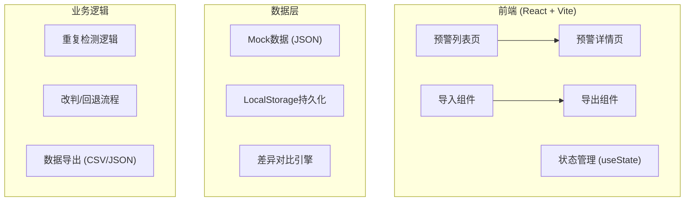

## 1. 架构设计



## 2. 技术描述
- 前端：React@18 + TypeScript + tailwindcss@3 + vite
- 初始化工具：npm create vite@latest
- 数据存储：LocalStorage + JSON Mock数据
- 无后端服务，纯前端实现

## 3. 路由定义
| 路由 | 页面名称 | 用途 |
|------|----------|------|
| / | 预警列表页 | 展示所有预警记录，支持搜索筛选 |
| /detail/:id | 预警详情页 | 单条预警详情，改判/回退操作 |

## 4. 数据模型

### 4.1 预警记录数据结构
```typescript
interface WarningRecord {
  id: string;
  supplierName: string;
  billAmount: number;
  warningType: 'amount_mismatch' | 'reason_unknown' | 'old_version' | 'other';
  status: 'pending' | 'confirmed' | 'rejected' | 'need_manual';
  source: 'bank_receipt' | 'business_ledger' | 'screenshot' | 'contract_scan' | 'supplement';
  originalRemark: string;
  currentRemark: string;
  materials: MaterialItem[];
  history: HistoryRecord[];
  createdAt: string;
  updatedAt: string;
  processingAdvice: string;
}

interface MaterialItem {
  id: string;
  type: 'bank_receipt' | 'business_ledger' | 'screenshot' | 'contract_scan' | 'supplement';
  name: string;
  url?: string;
  uploadTime: string;
  isDirty?: boolean;
  formatNote?: string;
}

interface HistoryRecord {
  id: string;
  action: 'create' | 'update' | 'judge' | 'rollback' | 'remark';
  operator: string;
  time: string;
  oldValue?: any;
  newValue?: any;
  note?: string;
}

interface ImportResult {
  total: number;
  skipped: number;
  updated: number;
  conflicts: number;
  conflictItems: string[];
  diffReport: DiffItem[];
}

interface DiffItem {
  field: string;
  oldValue: any;
  newValue: any;
  type: 'add' | 'delete' | 'modify' | 'conflict';
}
```

## 5. 核心功能实现点

### 5.1 重复检测逻辑
- 基于供应商名称+票据金额+预警类型的组合键检测
- 检测结果分三类：跳过（完全相同）、更新（部分字段不同）、冲突（核心字段矛盾）

### 5.2 脏数据处理
- 格式标准化：金额统一格式、日期统一格式
- 缺失字段标记：红色星号标注
- 备注冲突：保留所有版本，用颜色区分

### 5.3 改判与回退
- 每条操作记录历史快照
- 回退时恢复到指定历史版本
- 差异对比：删除线+新增高亮

## 6. 文件结构
```
src/
├── components/
│   ├── WarningList.tsx
│   ├── WarningDetail.tsx
│   ├── ImportModal.tsx
│   ├── DiffViewer.tsx
│   └── MaterialCard.tsx
├── data/
│   └── mockData.ts
├── hooks/
│   └── useWarningStore.ts
├── utils/
│   ├── diffEngine.ts
│   ├── duplicateChecker.ts
│   └── exportUtils.ts
├── App.tsx
└── main.tsx
```
