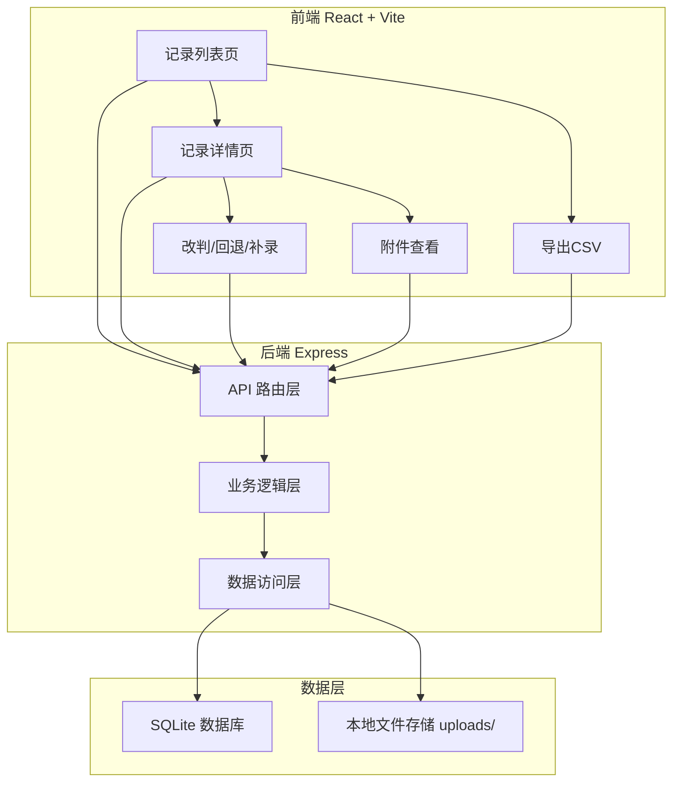
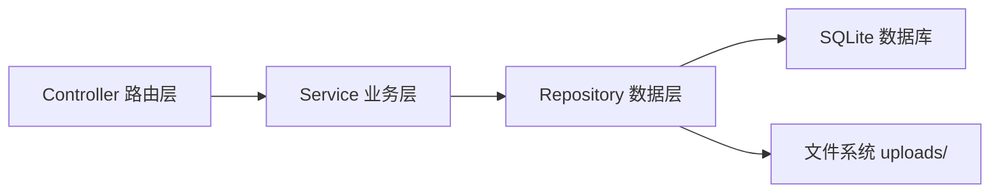
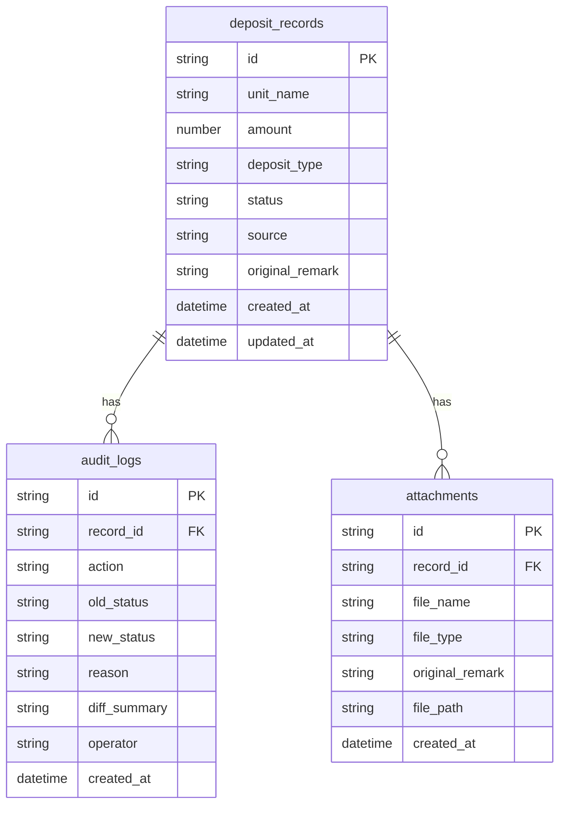

## 1. 架构设计



## 2. 技术说明

- **前端**：React@18 + TypeScript + Tailwind CSS@3 + Vite
- **初始化工具**：Vite (react-ts 模板)
- **后端**：Express@4 + better-sqlite3 (同步 SQLite 驱动，无需异步处理)
- **数据库**：SQLite，文件存储于项目根目录 `data/deposit.db`
- **附件存储**：本地 `uploads/` 目录，数据库仅存文件名和元数据
- **依赖库**：lucide-react (图标)、date-fns (日期处理)、uuid (唯一ID)

## 3. 路由定义

| 路由 | 用途 |
|------|------|
| `/` | 记录列表页，汇总区 + 筛选 + 表格 |
| `/record/:id` | 记录详情页，基本信息 + 附件 + 时间线 + 操作 |

## 4. API 定义

### 4.1 记录相关

```typescript
interface DepositRecord {
  id: string
  unit_name: string
  amount: number
  deposit_type: string
  status: "pending" | "confirmed" | "returned" | "suspended"
  source: string
  original_remark: string
  created_at: string
  updated_at: string
}

interface AuditLog {
  id: string
  record_id: string
  action: "create" | "rejudge" | "rollback" | "supplement"
  old_status: string
  new_status: string
  reason: string
  diff_summary: string
  operator: string
  created_at: string
}

interface Attachment {
  id: string
  record_id: string
  file_name: string
  file_type: "bank_receipt" | "ledger" | "screenshot" | "explanation" | "other"
  original_remark: string
  file_path: string
  created_at: string
}
```

### 4.2 请求/响应

| 方法 | 路径 | 描述 | 请求体 | 响应 |
|------|------|------|--------|------|
| GET | `/api/records` | 获取记录列表（支持筛选） | query: status, min_amount, max_amount, start_date, end_date, keyword | `{ data: DepositRecord[], summary: { confirmed_total, suspended_total, total_count } }` |
| GET | `/api/records/:id` | 获取记录详情 | - | `{ data: DepositRecord, attachments: Attachment[], audit_logs: AuditLog[] }` |
| POST | `/api/records` | 新增记录 | `DepositRecord` (不含 id, created_at, updated_at) | `{ data: DepositRecord }` |
| PUT | `/api/records/:id/rejudge` | 改判 | `{ new_status, reason }` | `{ data: DepositRecord, audit_log: AuditLog }` |
| PUT | `/api/records/:id/rollback` | 回退 | `{ reason }` | `{ data: DepositRecord, audit_log: AuditLog }` |
| POST | `/api/records/:id/supplement` | 补录备注 | `{ remark, attachments?: File[] }` | `{ data: DepositRecord, audit_log: AuditLog, diff: { before, after, summary } }` |
| GET | `/api/records/export` | 导出 CSV | query: 同列表筛选参数 | CSV 文件流 |
| POST | `/api/records/:id/attachments` | 上传附件 | FormData: file, file_type, original_remark | `{ data: Attachment }` |
| DELETE | `/api/records/:id/attachments/:aid` | 删除附件 | - | `{ success: boolean }` |

## 5. 服务端架构图



## 6. 数据模型

### 6.1 数据模型定义



### 6.2 数据定义语言

```sql
CREATE TABLE IF NOT EXISTS deposit_records (
  id TEXT PRIMARY KEY,
  unit_name TEXT NOT NULL,
  amount REAL NOT NULL,
  deposit_type TEXT NOT NULL DEFAULT '租赁保证金',
  status TEXT NOT NULL DEFAULT 'pending' CHECK(status IN ('pending', 'confirmed', 'returned', 'suspended')),
  source TEXT NOT NULL DEFAULT '',
  original_remark TEXT NOT NULL DEFAULT '',
  created_at TEXT NOT NULL DEFAULT (datetime('now', 'localtime')),
  updated_at TEXT NOT NULL DEFAULT (datetime('now', 'localtime'))
);

CREATE TABLE IF NOT EXISTS audit_logs (
  id TEXT PRIMARY KEY,
  record_id TEXT NOT NULL REFERENCES deposit_records(id),
  action TEXT NOT NULL CHECK(action IN ('create', 'rejudge', 'rollback', 'supplement')),
  old_status TEXT NOT NULL DEFAULT '',
  new_status TEXT NOT NULL DEFAULT '',
  reason TEXT NOT NULL DEFAULT '',
  diff_summary TEXT NOT NULL DEFAULT '',
  operator TEXT NOT NULL DEFAULT '资金组',
  created_at TEXT NOT NULL DEFAULT (datetime('now', 'localtime'))
);

CREATE TABLE IF NOT EXISTS attachments (
  id TEXT PRIMARY KEY,
  record_id TEXT NOT NULL REFERENCES deposit_records(id),
  file_name TEXT NOT NULL,
  file_type TEXT NOT NULL CHECK(file_type IN ('bank_receipt', 'ledger', 'screenshot', 'explanation', 'other')),
  original_remark TEXT NOT NULL DEFAULT '',
  file_path TEXT NOT NULL,
  created_at TEXT NOT NULL DEFAULT (datetime('now', 'localtime'))
);

CREATE INDEX IF NOT EXISTS idx_records_status ON deposit_records(status);
CREATE INDEX IF NOT EXISTS idx_records_created ON deposit_records(created_at);
CREATE INDEX IF NOT EXISTS idx_logs_record_id ON audit_logs(record_id);
CREATE INDEX IF NOT EXISTS idx_attachments_record_id ON attachments(record_id);
```
