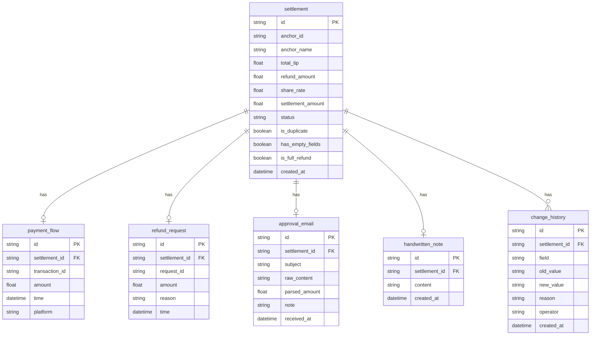

## 1. 架构设计

```mermaid
graph TB
    "浏览器前端" --> "Express API"
    "Express API" --> "SQLite 数据库"
    "Express API" --> "样例数据目录 samples/"
    "Express API" --> "差异报告目录 reports/"
```

前端负责列表/详情/改判/回退/导出界面，后端负责数据持久化、匹配逻辑、变更历史、导出生成。数据全部存本地 SQLite，不依赖外部服务。

## 2. 技术说明

- 前端：React@18 + TypeScript + Tailwind CSS + Vite
- 初始化工具：vite-init（react-express-ts 模板）
- 后端：Express@4 + TypeScript（ESM）
- 数据库：SQLite（better-sqlite3），数据文件存项目根目录 `data/settlement.db`
- 状态管理：zustand
- 图标：lucide-react
- 导出：后端生成 CSV，前端下载

## 3. 路由定义

| 路由 | 用途 |
|------|------|
| `/` | 结算列表页，展示所有记录，筛选/导出入口 |
| `/settlement/:id` | 结算详情页，依据链+变更历史+改判/回退操作 |

## 4. API 定义

### 4.1 结算记录

```
GET    /api/settlements          → Settlement[]        获取列表（支持 ?status= 筛选）
GET    /api/settlements/:id      → SettlementDetail    获取详情（含依据链+变更历史）
POST   /api/settlements/:id/override  → SettlementDetail  改判（body: { field, newValue, reason })
POST   /api/settlements/:id/rollback  → SettlementDetail  回退（body: { reason })
GET    /api/settlements/export   → CSV file            导出
POST   /api/data/reload         → { count }           重新加载样例数据
```

### 4.2 类型定义

```typescript
interface Settlement {
  id: string
  anchorId: string
  anchorName: string
  totalTip: number | null
  refundAmount: number | null
  shareRate: number | null
  settlementAmount: number | null
  status: 'matched' | 'needs_review' | 'overridden' | 'rolled_back'
  hasChangeHistory: boolean
  isDuplicate: boolean
  hasEmptyFields: boolean
  isFullRefund: boolean
  createdAt: string
}

interface SettlementDetail extends Settlement {
  paymentFlow: PaymentFlow
  refundRequest: RefundRequest | null
  approvalEmail: ApprovalEmail | null
  handwrittenNote: string | null
  changeHistory: ChangeRecord[]
}

interface PaymentFlow {
  transactionId: string
  amount: number
  time: string
  platform: string
}

interface RefundRequest {
  requestId: string
  amount: number
  reason: string
  time: string
}

interface ApprovalEmail {
  subject: string
  rawContent: string
  parsedAmount: number | null
  note: string
  receivedAt: string
}

interface ChangeRecord {
  id: string
  field: string
  oldValue: string | null
  newValue: string
  reason: string
  operator: string
  createdAt: string
}
```

## 5. 数据模型

### 5.1 数据模型定义



### 5.2 DDL

```sql
CREATE TABLE IF NOT EXISTS settlement (
  id TEXT PRIMARY KEY,
  anchor_id TEXT NOT NULL,
  anchor_name TEXT NOT NULL,
  total_tip REAL,
  refund_amount REAL,
  share_rate REAL,
  settlement_amount REAL,
  status TEXT NOT NULL DEFAULT 'needs_review',
  is_duplicate INTEGER NOT NULL DEFAULT 0,
  has_empty_fields INTEGER NOT NULL DEFAULT 0,
  is_full_refund INTEGER NOT NULL DEFAULT 0,
  created_at TEXT NOT NULL
);

CREATE TABLE IF NOT EXISTS payment_flow (
  id TEXT PRIMARY KEY,
  settlement_id TEXT NOT NULL REFERENCES settlement(id),
  transaction_id TEXT NOT NULL,
  amount REAL NOT NULL,
  time TEXT NOT NULL,
  platform TEXT NOT NULL
);

CREATE TABLE IF NOT EXISTS refund_request (
  id TEXT PRIMARY KEY,
  settlement_id TEXT NOT NULL REFERENCES settlement(id),
  request_id TEXT NOT NULL,
  amount REAL NOT NULL,
  reason TEXT NOT NULL,
  time TEXT NOT NULL
);

CREATE TABLE IF NOT EXISTS approval_email (
  id TEXT PRIMARY KEY,
  settlement_id TEXT NOT NULL REFERENCES settlement(id),
  subject TEXT NOT NULL,
  raw_content TEXT NOT NULL,
  parsed_amount REAL,
  note TEXT NOT NULL DEFAULT '',
  received_at TEXT NOT NULL
);

CREATE TABLE IF NOT EXISTS handwritten_note (
  id TEXT PRIMARY KEY,
  settlement_id TEXT NOT NULL REFERENCES settlement(id),
  content TEXT NOT NULL,
  created_at TEXT NOT NULL
);

CREATE TABLE IF NOT EXISTS change_history (
  id TEXT PRIMARY KEY,
  settlement_id TEXT NOT NULL REFERENCES settlement(id),
  field TEXT NOT NULL,
  old_value TEXT,
  new_value TEXT NOT NULL,
  reason TEXT NOT NULL,
  operator TEXT NOT NULL DEFAULT '阿宁',
  created_at TEXT NOT NULL
);
```

## 6. 样例数据加载

- 样例数据放在项目根目录 `samples/` 下，包含四个 JSON 文件：
  - `payment_flows.json` — 收款流水
  - `refund_requests.json` — 退款申请
  - `approval_emails.json` — 审批邮件（含乱备注原文）
  - `handwritten_notes.json` — 手写备注
- 调用 `POST /api/data/reload` 或启动时自动加载，清空旧数据后重新写入
- 匹配逻辑按 `anchor_id` 关联，自动判断状态

## 7. 差异报告

- 每次改判/回退，变更历史记录写入 `change_history` 表
- 导出 CSV 包含"变更历史摘要"列，格式：`字段:旧值→新值(原因);...`
- 差异报告同时输出到 `reports/` 目录，文件名含时间戳，便于事后查阅和交接
