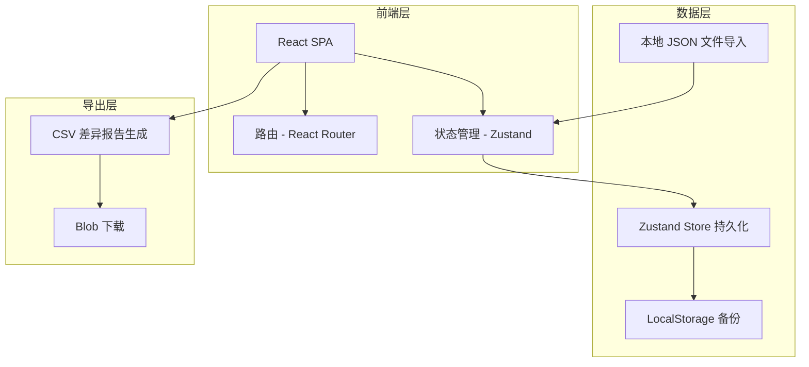
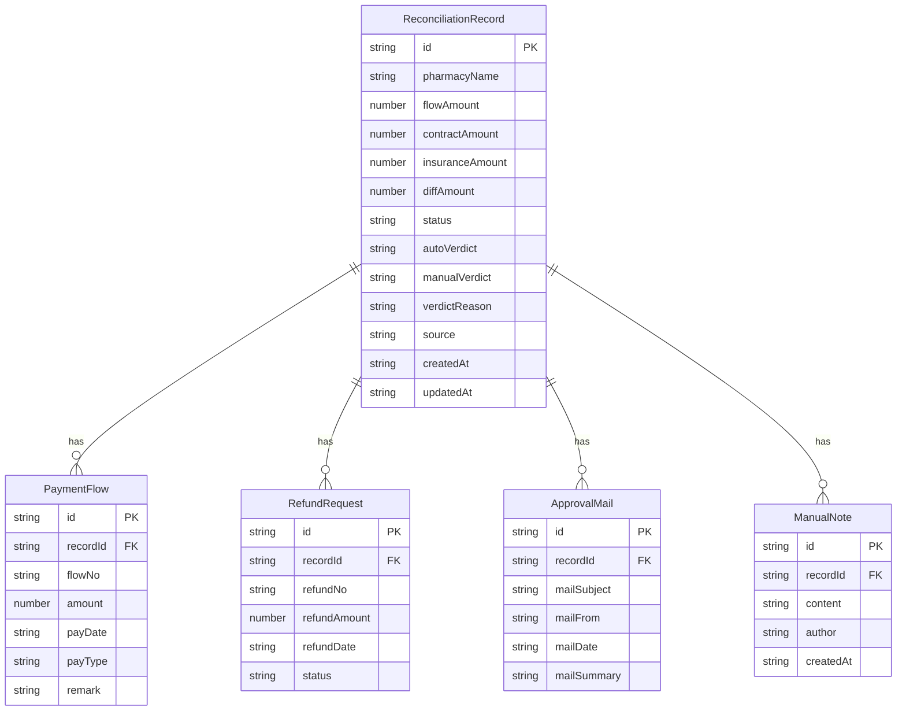

## 1. 架构设计

纯前端架构，无需后端服务。数据通过 JSON 文件导入，状态保存在 Zustand Store 并持久化到 LocalStorage，导出直接生成 CSV 下载。

## 2. 技术说明
- 前端：React@18 + Tailwind CSS@3 + Vite
- 初始化工具：Vite
- 后端：无（纯前端应用）
- 数据库：无（JSON 文件导入 + LocalStorage 持久化）
- 状态管理：Zustand（含 persist 中间件）
- 路由：React Router v6
- 导出：PapaParse 生成 CSV

## 3. 路由定义
| 路由 | 用途 |
|------|------|
| / | 对账列表页，展示所有记录与筛选 |
| /detail/:id | 对账详情页，展示单条记录完整信息与操作 |
| / | 导入弹窗（覆盖层，非独立路由） |

## 4. API 定义
无后端 API。所有数据操作通过 Zustand Store 完成。

核心 Store 方法：
- `importRecords(data, strategy)` — 导入记录，strategy 为 skip/update/conflict
- `updateVerdict(id, verdict, reason)` — 改判
- `revertVerdict(id)` — 回退到自动判定
- `exportDiffReport()` — 生成差异报告 CSV
- `addNote(id, note)` — 添加备注

## 5. 服务器架构
不涉及

## 6. 数据模型

### 6.1 数据模型定义

### 6.2 数据定义

**对账状态枚举**：
- `matched` — 一致
- `diff` — 差异
- `pending` — 待确认
- `overridden` — 已改判
- `conflict` — 导入冲突

**自动判定逻辑**：
- 流水金额 = 合同金额 且 医保金额无空值 → matched
- 流水金额 ≠ 合同金额 → diff
- 关键字段存在空值 → pending

**来源枚举**：
- `flow` — 收款流水
- `contract` — 合同扫描件
- `manual` — 手动录入

**重复识别规则**：
- 以 pharmacyName + flowNo 作为唯一键
- 导入时匹配已有记录，按策略处理

**样例数据要求**：
1. 一条顺利记录：金额完全一致，状态为 matched
2. 一条待确认记录：关键字段有空值，状态为 pending
3. 一条旧口径记录：来源为 contract，金额与流水不一致，状态为 diff
4. 边界测试：一条空值记录、一条重复记录、一条边界金额记录
