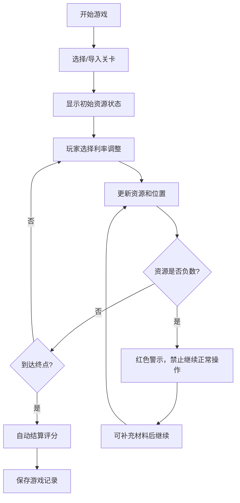
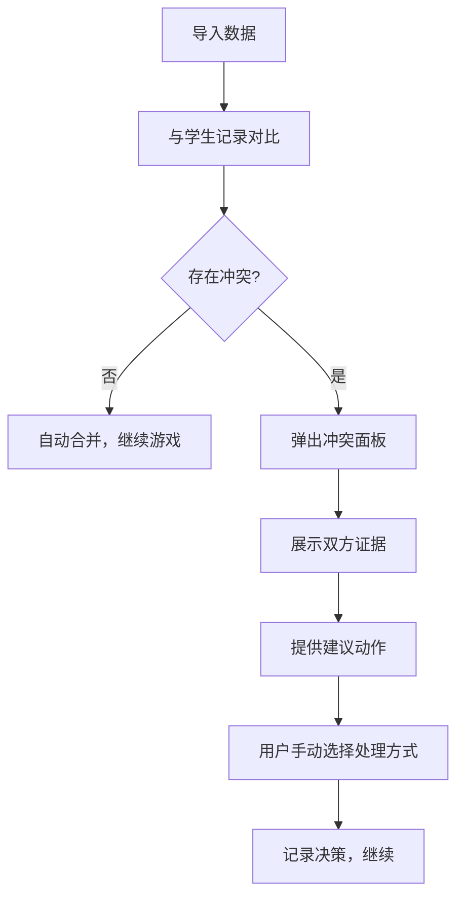
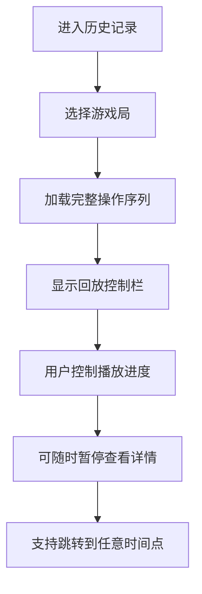

## 1. 产品概述
"央行利率迷宫"是一款面向科普馆讲解员和学生的互动式金融教育游戏，通过浏览器运行，模拟央行利率调整对经济的影响。解决手工核对学生练习记录效率低、课堂节奏易被拖慢的问题，让讲解员能够快速导入关卡参数、回放游戏过程、自动结算评分。

### 核心价值
- 减少讲解员翻阅旧记录的时间，提升课堂效率
- 完整记录游戏过程，支持随时暂停、重开和回放
- 自动处理数据冲突，提供明确证据对比
- 支持断点续玩，补材料时可继续处理

---

## 2. 核心功能

### 2.1 用户角色
| 角色 | 登录方式 | 核心权限 |
|------|----------|----------|
| 讲解员 | 无需登录，本地使用 | 导入关卡、查看历史、结算评分、处理冲突 |
| 学生 | 无需登录，本地使用 | 进行游戏、查看自己的记录 |

### 2.2 功能模块
1. **游戏主界面**：迷宫地图、资源面板、决策选项、操作控制栏
2. **历史记录面板**：游戏列表、详情查看、回放控制
3. **数据导入面板**：关卡参数导入、玩家记录导入、评分备注导入
4. **冲突处理面板**：数据对比、证据展示、建议动作
5. **结算面板**：得分计算、评分展示、备注查看

### 2.3 页面详情
| 页面名称 | 模块名称 | 功能描述 |
|---------|----------|----------|
| 游戏主界面 | 迷宫地图 | 可视化展示利率决策路径，高亮当前位置和已走路径 |
| 游戏主界面 | 资源面板 | 实时显示准备金、贷款利率、存款利率等资源状态，负数时红色警示 |
| 游戏主界面 | 操作控制栏 | 开始、暂停、继续、重开、结算按钮，状态指示 |
| 游戏主界面 | 决策选项 | 当前节点可选择的利率调整方向和幅度 |
| 历史记录 | 游戏列表 | 按时间展示所有游戏局，支持筛选和搜索 |
| 历史记录 | 回放控制 | 进度条、播放/暂停、快进快退、倍速控制 |
| 数据导入 | 关卡配置 | 导入JSON格式的关卡参数，支持多组切换 |
| 数据导入 | 记录导入 | 导入玩家选择记录，自动匹配对应关卡 |
| 冲突处理 | 对比面板 | 左右对比学生记录与导入数据的差异 |
| 冲突处理 | 建议区域 | 展示冲突点证据和建议操作，不替用户决策 |
| 结算面板 | 得分详情 | 分步展示得分计算过程，关联老师评分备注 |

---

## 3. 核心流程

### 3.1 正常游戏流程

### 3.2 数据冲突处理流程

### 3.3 回放流程

---

## 4. 用户界面设计

### 4.1 设计风格
- **主色调**：深金融蓝 (#1a365d) 作为主色，金色 (#d4af37) 作为强调色，红色 (#e53e3e) 作为资源负数警示
- **按钮风格**：圆角矩形，微立体效果，hover时有轻微上浮动画
- **字体**：标题使用思源宋体（庄重专业），正文使用思源黑体（清晰易读）
- **布局风格**：三栏式布局，左侧地图，中间控制面板，右侧信息面板
- **图标风格**：线性图标，金融主题（金币、利率表、迷宫路径等）

### 4.2 页面设计概览
| 页面名称 | 模块名称 | UI元素 |
|---------|----------|--------|
| 游戏主界面 | 迷宫地图 | SVG绘制的节点和路径，动态高亮，粒子效果装饰 |
| 游戏主界面 | 资源面板 | 卡片式布局，数据网格，负数时红色闪烁动画 |
| 游戏主界面 | 控制栏 | 横向排列按钮组，状态指示器（绿/黄/红） |
| 历史记录 | 游戏列表 | 时间线布局，卡片hover效果，筛选标签 |
| 数据导入 | 导入区域 | 拖拽上传区，文件预览，参数校验提示 |
| 冲突处理 | 对比面板 | 左右分栏，差异高亮标注，建议卡片 |

### 4.3 响应式设计
- 桌面端优先，1280px以上最佳体验
- 平板端自适应，右侧面板可折叠
- 移动端简化为垂直布局，核心功能保留

### 4.4 动画与交互
- 页面加载：元素从下往上 staggered 入场
- 资源变化：数字滚动动画，负数时脉冲警告
- 决策选择：按钮点击波纹效果，路径绘制动画
- 回放：进度条平滑过渡，节点标记闪烁提示
