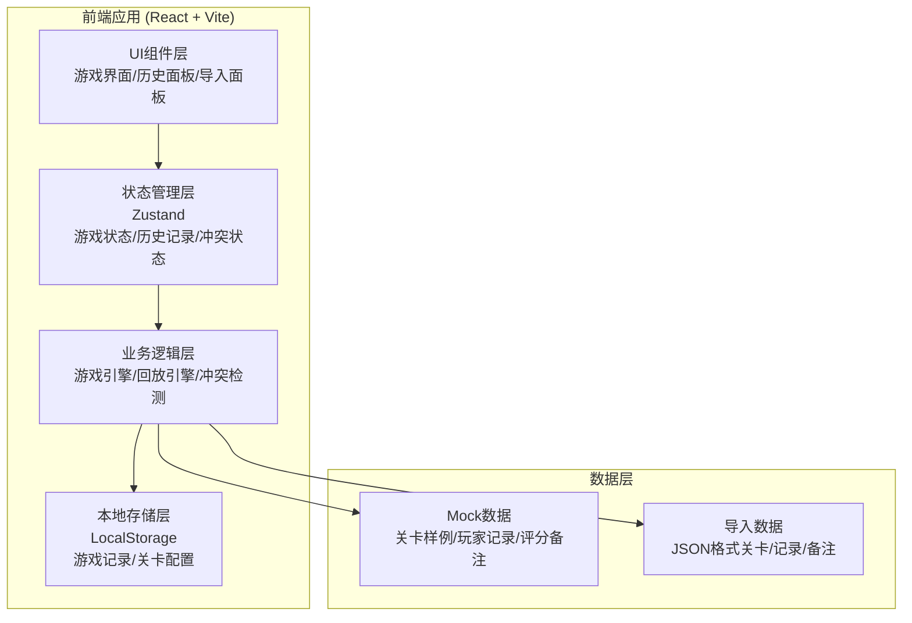
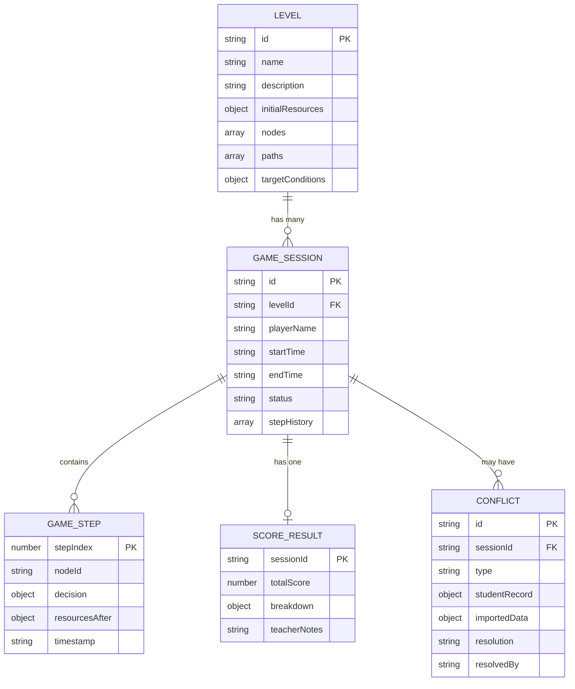

## 1. 架构设计



---

## 2. 技术描述

- **前端框架**: React@18 + TypeScript
- **构建工具**: Vite@5
- **样式方案**: TailwindCSS@3 + CSS Variables
- **状态管理**: Zustand (轻量级，适合本地应用)
- **图表/可视化**: SVG原生 + CSS动画
- **图标**: Lucide React
- **本地存储**: LocalStorage (持久化游戏记录)
- **后端**: 无，纯前端应用，所有数据本地处理
- **数据库**: 无，使用LocalStorage和JSON文件

---

## 3. 路由定义

| 路由 | 页面/组件 | 功能描述 |
|------|-----------|----------|
| `/` | 游戏主界面 | 默认路由，包含迷宫地图、资源面板、控制栏 |
| `/history` | 历史记录页 | 游戏列表、回放控制、详情查看 |
| `/import` | 数据导入页 | 关卡、记录、备注的导入和管理 |

---

## 4. 核心数据模型

### 4.1 数据模型ER图



### 4.2 TypeScript类型定义

```typescript
// 关卡配置
interface Level {
  id: string;
  name: string;
  description: string;
  initialResources: Resources;
  nodes: LevelNode[];
  paths: LevelPath[];
  targetConditions: TargetCondition[];
}

interface LevelNode {
  id: string;
  label: string;
  type: 'start' | 'decision' | 'event' | 'end';
  position: { x: number; y: number };
  description?: string;
  effects?: ResourceEffect[];
}

interface LevelPath {
  from: string;
  to: string;
  decisions: DecisionOption[];
}

interface DecisionOption {
  id: string;
  label: string;
  description: string;
  resourceEffects: ResourceEffect[];
}

// 资源系统
interface Resources {
  reserveRequirement: number;      // 准备金率
  lendingRate: number;             // 贷款利率
  depositRate: number;             // 存款利率
  inflation: number;               // 通货膨胀率
  gdpGrowth: number;               // GDP增长率
  employment: number;              // 就业率
}

interface ResourceEffect {
  resource: keyof Resources;
  change: number;
  type: 'absolute' | 'percentage';
}

// 游戏会话
interface GameSession {
  id: string;
  levelId: string;
  playerName: string;
  startTime: string;
  endTime?: string;
  status: 'idle' | 'playing' | 'paused' | 'completed' | 'interrupted';
  currentNodeId: string;
  currentResources: Resources;
  stepHistory: GameStep[];
  scoreResult?: ScoreResult;
  conflicts: Conflict[];
  teacherNotes?: string;
}

interface GameStep {
  stepIndex: number;
  nodeId: string;
  decisionId?: string;
  decisionLabel?: string;
  resourcesBefore: Resources;
  resourcesAfter: Resources;
  timestamp: string;
  isSupplement?: boolean;          // 是否为补充材料操作
}

interface ScoreResult {
  totalScore: number;
  breakdown: ScoreBreakdownItem[];
  teacherNotes: string;
  calculatedAt: string;
}

interface ScoreBreakdownItem {
  category: string;
  maxScore: number;
  earnedScore: number;
  description: string;
}

// 冲突处理
interface Conflict {
  id: string;
  sessionId: string;
  type: 'resource_mismatch' | 'step_missing' | 'timeline_conflict' | 'duplicate_step';
  stepIndex?: number;
  studentRecord: any;
  importedData: any;
  evidence: ConflictEvidence[];
  suggestedActions: SuggestedAction[];
  resolution?: 'use_student' | 'use_imported' | 'manual' | 'skip';
  resolvedAt?: string;
  resolvedBy?: string;
}

interface ConflictEvidence {
  source: 'student' | 'imported' | 'system';
  description: string;
  data: any;
}

interface SuggestedAction {
  id: string;
  label: string;
  description: string;
  consequence: string;
}

// 导入数据格式
interface ImportedLevel {
  formatVersion: string;
  levels: Level[];
}

interface ImportedPlayerRecord {
  formatVersion: string;
  records: PlayerRecord[];
}

interface PlayerRecord {
  sessionId?: string;
  levelId: string;
  playerName: string;
  steps: PlayerStep[];
  teacherNotes?: string;
}

interface PlayerStep {
  stepIndex: number;
  decision: string;
  timestamp?: string;
  notes?: string;
}
```

---

## 5. 核心模块设计

### 5.1 游戏引擎模块
- **文件**: `src/engine/GameEngine.ts`
- **职责**: 处理游戏逻辑、资源计算、状态转换
- **核心方法**:
  - `startGame(levelId, playerName)`: 初始化游戏
  - `makeDecision(decisionId)`: 执行决策，更新状态
  - `pauseGame()` / `resumeGame()`: 暂停/继续
  - `restartGame()`: 重新开始
  - `endGame()`: 结算评分
  - `supplementMaterials(effects)`: 补充材料，调整资源

### 5.2 回放引擎模块
- **文件**: `src/engine/ReplayEngine.ts`
- **职责**: 控制游戏回放
- **核心方法**:
  - `loadSession(sessionId)`: 加载游戏记录
  - `play()` / `pause()`: 播放/暂停
  - `seekTo(stepIndex)`: 跳转到指定步骤
  - `setPlaybackSpeed(speed)`: 设置倍速
  - `getCurrentState()`: 获取当前回放状态

### 5.3 冲突检测模块
- **文件**: `src/engine/ConflictDetector.ts`
- **职责**: 检测并处理数据冲突
- **核心方法**:
  - `detectConflicts(session, importedData)`: 检测冲突
  - `generateEvidence(conflict)`: 生成证据
  - `suggestActions(conflict)`: 生成建议动作
  - `resolveConflict(conflictId, action)`: 记录解决结果

### 5.4 存储模块
- **文件**: `src/storage/LocalStorage.ts`
- **职责**: 本地持久化
- **核心方法**:
  - `saveSession(session)`: 保存游戏会话
  - `getSession(id)`: 获取会话
  - `getAllSessions()`: 获取所有会话
  - `deleteSession(id)`: 删除会话
  - `saveLevel(level)`: 保存关卡
  - `getLevels()`: 获取所有关卡

---

## 6. 组件结构

```
src/
├── components/
│   ├── game/
│   │   ├── MazeMap.tsx          # 迷宫地图
│   │   ├── ResourcePanel.tsx    # 资源面板
│   │   ├── ControlBar.tsx       # 控制栏
│   │   ├── DecisionPanel.tsx    # 决策选项
│   │   └── ResultPanel.tsx      # 结算面板
│   ├── history/
│   │   ├── SessionList.tsx      # 游戏列表
│   │   ├── ReplayControls.tsx   # 回放控制
│   │   └── StepTimeline.tsx     # 步骤时间线
│   ├── import/
│   │   ├── LevelImporter.tsx    # 关卡导入
│   │   ├── RecordImporter.tsx   # 记录导入
│   │   └── DataPreview.tsx      # 数据预览
│   └── conflict/
│       ├── ConflictPanel.tsx    # 冲突面板
│       ├── EvidenceCompare.tsx  # 证据对比
│       └── ActionSuggestion.tsx # 建议动作
├── stores/
│   ├── useGameStore.ts          # 游戏状态
│   ├── useHistoryStore.ts       # 历史记录状态
│   └── useImportStore.ts        # 导入状态
├── engine/
│   ├── GameEngine.ts
│   ├── ReplayEngine.ts
│   └── ConflictDetector.ts
├── data/
│   ├── mockLevels.ts            # 样例关卡
│   ├── mockRecords.ts           # 样例记录
│   └── mockNotes.ts             # 样例评分备注
└── types/
    └── index.ts                 # 类型定义
```
